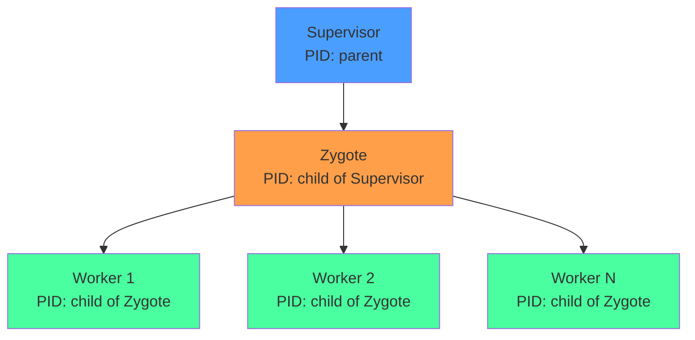
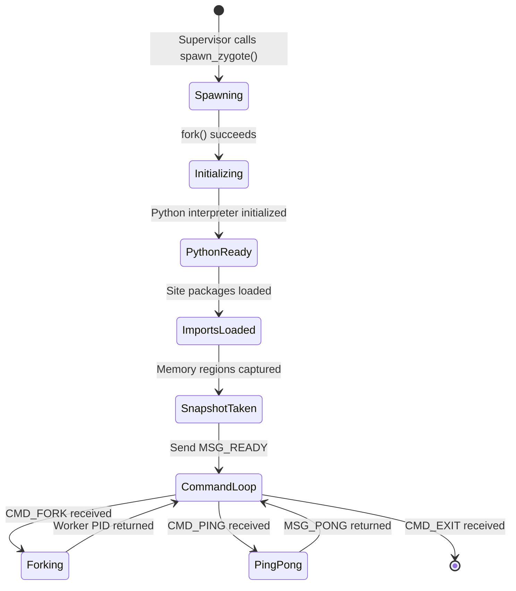
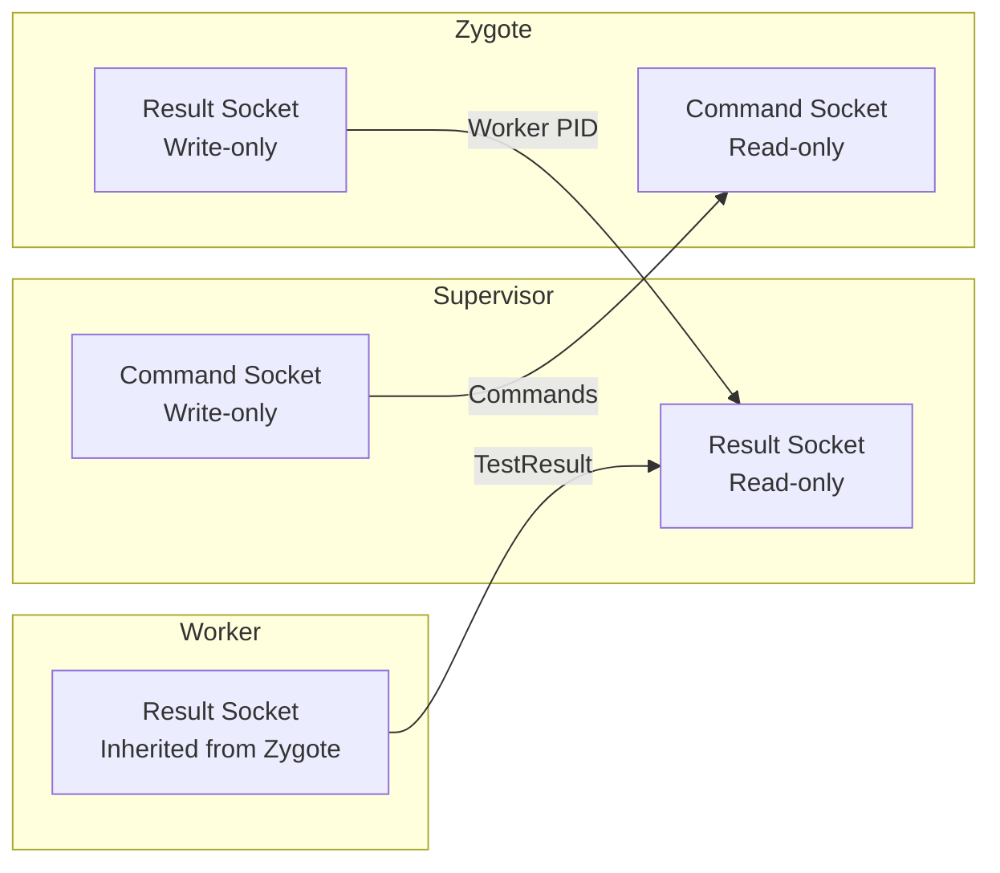
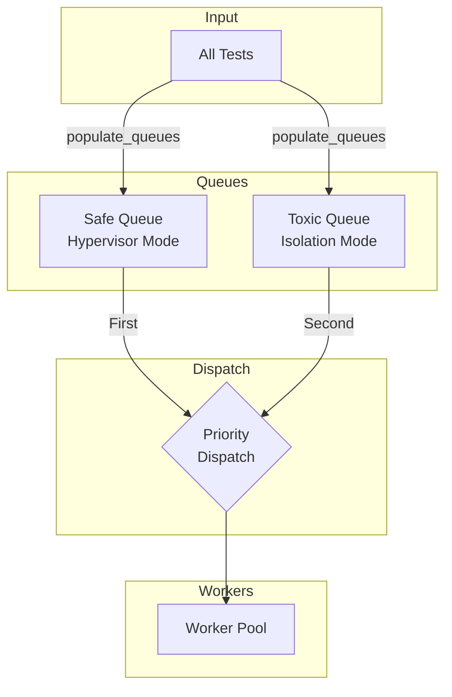
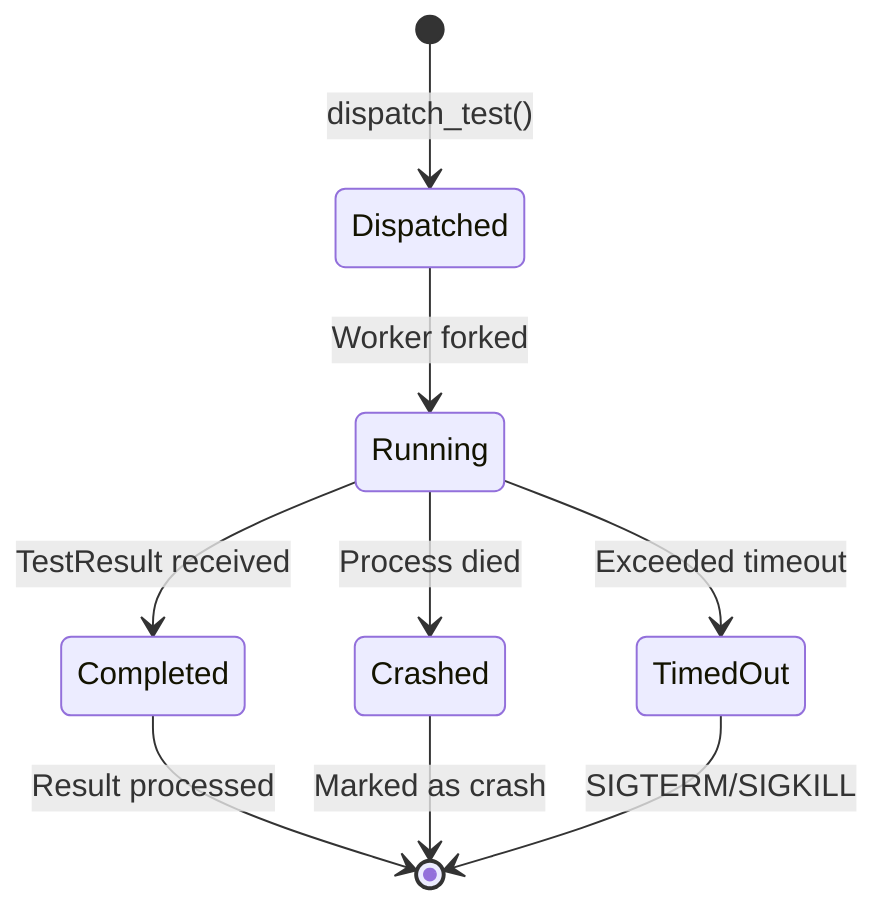
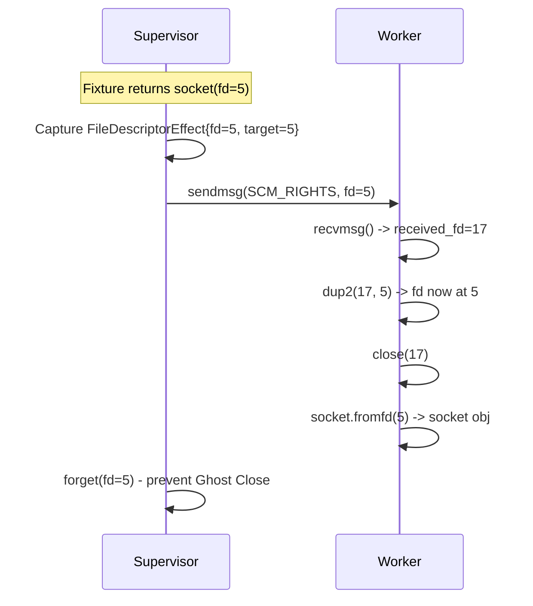
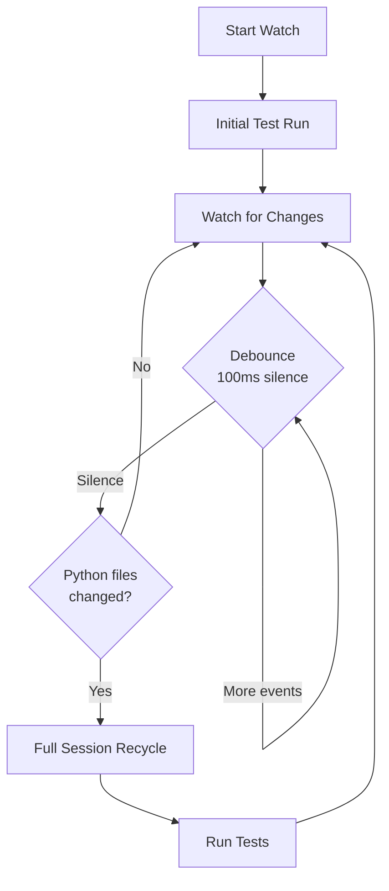
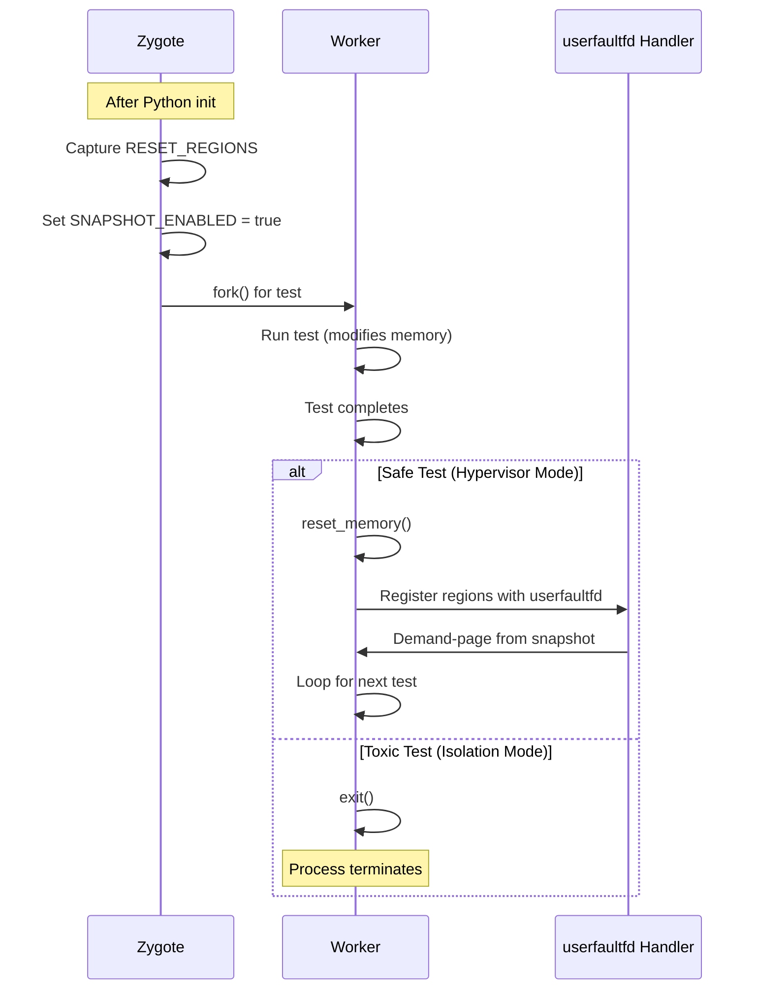
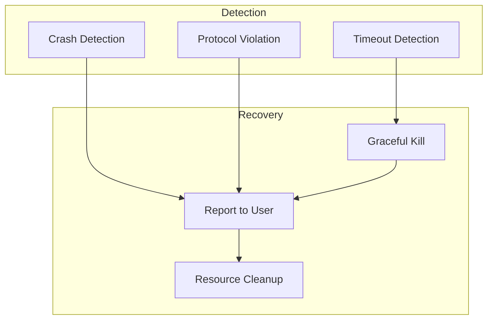

# Execution Engine Deep Dive

> **Purpose**: Comprehensive technical documentation of Tach's execution engine, including the Zygote fork server, Scheduler, Plugin Bridge, and Watch mode.
>
> **Audience**: Contributors, maintainers, and developers seeking deep understanding of Tach internals.

---

## Table of Contents

1. [Architecture Overview](#1-architecture-overview)
2. [Zygote Process Model](#2-zygote-process-model)
3. [Supervisor-Worker Communication](#3-supervisor-worker-communication)
4. [Test Scheduling Algorithm](#4-test-scheduling-algorithm)
5. [Worker Pool Management](#5-worker-pool-management)
6. [Plugin Bridge for Pytest Compatibility](#6-plugin-bridge-for-pytest-compatibility)
7. [Watch Mode Implementation](#7-watch-mode-implementation)
8. [Memory Reset Cycle](#8-memory-reset-cycle)
9. [Error Propagation and Recovery](#9-error-propagation-and-recovery)
10. [Key Code References](#10-key-code-references)

---

## 1. Architecture Overview

Tach's execution engine follows a **Supervisor-Zygote-Worker** architecture inspired by Chrome's multi-process model and Android's Zygote pattern. This design enables sub-millisecond test isolation through memory snapshots rather than process recreation.

### High-Level Architecture

```mermaid
flowchart TB
    subgraph Supervisor["Supervisor Process"]
        CLI[CLI / Main]
        Scheduler[Scheduler]
        Reporter[Reporter]
        HookRegistry[Hook Registry]
    end

    subgraph Zygote["Zygote Process"]
        PyInit[Python Initialized]
        Imports[Common Imports Loaded]
        Snapshot[Memory Snapshot Ready]
        CmdLoop[Command Loop]
    end

    subgraph Workers["Worker Pool"]
        W1[Worker 1]
        W2[Worker 2]
        W3[Worker N]
    end

    CLI --> Scheduler
    Scheduler -->|CMD_FORK| CmdLoop
    CmdLoop -->|fork()| W1
    CmdLoop -->|fork()| W2
    CmdLoop -->|fork()| W3

    W1 -->|TestResult| Scheduler
    W2 -->|TestResult| Scheduler
    W3 -->|TestResult| Scheduler

    Scheduler --> Reporter
```

### Process Hierarchy



### Key Design Principles

| Principle                | Implementation                                                                  |
| ------------------------ | ------------------------------------------------------------------------------- |
| **Zero-Copy IPC**        | Binary protocol with `encode_with_length`/`decode_with_limit` over Unix sockets |
| **Copy-on-Write Fork**   | Workers inherit Zygote's initialized Python state via `fork()`                  |
| **Dual-Path Execution**  | Safe tests use Hypervisor Mode (reset), Toxic tests use Isolation Mode (exit)   |
| **Graceful Degradation** | Falls back when kernel features unavailable                                     |

---

## 2. Zygote Process Model

The Zygote is a pre-initialized Python process that serves as a template for spawning workers. By loading Python, importing common modules, and taking a memory snapshot before forking, Tach amortizes initialization costs across all tests.

### Zygote Lifecycle



### Zygote Initialization Sequence

The `spawn_zygote` function orchestrates the entire process:

1. **Socket Pair Creation**: Creates dual Unix socket pairs for command and result channels
2. **Python Preparation**: Calls `Python::initialize()` (PyO3 0.26+ API)
3. **Fork**: Creates Zygote child process
4. **Child Setup**:
   - Resets signal handlers (SIGINT, SIGTERM)
   - Initializes Python with GIL
   - Loads site-packages into `sys.path`
   - Loads the embedded `tach_harness.py` module
   - Initializes snapshot mode (captures memory regions)
   - Enters command loop

### Memory Regions Tracked

The Zygote captures specific memory regions for later restoration:

```rust
// From zygote.rs - RESET_REGIONS static
static RESET_REGIONS: Mutex<Vec<(usize, usize)>> = Mutex::new(Vec::new());
static SNAPSHOT_ENABLED: AtomicBool = AtomicBool::new(false);
```

Regions tracked include:

- **Heap segments**: Python object allocations
- **BSS segment**: Uninitialized global data
- **Data segment**: Initialized global data
- **Excludes stack**: Avoids "demolishing the floor we're standing on"

### Command Protocol

The Zygote responds to these commands:

| Command        | Value  | Description                      |
| -------------- | ------ | -------------------------------- |
| `CMD_PING`     | `0x01` | Health check, returns `MSG_PONG` |
| `CMD_FORK`     | `0x02` | Fork a worker with test payload  |
| `CMD_RUN_TEST` | `0x03` | Direct test execution (no fork)  |
| `CMD_EXIT`     | `0xFF` | Graceful shutdown                |

---

## 3. Supervisor-Worker Communication

Tach uses a **dual-channel IPC** architecture with separate sockets for commands and results.

### Channel Architecture



### Protocol Message Format

All messages use a structured header format:

```
+--------+--------+--------+--------+--------+--------+--------+--------+
| Magic (2 bytes) | Version (1)     | Reserved (1)    | Length (4 bytes)|
+--------+--------+--------+--------+--------+--------+--------+--------+
|                         Payload (variable length)                      |
+------------------------------------------------------------------------+
```

**Header Constants** (from `protocol.rs`):

- `HEADER_SIZE`: 8 bytes
- `MAX_PAYLOAD_SIZE`: 16 MB (OOM protection)
- Magic bytes identify Tach protocol messages

### TestPayload Structure

When dispatching a test, the Supervisor sends a `TestPayload`:

```rust
pub struct TestPayload {
    pub test_id: u32,
    pub file_path: String,
    pub test_name: String,
    pub is_async: bool,
    pub fixtures: Vec<FixtureInfo>,
    pub log_fd: i32,
    pub debug_socket_path: String,
    pub is_toxic: bool,
    pub timeout_secs: Option<u64>,
    pub hooks: Vec<Hook>,
    pub cached_effects: Vec<Effect>,
    pub markers: Vec<String>,
}
```

### TestResult Structure

Workers return `TestResult` after execution:

```rust
pub struct TestResult {
    pub test_id: u32,
    pub status: u8,           // STATUS_PASS, STATUS_FAIL, etc.
    pub duration_ns: u64,
    pub message: String,
    pub memory_rss_bytes: Option<u64>,
}
```

---

## 4. Test Scheduling Algorithm

The Scheduler implements a **dual-queue prioritized dispatch** system that separates safe and toxic tests.

### Dual-Queue Architecture



### Queue Population Logic

```rust
fn populate_queues(&mut self, tests: Vec<RunnableTest>) {
    for (idx, test) in tests.into_iter().enumerate() {
        let test_id = idx as u32;
        if test.is_toxic {
            self.toxic_queue.push_back((test_id, test));
        } else {
            self.safe_queue.push_back((test_id, test));
        }
    }
}
```

### Dispatch Priority

```rust
fn next_test(&mut self) -> Option<(u32, RunnableTest)> {
    // Priority: Safe tests first (high throughput via reset)
    // Then toxic tests (containment via exit)
    self.safe_queue
        .pop_front()
        .or_else(|| self.toxic_queue.pop_front())
}
```

### Why Safe Tests First?

| Order          | Mode       | Reason                                             |
| -------------- | ---------- | -------------------------------------------------- |
| 1. Safe tests  | Hypervisor | Workers reset and loop, maximizing throughput      |
| 2. Toxic tests | Isolation  | Workers exit after each test, ensuring containment |

This ordering ensures:

- Maximum worker reuse during the safe test phase
- No contamination from toxic tests affecting safe tests
- Toxic tests get full isolation at the cost of throughput

---

## 5. Worker Pool Management

### Active Worker Tracking

The Scheduler maintains an `ActiveWorker` map for tracking running tests:

```rust
struct ActiveWorker {
    test_name: String,
    slot: usize,
    start_time: Instant,
    timeout_secs: u64,
    worker_pid: Option<i32>,
    timeout_handled: Arc<AtomicBool>,  // Race condition prevention
}
```

### Worker Lifecycle



### Slot Assignment

Workers are assigned to slots using modular arithmetic:

```rust
let slot = test_id as usize % self.max_workers;
```

This ensures even distribution across available worker slots.

### Timeout Handling

The scheduler implements atomic timeout handling to prevent race conditions:

```rust
fn get_timed_out_workers(&self) -> Vec<(u32, String, usize, Option<i32>, u64)> {
    workers
        .iter()
        .filter(|(_, w)| {
            let is_timed_out = w.start_time.elapsed() > Duration::from_secs(w.timeout_secs);
            // Atomically claim this timeout - only succeed if we're first
            is_timed_out
                && w.timeout_handled
                    .compare_exchange(false, true, Ordering::SeqCst, Ordering::SeqCst)
                    .is_ok()
        })
        .map(...)
        .collect()
}
```

### Graceful Worker Termination

Timed-out workers are killed gracefully:

```rust
pub fn graceful_kill_worker(pid: Option<i32>, grace_period: Duration) -> Result<()> {
    // Step 1: SIGTERM for graceful shutdown
    let _ = kill(pgid_raw, Signal::SIGTERM);
    let _ = kill(pid_raw, Signal::SIGTERM);

    // Step 2: Wait for grace period
    while start.elapsed() < grace_period {
        match kill(pid_raw, None) {
            Err(nix::errno::Errno::ESRCH) => return Ok(()), // Exited
            _ => std::thread::sleep(check_interval),
        }
    }

    // Step 3: SIGKILL if still running
    let _ = kill(pgid_raw, Signal::SIGKILL);
    let _ = kill(pid_raw, Signal::SIGKILL);

    Ok(())
}
```

---

## 6. Plugin Bridge for Pytest Compatibility

The Plugin Bridge module (`plugin_bridge.rs`) implements **FD Teleportation** using SCM_RIGHTS for passing file descriptors between processes.

### The Fidelity Gap Problem

When pytest fixtures return sockets, database connections, or file handles, they cannot be serialized via JSON/pickle. The Plugin Bridge solves this with SCM_RIGHTS.

### FD Teleportation Architecture



### Message Format for FD Transfer

```
| Bytes  | Field        | Description                              |
|--------|--------------|------------------------------------------|
| 0-3    | count        | Number of FDs being sent (u32 LE)        |
| 4-7    | target_fd[0] | Expected FD number for first FD          |
| 8-11   | target_fd[1] | Expected FD number for second FD         |
| ...    | ...          | Additional target FDs                    |
| CMSG   | SCM_RIGHTS   | Actual FDs attached via control message  |
```

### Ghost Close Prevention

After sending FDs, the Supervisor must not close them:

```rust
pub fn forget_sent_fd(fd: OwnedFd) {
    let raw_fd = fd.as_raw_fd();
    std::mem::forget(fd);  // Intentionally leak to prevent Drop
    eprintln!("[tach:fd_teleporter] Ghost Close Prevention: forgot ownership of FD {}", raw_fd);
}
```

### Key Structures

```rust
pub struct FdTeleportRequest {
    pub fds: Vec<RawFd>,          // Source FDs
    pub target_fds: Vec<i32>,     // Where to dup2
    pub names: Vec<String>,       // Debug names
}

pub struct FdAdoptionResult {
    pub adopted_count: usize,
    pub final_fds: Vec<RawFd>,
    pub errors: Vec<String>,
}
```

---

## 7. Watch Mode Implementation

Watch mode (`watch.rs`) provides automatic test re-execution when source files change.

### The Stale Zygote Problem

Workers fork from a Zygote that has old code in memory. Changed files on disk won't be visible unless the entire session is recycled.

### Watch Loop Architecture



### File Filtering

The watch system filters events to only trigger on relevant changes:

```rust
fn collect_python_paths(event: &Event) -> Vec<PathBuf> {
    event
        .paths
        .iter()
        .filter(|p| p.extension() == Some(OsStr::new("py")))
        .filter(|p| !is_ignored_path(p))
        .cloned()
        .collect()
}

fn is_ignored_path(path: &Path) -> bool {
    let path_str = path.to_string_lossy();
    path_str.contains("__pycache__")
        || path_str.contains(".pytest_cache")
        || path_str.contains(".mypy_cache")
        || path_str.contains(".git")
        || path_str.contains(".venv")
        || path_str.contains("/venv/")
        || path_str.contains("/env/")
        || path_str.contains("/node_modules/")
}
```

### Debouncing Strategy

Events are accumulated until 100ms of silence:

```rust
// Debounce: accumulate events until 100ms of silence
while let Ok(event) = rx.recv_timeout(Duration::from_millis(100)) {
    changed_paths.extend(collect_python_paths(&event));
}
```

---

## 8. Memory Reset Cycle

The memory reset cycle is the core of Tach's performance advantage. It enables sub-millisecond test isolation.

### Snapshot/Restore Flow



### The Seppuku Pattern

Workers perform "self-reset" by restoring their own memory regions:

```rust
// Cached memory regions for worker self-reset (Seppuku pattern)
// These are populated during init_snapshot_mode and used by reset_memory.
// We exclude stack to avoid "standing on the floor we're demolishing".
static RESET_REGIONS: Mutex<Vec<(usize, usize)>> = Mutex::new(Vec::new());
```

### Why Exclude Stack?

Resetting the stack while executing on it would cause undefined behavior. The reset function itself runs on the stack, so it must be excluded from the reset regions.

### userfaultfd Integration

Tach uses userfaultfd for demand paging:

```rust
use userfaultfd::UffdBuilder;

// Create userfaultfd instance
let uffd = UffdBuilder::new()
    .non_blocking(false)
    .build()?;

// Register memory regions
for (addr, len) in regions {
    uffd.register(addr, len)?;
}
```

---

## 9. Error Propagation and Recovery

### Error Detection Mechanisms



### Crash Detection

Workers are monitored for unexpected death:

```rust
fn detect_crashed_workers(&self) -> Vec<(u32, String, usize)> {
    workers
        .iter()
        .filter(|(_, w)| {
            if let Some(pid) = w.worker_pid {
                // Check if process is still alive using kill(pid, 0)
                kill(Pid::from_raw(pid), None).is_err()
            } else {
                false
            }
        })
        .map(|(id, w)| (*id, w.test_name.clone(), w.slot))
        .collect()
}
```

### Crash Phase Detection

The scheduler determines the crash phase based on elapsed time:

```rust
let crash_phase = {
    if w.start_time.elapsed() < Duration::from_secs(1) {
        "Worker crashed during fixture setup"
    } else {
        "Worker crashed during test execution"
    }
};
```

### Protocol Violation Handling

Oversized payloads are rejected with OOM protection:

```rust
if len > MAX_PAYLOAD_SIZE {
    eprintln!(
        "[tach:scheduler] FATAL: Rejecting oversized payload: {} bytes > {} limit. Socket desync.",
        len, MAX_PAYLOAD_SIZE
    );
    // Socket is now corrupt - caller should detect via timeout
    return None;
}
```

### Timeout Hook Integration

Custom Python hooks can be invoked on timeout:

```rust
pub fn invoke_timeout_hook(hook_spec: &str, test_id: u32, test_name: &str, timeout_secs: u64) {
    // Parse hook spec: "module.path:function_name"
    let parts: Vec<&str> = hook_spec.splitn(2, ':').collect();
    let (module_path, func_name) = (parts[0], parts[1]);

    Python::attach(|py| -> PyResult<()> {
        let module = py.import(module_path)?;
        let func = module.getattr(func_name)?;
        func.call1((test_id.to_string(), test_name, timeout_secs))?;
        Ok(())
    });
}
```

---

## 10. Key Code References

### Core Files

| File                             | Purpose                                            |
| -------------------------------- | -------------------------------------------------- |
| `src/execution/zygote.rs`        | Zygote process, fork server, worker loop           |
| `src/execution/scheduler.rs`     | Test dispatch, worker management, timeout handling |
| `src/execution/plugin_bridge.rs` | FD teleportation via SCM_RIGHTS                    |
| `src/execution/watch.rs`         | File watching and session recycling                |
| `src/protocol.rs`                | IPC message format, encoding/decoding              |
| `src/tach_harness.py`            | Embedded Python test harness                       |

### Key Functions by Component

**Zygote (`zygote.rs`)**:

- `spawn_zygote` - Creates and initializes the Zygote process
- `zygote_main` - Main command loop in Zygote
- `worker_main` - Test execution in forked worker
- `init_snapshot_mode` - Captures memory regions for reset
- `reset_memory` - Restores memory to snapshot state

**Scheduler (`scheduler.rs`)**:

- `Scheduler::new` / `with_config` - Constructor with configuration
- `Scheduler::run` - Main scheduling loop
- `populate_queues` - Separates safe/toxic tests
- `next_test` - Priority dispatch (safe first)
- `dispatch_test` - Sends test to Zygote
- `try_collect_result_for_reporter` - Receives test results
- `detect_crashed_workers` - Monitors worker health
- `get_timed_out_workers` - Atomic timeout detection
- `graceful_kill_worker` - SIGTERM then SIGKILL

**Plugin Bridge (`plugin_bridge.rs`)**:

- `send_fds` - Supervisor sends FDs via SCM_RIGHTS
- `receive_and_adopt_fds` - Worker receives and dup2s FDs
- `forget_sent_fd` - Ghost close prevention
- `create_teleporter_socket_pair` - Creates socket pair for FD transfer

**Watch (`watch.rs`)**:

- `start_watch_loop` - Main watch event loop
- `collect_python_paths` - Filters Python file events
- `is_ignored_path` - Excludes cache/venv directories
- `clear_screen` - ANSI terminal clear

### Static State

| Symbol             | Location  | Purpose                              |
| ------------------ | --------- | ------------------------------------ |
| `RESET_REGIONS`    | zygote.rs | Memory regions for snapshot restore  |
| `SNAPSHOT_ENABLED` | zygote.rs | Flag indicating snapshot mode active |

### Protocol Constants

| Constant           | Value  | Description          |
| ------------------ | ------ | -------------------- |
| `CMD_PING`         | `0x01` | Health check command |
| `CMD_FORK`         | `0x02` | Fork worker command  |
| `CMD_RUN_TEST`     | `0x03` | Direct test run      |
| `CMD_EXIT`         | `0xFF` | Shutdown command     |
| `MSG_READY`        | `0x01` | Zygote ready signal  |
| `MSG_PONG`         | `0x02` | Ping response        |
| `MSG_WORKER_READY` | `0x03` | Worker ready signal  |
| `STATUS_PASS`      | `0x00` | Test passed          |
| `HEADER_SIZE`      | `8`    | Protocol header size |
| `MAX_PAYLOAD_SIZE` | `16MB` | OOM protection limit |

---

## Related Documentation

- [External Research](./external-research.md) - Related projects and technologies
- [Roadmap](./roadmap.md) - Development trajectory
- [README](../../README.md) - Project overview and architecture
- [Configuration](../configuration.md) - CLI and configuration reference
- [Troubleshooting](../troubleshooting.md) - Common issues and solutions

---

## Appendix: Modular Expansion Notes

The following sections may warrant separate files if they grow beyond 300 lines:

| Section            | Expansion Criteria                             | Suggested File                 |
| ------------------ | ---------------------------------------------- | ------------------------------ |
| Memory Reset Cycle | Add userfaultfd internals, page fault handling | `memory-snapshot-internals.md` |
| Plugin Bridge      | Add more FD types, Python wrapper details      | `fd-teleportation-protocol.md` |
| Scheduler          | Add distributed scheduling, cluster mode       | `distributed-scheduling.md`    |

---

_Last Updated: 2026-01-17_
