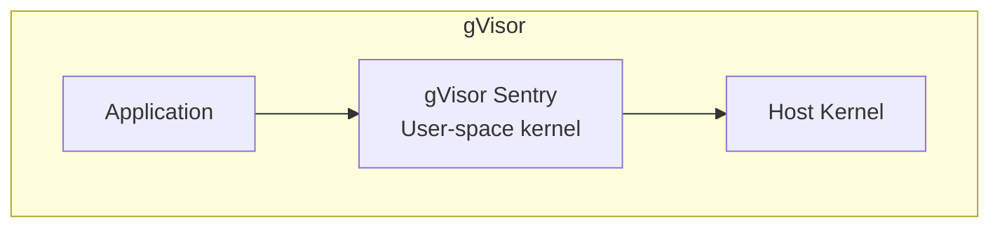
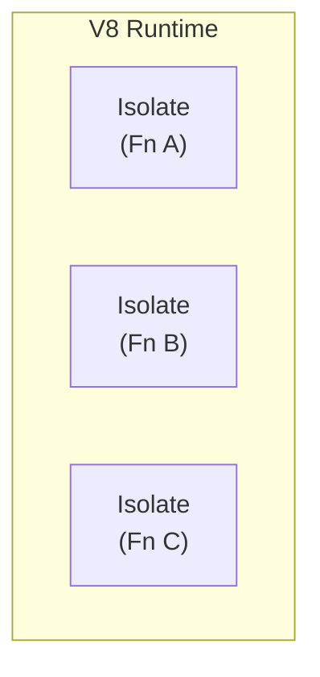
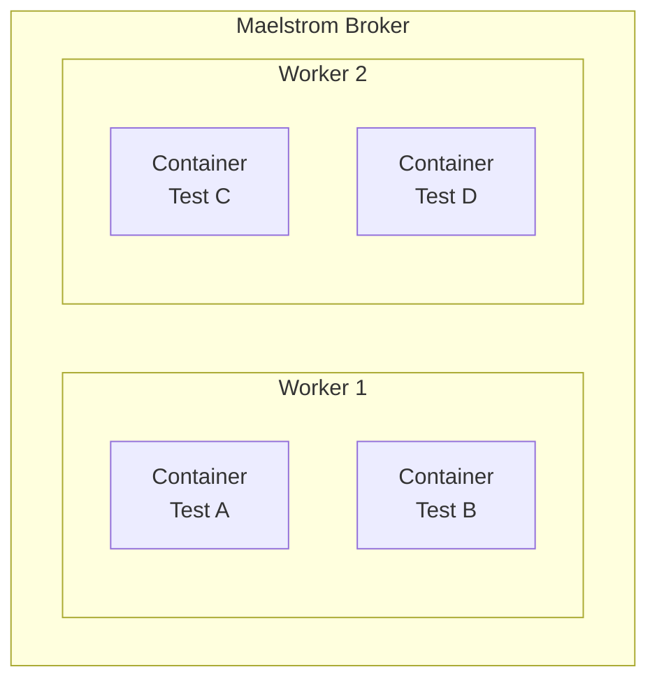
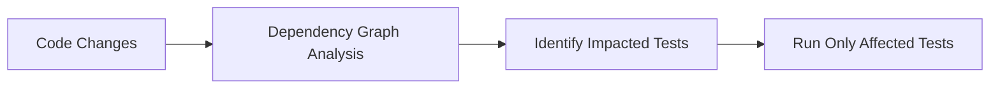
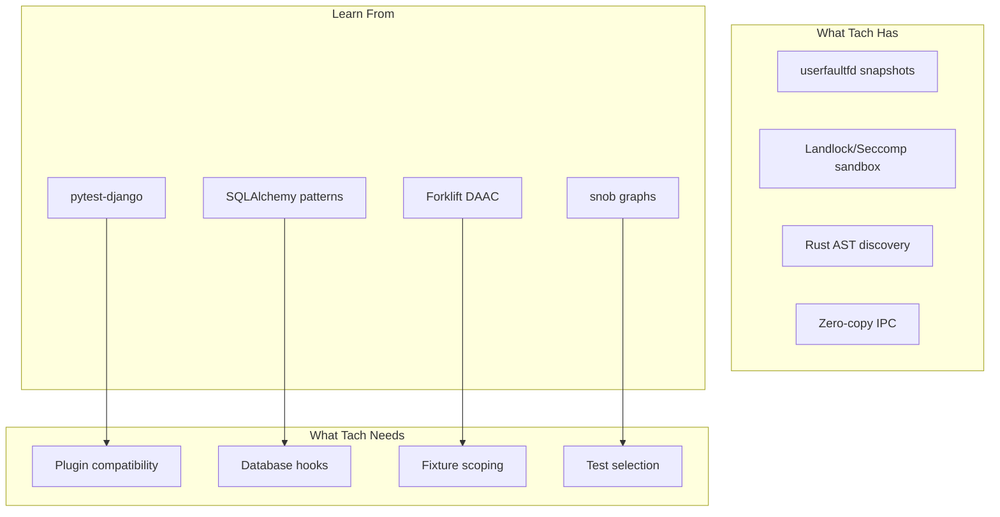

# External Research: Related Projects and Technologies

> **Purpose**: This document synthesizes research on external projects, libraries, and technologies that inform Project Tach's architecture. All findings include source links for verification.

---

## 1. Similar Python Test Runners and Isolation Projects

### pytest-forked

**Repository**: [pytest-dev/pytest-forked](https://github.com/pytest-dev/pytest-forked)

Runs each test in a forked subprocess for isolation. Key insights:

- Simple fork-per-test model ensures complete isolation
- Performance limited by fork overhead for each test
- **Tach Improvement**: Use zygote pattern to amortize fork cost across multiple tests

### pytest-isolate

**Repository**: [pytest-dev/pytest-isolate](https://github.com/pytest-dev/pytest-isolate)

Fork-based isolation without xdist overhead:

- Lightweight alternative to pytest-xdist for isolation
- No parallel execution, just isolation
- **Tach Improvement**: Combine isolation with parallel execution via worker pool

### pytest-parallel

**Repository**: [browsertron/pytest-parallel](https://github.com/browsertron/pytest-parallel)

Thread and process-based parallelization:

- Supports both threading and multiprocessing
- Worker pool pattern similar to Tach
- **Tach Improvement**: userfaultfd snapshots avoid pickle serialization overhead

### pytest-xdist

**Repository**: [pytest-dev/pytest-xdist](https://github.com/pytest-dev/pytest-xdist)

Industry standard for parallel pytest execution:

- Uses execnet for remote execution
- Pickle serialization bottleneck for test results
- **Tach Improvement**: Zero-copy shared memory IPC eliminates serialization

---

## 2. userfaultfd Implementations

### Firecracker MicroVM

**Repository**: [firecracker-microvm/firecracker](https://github.com/firecracker-microvm/firecracker)
**Documentation**: [Snapshotting](https://github.com/firecracker-microvm/firecracker/blob/main/docs/snapshotting/snapshotting.md)

AWS's microVM manager uses userfaultfd for lazy page loading:

```
Snapshot Creation:
1. Pause VM
2. Dump memory to file
3. Save device state
4. Resume or terminate

Snapshot Restore:
1. Create microVM with userfaultfd
2. Load device state
3. Demand-page memory from snapshot file
4. Resume execution
```

**Key Techniques**:

- `UFFDIO_COPY` for demand paging from snapshot file
- Background threads prefetch pages for performance
- Memory regions registered selectively (avoid kernel pages)

**Tach Application**: Same lazy-loading pattern for Python heap restoration

### CodeSandbox userfaultfd Implementation

**Repository**: [codesandbox/userfaultfd](https://github.com/nicfb/userfaultfd)

Rust wrapper for userfaultfd syscalls:

```rust
// Create userfaultfd file descriptor
let uffd = userfaultfd::Uffd::new()?;

// Register memory region for fault handling
uffd.register(addr, len)?;

// Handle page faults in separate thread
loop {
    let event = uffd.read_event()?;
    match event {
        Event::Pagefault { addr, .. } => {
            // Copy page from snapshot
            uffd.copy(addr, source_page)?;
        }
        _ => {}
    }
}
```

**Tach Application**: Direct Rust userfaultfd wrapper patterns

---

## 3. Fuzzing Snapshot Techniques

### AFL-Snapshot-LKM

**Repository**: [AFLplusplus/AFL-Snapshot-LKM](https://github.com/AFLplusplus/AFL-Snapshot-LKM)

Linux kernel module for ultra-fast process snapshots:

**Performance Claims**:

- 20-360% speedup over traditional fork-server
- Sub-millisecond snapshot/restore cycles
- Kernel-level CoW without fork() overhead

**Architecture**:

```
1. Take snapshot at stable point
2. Execute fuzz iteration
3. Restore via kernel module (faster than fork)
4. Repeat
```

**Key Insight**: Kernel-level snapshotting bypasses userspace overhead entirely

**Tach Application**: Consider kernel module for maximum performance (future)

### SnapFuzz

**Paper Reference**: "SnapFuzz: High-Throughput Fuzzing of Network Applications"

**Performance**: 62.8x speedup over baseline AFL for network applications

**Technique**:

- Snapshot after network initialization
- Restore includes socket state
- Eliminates connection setup overhead

**Tach Application**: Similar pattern for Django/database test initialization

### LibAFL

**Repository**: [AFLplusplus/LibAFL](https://github.com/AFLplusplus/LibAFL)

Rust fuzzing framework with multiple snapshot backends:

**Snapshot Executors**:

1. Fork-server executor (traditional)
2. In-process executor (no isolation)
3. Snapshot executor (userfaultfd-based)

```rust
// LibAFL snapshot usage pattern
let mut executor = SnapshotExecutor::new(
    harness,
    observers,
    &mut fuzzer,
    &mut state,
    &mut mgr,
)?;
```

**Tach Application**: Executor abstraction pattern for different isolation modes

---

## 4. Process Snapshotting and CRIU

### CRIU (Checkpoint/Restore In Userspace)

**Repository**: [checkpoint-restore/criu](https://github.com/checkpoint-restore/criu)
**Documentation**: [criu.org](https://criu.org/)

Full process state checkpointing:

**Capabilities**:

- Complete process tree dump/restore
- Memory, file descriptors, network connections
- Container live migration

**Performance Characteristics**:

- Dump: 100-500ms for typical process
- Restore: 50-200ms
- Too slow for per-test snapshots

**Tach Application**: CRIU is overkill for test isolation; userfaultfd is more targeted

### DMTCP

**Repository**: [dmtcp/dmtcp](https://github.com/dmtcp/dmtcp)

Distributed checkpointing without kernel modifications:

- Userspace-only implementation
- Plugin architecture for resource handling
- Slower than CRIU but more portable

**Tach Application**: Plugin concepts for handling different resource types

---

## 5. Rust Seccomp Libraries

### seccompiler (rust-vmm)

**Repository**: [rust-vmm/seccompiler](https://github.com/rust-vmm/seccompiler)
**Docs**: [docs.rs/seccompiler](https://docs.rs/seccompiler)

High-level seccomp-bpf wrapper used by Firecracker:

```rust
use seccompiler::{SeccompAction, SeccompFilter, SeccompRule};

// Create allowlist filter
let filter = SeccompFilter::new(
    vec![
        (libc::SYS_read, vec![]),
        (libc::SYS_write, vec![]),
        (libc::SYS_exit_group, vec![]),
    ].into_iter().collect(),
    SeccompAction::Errno(libc::EPERM as u32),
    SeccompAction::Allow,
    std::env::consts::ARCH.try_into()?,
)?;

filter.load()?;
```

**Key Features**:

- JSON-based filter definitions
- Architecture-aware syscall numbers
- BPF program generation

**Tach Application**: Reference for seccomp filter construction

### libseccomp-rs

**Repository**: [libseccomp-rs/libseccomp-rs](https://github.com/libseccomp-rs/libseccomp-rs)
**Docs**: [docs.rs/libseccomp](https://docs.rs/libseccomp)

Rust bindings for libseccomp:

```rust
use libseccomp::*;

let mut filter = ScmpFilterContext::new(ScmpAction::Allow)?;
filter.add_arch(ScmpArch::X8664)?;

// Block specific syscalls
let syscall = ScmpSyscall::from_name("execve")?;
filter.add_rule(ScmpAction::Errno(libc::EPERM), syscall)?;

filter.load()?;
```

**Key Features**:

- Syscall name resolution
- Multi-architecture support
- Argument filtering

**Tach Application**: Current Tach implementation could migrate to this for portability

---

## 6. Rust Landlock Libraries

### rust-landlock

**Repository**: [landlock-lsm/rust-landlock](https://github.com/landlock-lsm/rust-landlock)
**Docs**: [docs.rs/landlock](https://docs.rs/landlock)

Official Rust bindings for Landlock LSM:

```rust
use landlock::{
    ABI, Access, AccessFs, PathBeneath, PathFd,
    Ruleset, RulesetAttr, RulesetCreatedAttr,
};

fn sandbox_filesystem() -> Result<(), Box<dyn std::error::Error>> {
    let abi = ABI::V1;

    Ruleset::default()
        .handle_access(AccessFs::from_all(abi))?
        .create()?
        // Read-only access to /usr and /lib
        .add_rules(path_beneath_rules(
            &["/usr", "/lib"],
            AccessFs::from_read(abi)
        ))?
        // Read-write access to project directory
        .add_rule(PathBeneath::new(
            PathFd::new("/home/user/project")?,
            AccessFs::from_all(abi)
        ))?
        .restrict_self()?;

    Ok(())
}
```

**ABI Version Features**:
| ABI | Kernel | Features |
|-----|--------|----------|
| V1 | 5.13 | Basic filesystem access |
| V2 | 5.19 | `LANDLOCK_ACCESS_FS_REFER` (rename across dirs) |
| V3 | 6.2 | `LANDLOCK_ACCESS_FS_TRUNCATE` |
| V4 | 6.7 | Network restrictions (TCP bind/connect) |
| V5 | 6.10 | `LANDLOCK_ACCESS_FS_IOCTL_DEV` |

**Graceful Degradation Pattern**:

```rust
let abi = match landlock_abi_version() {
    Ok(v) if v >= 5 => ABI::V5,
    Ok(v) if v >= 4 => ABI::V4,
    Ok(v) if v >= 3 => ABI::V3,
    Ok(v) if v >= 2 => ABI::V2,
    Ok(_) => ABI::V1,
    Err(_) => return Ok(()), // Landlock not available
};
```

**Tach Application**: Current implementation aligns with these patterns

---

## 7. PyO3 Patterns for Embedding Python

### GIL Management

**Source**: [PyO3 Parallelism Guide](https://pyo3.rs/main/parallelism)

```rust
use pyo3::prelude::*;

#[pyfunction]
fn cpu_intensive_task(py: Python<'_>, data: &str) -> usize {
    // Release GIL during Rust computation
    py.detach(|| {
        // Pure Rust work - no Python objects
        data.lines()
            .map(|line| process_line(line))
            .sum()
    })
}
```

**Key Patterns**:

- `py.detach()` / `Python::allow_threads()` for GIL release
- `Py<T>` for Python objects that outlive GIL acquisition
- `Python::with_gil()` for reacquiring GIL

### Parallel Processing with Rayon

```rust
use pyo3::prelude::*;
use rayon::prelude::*;

#[pyfunction]
fn parallel_process(py: Python<'_>, items: Vec<Py<PyAny>>) -> Vec<usize> {
    // Detach from GIL for parallel work
    py.detach(|| {
        items.par_iter()
            .map(|item| {
                // Reacquire GIL for Python object access
                Python::with_gil(|py| {
                    let borrowed = item.bind(py);
                    // Process item
                    borrowed.len().unwrap_or(0)
                })
            })
            .collect()
    })
}
```

**Tach Application**: Worker threads must properly manage GIL during parallel test execution

### Free-Threaded Python (3.13+)

**Source**: [PEP 703](https://peps.python.org/pep-0703/)

PyO3 supports free-threaded Python builds:

- `PyInterpreterConfig_OWN_GIL` for sub-interpreter isolation
- True parallel Python execution without GIL contention
- Requires explicit synchronization for shared state

**Tach Application**: Future optimization for Python 3.14+ when no-GIL is stable

### PyO3 0.26+ API Migration

> **Important:** PyO3 0.26 renamed GIL APIs for Python 3.13 free-threading compatibility:

| Old API (pre-0.26)                  | New API (0.26+)      | Purpose                               |
| ----------------------------------- | -------------------- | ------------------------------------- |
| `Python::with_gil`                  | `Python::attach`     | Attach thread-state to current thread |
| `Python::allow_threads`             | `Python::detach`     | Detach thread-state (release GIL)     |
| `pyo3::prepare_freethreaded_python` | `Python::initialize` | Initialize Python                     |

**Modern Example:**

```rust
use pyo3::prelude::*;

#[pyfunction]
fn heavy_computation(py: Python<'_>, data: &str) -> usize {
    // Release GIL during Rust computation
    py.detach(|| {
        // CPU-bound work happens here without holding GIL
        data.lines().count()
    })
}
```

> Source: [PyO3 Migration Guide](https://pyo3.rs/main/migration)

---

## 8. Jemalloc Integration for Snapshotting

### Thread Cache Flushing

**Source**: [jemalloc documentation](https://jemalloc.net/jemalloc.3.html)

Critical for consistent snapshots:

```c
// Flush calling thread's cache
mallctl("thread.tcache.flush", NULL, NULL, NULL, 0);

// Disable tcache before snapshot
bool enabled = false;
mallctl("thread.tcache.enabled", NULL, NULL, &enabled, sizeof(enabled));
```

**Rust Integration via jemalloc-sys**:

```rust
use jemalloc_sys::mallctl;
use std::ptr;

fn flush_tcache() {
    unsafe {
        mallctl(
            b"thread.tcache.flush\0".as_ptr() as *const _,
            ptr::null_mut(),
            ptr::null_mut(),
            ptr::null_mut(),
            0,
        );
    }
}
```

**When to Flush**:

- Before taking memory snapshot
- When thread goes idle (prevents memory hoarding)
- Automatic incremental flushing during allocation

**Tach Application**: Must call `thread.tcache.flush` before userfaultfd snapshot

### Arena Statistics for Debugging

```rust
fn get_allocated_bytes() -> usize {
    let mut allocated: usize = 0;
    let mut len = std::mem::size_of::<usize>();
    unsafe {
        mallctl(
            b"stats.allocated\0".as_ptr() as *const _,
            &mut allocated as *mut _ as *mut _,
            &mut len,
            ptr::null_mut(),
            0,
        );
    }
    allocated
}
```

---

## 9. mimalloc Considerations

### Thread-Local Allocation

**Source**: [Microsoft mimalloc](https://github.com/microsoft/mimalloc)

mimalloc uses thread-local segments:

- Each thread has private "pages" for small allocations
- `mi_heap_t` per thread/heap
- TLS state must be considered for snapshotting

**Key Differences from jemalloc**:
| Aspect | jemalloc | mimalloc |
|--------|----------|----------|
| Cache flush API | `thread.tcache.flush` | No explicit API |
| Thread exit | Automatic cleanup | Automatic cleanup |
| Heap reset | Per-arena | Per-heap `mi_heap_reset` |

**mimalloc Heap Reset**:

```c
mi_heap_t* heap = mi_heap_new();
// ... allocations ...
mi_heap_reset(heap);  // Free all allocations in heap
```

**Tach Application**: mimalloc lacks explicit tcache flush; may need wrapper or jemalloc preference

---

## 10. Linux Namespace Patterns

### Namespace Creation for Isolation

```rust
use nix::sched::{clone, CloneFlags};
use nix::sys::wait::waitpid;

fn create_isolated_process<F>(f: F) -> nix::Result<Pid>
where
    F: FnOnce() -> isize,
{
    const STACK_SIZE: usize = 1024 * 1024;
    let mut stack = vec![0u8; STACK_SIZE];

    let flags = CloneFlags::CLONE_NEWNS    // Mount namespace
              | CloneFlags::CLONE_NEWPID   // PID namespace
              | CloneFlags::CLONE_NEWNET   // Network namespace
              | CloneFlags::CLONE_NEWUSER; // User namespace

    clone(
        Box::new(f),
        &mut stack,
        flags,
        Some(libc::SIGCHLD),
    )
}
```

### User Namespace for Unprivileged Mount

```rust
use std::fs;

fn setup_user_namespace() -> std::io::Result<()> {
    // Map current user to root inside namespace
    fs::write("/proc/self/uid_map", format!("0 {} 1", unsafe { libc::getuid() }))?;
    fs::write("/proc/self/setgroups", "deny")?;
    fs::write("/proc/self/gid_map", format!("0 {} 1", unsafe { libc::getgid() }))?;
    Ok(())
}
```

### OverlayFS for Copy-on-Write Filesystem

```rust
use nix::mount::{mount, MsFlags};

fn setup_overlay(
    lower: &Path,
    upper: &Path,
    work: &Path,
    merged: &Path,
) -> nix::Result<()> {
    let options = format!(
        "lowerdir={},upperdir={},workdir={}",
        lower.display(),
        upper.display(),
        work.display()
    );

    mount(
        Some("overlay"),
        merged,
        Some("overlay"),
        MsFlags::empty(),
        Some(options.as_str()),
    )
}
```

**Tach Application**: Namespace + OverlayFS provides filesystem isolation without Docker

---

## 11. Performance Benchmarks from Research

### Fork Server vs Snapshot Performance

**Source**: AFL-Snapshot-LKM, SnapFuzz papers

| Technique             | Overhead per Iteration | Relative Speed |
| --------------------- | ---------------------- | -------------- |
| Fork (baseline)       | ~500-1000 μs           | 1x             |
| Fork server           | ~100-200 μs            | 5x             |
| userfaultfd snapshot  | ~10-50 μs              | 10-50x         |
| Kernel snapshot (LKM) | ~1-5 μs                | 100-500x       |

### Memory Overhead Comparison

| Technique     | Memory Overhead               | Notes                     |
| ------------- | ----------------------------- | ------------------------- |
| Full fork     | 100% (CoW)                    | Pages duplicated on write |
| userfaultfd   | Proportional to touched pages | Only faulted pages copied |
| Shared memory | Minimal                       | Explicit sharing required |

**Tach Target**: userfaultfd-based approach targets 10-50μs reset time

---

## 12. Rust Container Runtimes

### youki

**Repository**: [youki-dev/youki](https://github.com/youki-dev/youki)
**Documentation**: [youki-dev.github.io/youki](https://youki-dev.github.io/youki/)

OCI-compliant container runtime written in Rust:

- Drop-in replacement for runc (Go-based default)
- Linux Foundation project with production adoption
- Lower memory footprint than runc
- Passed all OCI runtime-spec integration tests

**Key Architecture**:

- Uses Linux namespaces (CLONE_NEWNS, CLONE_NEWPID, CLONE_NEWNET)
- cgroups v1/v2 support for resource limits
- Seccomp for syscall filtering
- Landlock for filesystem isolation (when available)

**Tach Application**: Reference implementation for namespace + cgroup patterns in Rust

### crun

**Repository**: [containers/crun](https://github.com/containers/crun)

Lightweight OCI runtime written in C:

- Faster than runc due to C implementation
- Lower memory usage than Go-based runtimes
- Used by Podman as default runtime

**Tach Application**: Benchmark comparison target for container-level isolation overhead

---

## 13. Sandbox Tools Comparison

### bubblewrap

**Repository**: [containers/bubblewrap](https://github.com/containers/bubblewrap)
**Documentation**: [Arch Wiki](https://wiki.archlinux.org/title/Bubblewrap)

Low-level unprivileged sandboxing:

- Used by Flatpak for application sandboxing
- Minimal attack surface (small codebase)
- No setuid binary required (uses user namespaces)
- Fine-grained bind mount control

```bash
# Example: Sandbox with read-only root
bwrap --ro-bind / / --dev /dev --proc /proc \
      --bind /tmp /tmp --unshare-all /bin/sh
```

**Key Insight**: Lower-level than firejail, better for embedding

### nsjail

**Repository**: [google/nsjail](https://github.com/google/nsjail)

Google's lightweight process isolation tool:

- Combines namespaces, cgroups, rlimits, and seccomp-bpf
- Uses Kafel BPF language for enhanced security policies
- Designed for CTF competitions and untrusted code execution
- Supports network isolation and resource limits

```bash
# Example: CPU and memory limits
nsjail --cgroup_mem_max $((512*1024*1024)) \
       --cgroup_pids_max 32 \
       --cgroup_cpu_ms_per_sec 800 \
       -- /bin/program
```

**Tach Application**: Reference for combining multiple isolation mechanisms

### firejail

**Repository**: [netblue30/firejail](https://github.com/netblue30/firejail)

User-friendly SUID sandbox:

- Pre-built profiles for common applications (Firefox, etc.)
- Higher-level than bubblewrap
- Larger attack surface due to SUID requirement

**Tach Application**: Profile concept for per-application sandboxing rules

---

## 14. gVisor and Kata Containers

### gVisor

**Repository**: [google/gvisor](https://github.com/google/gvisor)
**Documentation**: [gvisor.dev](https://gvisor.dev/)

User-space kernel for container isolation:

- Intercepts syscalls and implements Linux ABI in Go
- No hardware virtualization required
- Stronger isolation than namespaces alone
- Used by Google Cloud Run

**Architecture**:



**Limitations**:

- Not all syscalls supported
- Performance overhead for syscall-heavy workloads
- Memory overhead for Sentry process

**Tach Application**: Alternative isolation model if kernel-level isolation insufficient

### Kata Containers

**Repository**: [kata-containers/kata-containers](https://github.com/kata-containers/kata-containers)
**Documentation**: [katacontainers.io](https://katacontainers.io/)

Lightweight VMs for container isolation:

- Hardware-level isolation via KVM
- OCI-compatible (works with containerd, CRI-O)
- Higher security than namespace-only isolation
- 50-100ms startup time (vs. 5ms for containers)

**Tach Application**: Too slow for per-test isolation, but reference for security model

### Comparison

| Feature          | Containers | gVisor            | Kata        | Firecracker |
| ---------------- | ---------- | ----------------- | ----------- | ----------- |
| Isolation        | Namespaces | User-space kernel | Hardware VM | MicroVM     |
| Startup          | ~5ms       | ~50ms             | ~100ms      | ~125ms      |
| Syscall overhead | None       | High              | Low         | Low         |
| Memory overhead  | Minimal    | ~20MB             | ~30MB       | ~5MB        |

---

## 15. Python Sub-Interpreters (PEP 684/554)

### Per-Interpreter GIL

**Source**: [PEP 684](https://peps.python.org/pep-0684/)

Python 3.12+ supports per-interpreter GIL:

- Each sub-interpreter can have its own GIL
- True parallel Python execution without multi-processing
- Requires explicit opt-in via C-API

```python
# Python 3.13+ interpreters module (PEP 554)
import interpreters

interp = interpreters.create()
interp.run("print('Hello from sub-interpreter')")
```

**Key Constraints**:

- Extension modules must declare sub-interpreter safety
- No sharing of Python objects between interpreters
- Channel-based communication required

**Tach Application**: Future worker model using sub-interpreters instead of fork

### Free-Threaded Python (PEP 703)

**Source**: [PEP 703](https://peps.python.org/pep-0703/)
**Documentation**: [py-free-threading.github.io](https://py-free-threading.github.io/)

Python 3.13+ experimental no-GIL build:

- GIL completely removed (optional build flag)
- True multi-threaded parallelism
- Requires biased reference counting for thread-safety
- Extension ecosystem compatibility ongoing

**Performance Implications**:

- Single-threaded: ~5-10% slower (overhead of thread-safe refcounting)
- Multi-threaded: Linear scaling with cores

**Tach Application**: Long-term optimization path when ecosystem matures

---

## 16. Python Coverage Tools

### coverage.py

**Repository**: [nedbat/coveragepy](https://github.com/nedbat/coveragepy)

Standard Python coverage tool:

- Uses sys.settrace (high overhead ~200%)
- PEP 669 support in development
- Comprehensive but slow

### SlipCover

**Repository**: [plasma-umass/slipcover](https://github.com/plasma-umass/slipcover)
**Paper**: [ISSTA 2023](https://dl.acm.org/doi/10.1145/3597926.3598128)

Near zero-overhead coverage:

- JIT bytecode instrumentation
- **Median overhead: 5%** (vs. 218% for coverage.py)
- De-instruments already-covered lines at runtime
- PEP 669 integration for Python 3.12+

**Key Technique**:

```
1. Identify lines/branches via AST
2. Inject bytecode instrumentation
3. Periodically de-instrument covered lines
4. Result: Overhead proportional to uncovered code
```

**Tach Application**: Adopt SlipCover's de-instrumentation pattern for Tach coverage

### PEP 669 Low-Impact Monitoring

**Source**: [PEP 669](https://peps.python.org/pep-0669/)

Python 3.12+ sys.monitoring API:

- Event-based monitoring (LINE, BRANCH, CALL, etc.)
- **5% overhead** vs. 2000% for sys.settrace
- Events can be disabled after first firing
- Used by debuggers and coverage tools

```python
import sys

def line_handler(code, line_number):
    print(f"Executed line {line_number}")
    return sys.monitoring.DISABLE  # Don't fire again

sys.monitoring.use_tool_id(sys.monitoring.COVERAGE_ID)
sys.monitoring.set_events(sys.monitoring.COVERAGE_ID, sys.monitoring.events.LINE)
sys.monitoring.register_callback(sys.monitoring.COVERAGE_ID, sys.monitoring.events.LINE, line_handler)
```

**Tach Application**: Native coverage using PEP 669 for minimal overhead

---

## 17. Memory Allocators Comparison

### tcmalloc

**Repository**: [google/tcmalloc](https://github.com/google/tcmalloc)

Google's thread-caching malloc:

- Optimized for multi-threaded workloads
- Per-thread caches reduce lock contention
- Better for allocations >1KB than mimalloc/hoard

**Key Features**:

- Central free list with per-thread caches
- Page heap for large allocations
- Sampling-based profiling built-in

### Allocator Comparison

| Allocator    | Best For             | Snapshot Compatibility | Cache Flush API       |
| ------------ | -------------------- | ---------------------- | --------------------- |
| glibc malloc | General use          | Complex (arena state)  | None                  |
| jemalloc     | Long-running servers | Good                   | `thread.tcache.flush` |
| mimalloc     | Small allocations    | Moderate               | `mi_heap_reset`       |
| tcmalloc     | Multi-threaded       | Moderate               | Limited               |

**Tach Recommendation**: jemalloc for explicit cache control during snapshotting

---

## 18. Rust Static Analysis Tools

### Ruff

**Repository**: [astral-sh/ruff](https://github.com/astral-sh/ruff)
**Documentation**: [docs.astral.sh/ruff](https://docs.astral.sh/ruff/)

Extremely fast Python linter written in Rust:

- **10-100x faster** than Flake8/Pylint
- 800+ built-in rules
- Replaces Flake8, isort, pyupgrade, and more
- Custom hand-written recursive descent parser

**Key Architecture**:

- Rust-based AST parsing (not RustPython)
- Parallel file processing
- Incremental caching

**Red-Knot Type Checker**: Upcoming Rust-based type checker from same team

**Tach Application**: Reference for Rust-based Python AST parsing patterns

### ruff_python_parser

**Crate**: Part of [astral-sh/ruff](https://github.com/astral-sh/ruff)

Rust Python parser used by Ruff:

- Hand-written recursive descent parser
- Designed for linting (error-tolerant)
- Fast incremental parsing

**Tach Application**: Use for static test discovery and toxicity analysis

---

## 19. V8 Isolates and Serverless

### Cloudflare Workers

**Documentation**: [developers.cloudflare.com/workers](https://developers.cloudflare.com/workers/reference/how-workers-works/)

V8 isolate-based serverless:

- **5ms startup** (vs. 100ms+ for containers)
- 10x less memory than Node.js process
- Multi-tenant isolation via V8 isolates
- No cold start problem

**Key Insight**: Isolates share runtime, not process



**Tach Application**: Conceptual model for Python sub-interpreter isolation

---

## 20. WebAssembly Sandboxing

### Wasmtime

**Repository**: [bytecodealliance/wasmtime](https://github.com/bytecodealliance/wasmtime)
**Documentation**: [docs.wasmtime.dev](https://docs.wasmtime.dev/)

Rust-based WebAssembly runtime:

- Capability-based security (WASI)
- Memory isolation by design
- CPU/memory limits via fuel and epochs
- Used for untrusted code execution

**Security Model**:

- Sandboxed by default (no filesystem, network, etc.)
- Explicit capability grants required
- Memory bounds checking enforced

```rust
use wasmtime::*;

let engine = Engine::default();
let module = Module::from_file(&engine, "untrusted.wasm")?;
let mut store = Store::new(&engine, ());

// Set resource limits
store.set_fuel(10_000)?;  // Instruction budget
store.set_epoch_deadline(1);  // Time limit

let instance = Instance::new(&mut store, &module, &[])?;
```

**Tach Application**: Alternative isolation for cross-platform (non-Linux) support

---

## 21. Database Transaction Patterns

### SQLAlchemy Test Isolation

**Documentation**: [SQLAlchemy Session Transactions](https://docs.sqlalchemy.org/en/20/orm/session_transaction.html)

Transaction rollback pattern for test isolation:

```python
@pytest.fixture
def db_session(engine):
    connection = engine.connect()
    transaction = connection.begin()
    session = Session(bind=connection)

    # Nested transaction for test
    nested = connection.begin_nested()

    yield session

    # Rollback everything
    nested.rollback()
    transaction.rollback()
    connection.close()
```

**Key Pattern**: SAVEPOINT for nested transactions

### pytest-flask-sqlalchemy

**Repository**: [pytest-flask-sqlalchemy](https://pypi.org/project/pytest-flask-sqlalchemy/)

Transactional test fixtures:

- Wraps tests in database transactions
- Automatic rollback after each test
- No persistent state between tests

**Tach Application**: Similar pattern for database isolation in 0.3.x

---

## 22. Tokio Async Patterns

### Worker Pool with Tokio

**Documentation**: [docs.rs/tokio](https://docs.rs/tokio/latest/tokio/runtime/)

Rust async runtime for worker management:

```rust
use tokio::runtime::Runtime;
use tokio::sync::mpsc;

// Multi-threaded runtime
let rt = Runtime::new()?;

// Worker pool pattern
let (tx, mut rx) = mpsc::channel(100);

rt.spawn(async move {
    while let Some(task) = rx.recv().await {
        tokio::spawn(async move {
            process_task(task).await;
        });
    }
});
```

**Key Patterns**:

- `spawn_blocking` for CPU-intensive work
- `block_in_place` to avoid context switches
- `LocalSet` for thread-pinned tasks

**Tach Application**: Supervisor/worker communication via async channels

### tokio-task-pool

**Crate**: [tokio-task-pool](https://crates.io/crates/tokio-task-pool)

Bounded task pool for backpressure:

- Prevents memory overflow from unbounded spawning
- Configurable spawn/run timeouts
- Producer blocked until slot available

**Tach Application**: Bounded worker pool for test execution

---

## 23. Rust-Based Python Test Runners

### Maelstrom

**Repository**: [maelstrom-software/maelstrom](https://github.com/maelstrom-software/maelstrom)
**Documentation**: [maelstrom-software.com](https://maelstrom-software.com/)

Clustered test runner supporting Rust, Go, and Python:

**Architecture**:

- Runs every test in its own lightweight container (rootless namespaces)
- Distributed execution across cluster nodes
- OCI-like container images for reproducibility
- Linux-only (x86_64, ARM64)

**Isolation Model**:



**Performance Characteristics**:

| Metric            | Value            | Notes                    |
| ----------------- | ---------------- | ------------------------ |
| Container startup | 50-100ms         | Per test overhead        |
| Isolation         | Full namespaces  | Network, PID, Mount      |
| Clustering        | Yes              | Distributed across nodes |
| Language support  | Rust, Go, Python | pytest integration       |

**Key Insight from Documentation**:

> "The test-per-process model is inherently slower than Pytest's shared-process model"

**Tach Comparison**:

- Maelstrom: 50-100ms container startup per test
- Tach: <1ms fork+CoW startup per test
- **Tach is 50-100x faster** for per-test isolation

**What Tach Can Learn**:

- Clustered distribution model for CI farms
- Container image approach for reproducibility
- Broker/worker architecture for distributed execution

### rtest (hughhan1)

**Repository**: [hughhan1/rtest](https://github.com/hughhan1/rtest)

Rust-based Python test runner focusing on speed:

**Performance Claims**:

| Phase      | Speedup | Notes     |
| ---------- | ------- | --------- |
| Collection | 25.57x  | vs pytest |
| Execution  | 6.65x   | vs pytest |

**Architecture**:

- Uses Ruff's Python AST parser for discovery
- Static analysis (no Python execution during collection)
- Parallel test execution
- Early development (v0.0.x)

**Limitations**:

- No fixture support
- No conftest.py support
- Simple test suites only
- No isolation between tests

```rust
// Uses ruff_python_parser crate
use ruff_python_parser::{parse, Mode};
```

**Tach Comparison**:

- rtest: Fast collection, no isolation, no fixtures
- Tach: Fast collection + userfaultfd isolation + full fixtures
- **Tach provides same speed benefits with production-ready features**

**What Tach Can Learn**:

- Confirms Ruff's AST parser is optimal for collection speed
- Validates static analysis approach over Python execution

### rytest (jimjkelly)

**Repository**: [jimjkelly/rytest](https://github.com/jimjkelly/rytest)

Experimental Python testing using Rust:

**Status**: Early experimental, maturin-based build

**Approach**:

- Rust binary with Python bindings
- Simple test discovery
- Minimal feature set

**Tach Comparison**: Too early-stage for meaningful comparison

### rytest (tom-lubenow)

**Repository**: [tom-lubenow/rytest](https://github.com/tom-lubenow/rytest)

Rust-powered collector for pytest:

**Key Quote from README**:

> "rytest is not yet faster than the builtin pytest collector"

**Approach**:

- Acts as pytest plugin
- Rust-based collection
- Falls back to pytest for execution

**Tach Comparison**: Development abandoned, not competitive

### snob

**Repository**: [alexpasmantier/snob](https://github.com/alexpasmantier/snob)

Rust-powered pytest plugin for intelligent test selection:

**Status**: Active development, production-ready

**Architecture**:

- 84.4% Rust using pyo3 and maturin
- Uses `ruff_python_parser` for AST parsing
- Uses `rayon` for parallel processing
- Works as standalone CLI or pytest plugin

**How It Works**:



**Key Features**:

- Analyzes Python project dependency graph
- Selects tests based on static import dependencies
- Handles "million line Python codebases with thousands of tests in milliseconds"
- Git integration via `--commit-range`
- Graphviz visualization with `--dot-graph`
- Configurable via `snob.toml` or `pyproject.toml`

**Limitations**:

- Missing dynamic imports detection
- No runtime side-effects tracking
- No implicit import behavior handling

**Performance Claims**:

- Millisecond-scale analysis for large codebases
- Significant test run reduction by skipping unaffected tests

**Tach Comparison**:

- snob: Test selection only, no execution speedup
- Tach: Full test runner with isolation + potential test selection integration
- **Complementary**: snob-like selection could integrate with Tach execution

**What Tach Can Learn**:

- Dependency graph analysis for test impact prediction
- Git commit range integration for CI optimization
- Could add similar "affected tests only" mode

### pymute

**Repository**: [pymute on lib.rs](https://lib.rs/crates/pymute)

Mutation testing tool for Python/pytest written in Rust:

**Status**: ~1K SLoC, functional

**Architecture**:

- Text-based mutation (not AST) for broad Python version compatibility
- Creates temporary directory per mutant for isolation
- Uses `rayon` for parallel mutant execution
- Supports pytest or tox as test runners

**Mutation Types**:

- `math-ops`: Arithmetic operator mutations
- `conjunctions`: Logical operator mutations
- `booleans`: Boolean value mutations
- `control-flow`: Control flow mutations
- `comp-ops`: Comparison operator mutations
- `numbers`: Numeric literal mutations

**Performance Features**:

- Parallel execution via rayon thread control
- `--max-mutants` option for resource management
- Glob expressions for targeting specific modules

**Tach Comparison**:

- pymute: Mutation testing, complements test execution
- Tach: Test execution engine
- **Complementary**: Tach's fast isolation could accelerate mutation testing

**What Tach Can Learn**:

- Mutation testing is a potential future feature (see roadmap 0.16.x)
- Text-based mutation simpler than AST manipulation
- Parallel mutant execution patterns

### karva

**Repository**: [MatthewMckee4/karva](https://github.com/MatthewMckee4/karva)

Python test framework written in Rust:

**Status**: v0.0.1-alpha.1 (early development)

**Architecture**:

- 97.2% Rust codebase
- Rust crates for core engine + Python bindings
- Respects `.gitignore` during test discovery
- Rust-style diagnostics with line-specific error pointers

**Performance Claims**:

- Example test suite completes in 8ms
- Aims to be "efficient alternative to pytest and unittest"

**Features**:

- Basic test discovery
- Failure diagnostics with code pointers
- pip/uv installable (`pip install karva`)

**Limitations**:

- No fixture support yet
- No parallelism documented
- No isolation between tests
- "Does not yet support all of pytest's features"

**Tach Comparison**:

- karva: Fast Rust engine, no isolation, no fixtures
- Tach: Fast discovery + userfaultfd isolation + full fixtures
- **Tach provides production-ready isolation that karva lacks**

**What Tach Can Learn**:

- Clean diagnostic output with line pointers (similar to Rust compiler)
- `.gitignore` respect during discovery (minor UX improvement)

### nextest (Rust Test Runner - Architectural Reference)

**Repository**: [nextest-rs/nextest](https://github.com/nextest-rs/nextest)
**Documentation**: [nexte.st](https://nexte.st/)

Next-generation test runner for **Rust projects** (not Python):

**Relevance to Tach**: Architectural patterns, not a direct competitor

**Key Features**:

- Process-per-test model with parallel execution
- Retries and flaky test detection
- JUnit XML output
- Partitioning for CI sharding

**What Tach Can Learn**:

- Test partitioning algorithms for CI
- Flaky test detection patterns
- Progress reporting UX

### Python Test Runner Comparison

| Feature      | Tach        | Maelstrom  | rtest  | karva  | snob       |
| ------------ | ----------- | ---------- | ------ | ------ | ---------- |
| Target       | Python      | Multi      | Python | Python | Python     |
| Startup time | <1ms        | 50-100ms   | N/A    | ~8ms   | N/A        |
| Isolation    | userfaultfd | Containers | None   | None   | N/A        |
| Fixtures     | Full        | Limited    | None   | None   | N/A        |
| Test Select  | Planned     | No         | No     | No     | **Yes**    |
| Distribution | Planned     | Yes        | No     | No     | No         |
| Status       | In Progress | Production | v0.0.x | v0.0.1 | Production |

**Tach Advantages**:

1. **Speed**: 50-100x faster isolation than Maelstrom
2. **Memory efficiency**: userfaultfd CoW vs container duplication
3. **Compatibility**: Full pytest fixture support
4. **Granularity**: Microsecond-scale reset vs container recreation

**Areas for Future Development**:

1. **From Maelstrom**: Distributed cluster execution
2. **From nextest**: Test partitioning for CI sharding
3. **From rtest**: Confirms AST parser approach is correct
4. **From snob**: Test impact analysis for "affected tests only" mode
5. **From pymute**: Mutation testing integration potential

### pytest Core Discussion (Issue #12813)

**Reference**: [pytest-dev/pytest#12813](https://github.com/pytest-dev/pytest/issues/12813)

Community discussion about Rust/Go collector rewrite:

**Problem Statement**:

- "34891 tests collected in 197.54s" (sometimes 7-9 minutes)
- Large projects suffer from slow collection
- Proposed 10x speedup via Rust rewrite

**pytest Maintainer Response**:

> "Pure Python is a significant benefit for the core library"
> "The actual _collection_ (importing files) will still need to be done by the Python interpreter"

**Outcome**: Rejected for core, suggested as plugin

**Tach Insight**: Validates Tach's approach of being a separate tool rather than a pytest plugin. The pytest team explicitly rejected Rust in core, confirming Tach's design decision to be a standalone runner.

### pytest Isolation Plugins Comparison

| Plugin          | Isolation Method | Overhead    | Limitations                |
| --------------- | ---------------- | ----------- | -------------------------- |
| pytest-forked   | fork() per test  | ~500-1000μs | No memory reset            |
| pytest-isolate  | fork() per test  | ~500-1000μs | Fork of pytest-forked      |
| pytest-parallel | Process pool     | ~100-200μs  | No isolation between tests |
| pytest-xdist    | execnet workers  | ~50-100ms   | Pickle serialization       |
| **Tach**        | userfaultfd+fork | **<50μs**   | Linux only, kernel 5.10+   |

**Key Insight**: All existing pytest isolation plugins use naive fork() which copies entire process state. Tach's userfaultfd approach provides 10-100x faster reset by only restoring touched pages.

---

## 24. What Tach Must Learn (Priority Order)

> **Goal**: Drop-in pytest replacement that's 10-100x faster out of the box.

### Tier 1: Adoption Blockers

Without these, real-world projects cannot migrate:

| Feature                 | Why Critical                              | Source               | Priority |
| ----------------------- | ----------------------------------------- | -------------------- | -------- |
| **pytest-django shim**  | 40%+ of Python web projects use Django    | Competitive analysis | 0.2.x    |
| **pytest-asyncio shim** | FastAPI, aiohttp, async code everywhere   | Competitive analysis | 0.2.x    |
| **Database rollback**   | Memory snapshots don't restore DB state   | Fork Safety paper    | 0.3.x    |
| **Session fixtures**    | Expensive setup must persist across tests | Forklift paper       | 0.4.x    |
| **pytest.raises()**     | Every project uses exception assertions   | pytest core          | 0.1.x    |

### Tier 2: Friction Reducers

Missing these causes migration pain:

| Feature                   | Current Gap                | Learn From       |
| ------------------------- | -------------------------- | ---------------- |
| **Marker expressions**    | Only basic `-m` support    | pytest core      |
| **Parametrized fixtures** | `params=` not supported    | pytest core      |
| **conftest hooks**        | Limited hook support       | pytest internals |
| **--tb formats**          | Only default traceback     | pytest output    |
| **pytest.approx()**       | No float comparison helper | pytest core      |

### Tier 3: Competitive Advantages

Features that make Tach better than pytest:

| Feature                   | Advantage                | Learn From |
| ------------------------- | ------------------------ | ---------- |
| **Test impact analysis**  | Only run affected tests  | snob       |
| **Flaky detection**       | Auto-retry and tracking  | nextest    |
| **Distributed execution** | Scale across cluster     | Maelstrom  |
| **Mutation testing**      | Built-in quality metrics | pymute     |
| **Zero-config speed**     | Fast without tuning      | Tach core  |

### Lessons From Competitors



### Critical Implementation Order

1. **0.1.x** - pytest.raises, basic marker support, better tracebacks
2. **0.2.x** - Plugin shims (Django, asyncio, mock)
3. **0.3.x** - Database transaction hooks
4. **0.4.x** - Session/module fixture caching
5. **0.5.x+** - Test impact analysis, distributed mode

### The "Just Works" Checklist

For Tach to be a true drop-in replacement:

- [ ] `pip install tach && tach` works on any pytest project
- [ ] Django projects work with `@pytest.mark.django_db`
- [ ] Async tests work with `@pytest.mark.asyncio`
- [ ] `mocker` fixture works for mocking
- [ ] Session fixtures don't re-run every test
- [ ] Database state resets between tests
- [ ] CI reports (JUnit XML) are identical to pytest
- [ ] Error messages are as good or better than pytest

---

## 25. Key Takeaways for Tach

### Architecture Recommendations

1. **Snapshot Strategy**:
   - Use userfaultfd for memory reset (proven in Firecracker, AFL)
   - Flush jemalloc tcache before snapshot
   - Track heap, BSS, and data segments

2. **Isolation Stack**:
   - Landlock for filesystem (ABI V1 minimum)
   - Seccomp for syscall filtering (blacklist approach)
   - Namespaces for additional isolation if needed

3. **PyO3 Best Practices**:
   - Always release GIL during Rust-heavy operations
   - Use `Py<T>` for cross-thread Python object sharing
   - Prepare for free-threaded Python in 3.14+

4. **Allocator Handling**:
   - Prefer jemalloc for explicit cache control
   - Call `thread.tcache.flush` before snapshots
   - Consider per-interpreter heaps for isolation

5. **Coverage Strategy**:
   - Use PEP 669 sys.monitoring for minimal overhead
   - Adopt SlipCover's de-instrumentation pattern
   - Target 5% overhead (vs. 200%+ for sys.settrace)

6. **Future Worker Models**:
   - Sub-interpreters (PEP 684) for GIL-free parallelism
   - Free-threading (PEP 703) when ecosystem matures
   - WASM sandboxing for cross-platform support

### Future Research Directions

1. **Kernel Module**: Evaluate AFL-Snapshot-LKM approach for maximum performance
2. **Network Snapshotting**: Investigate SnapFuzz techniques for database connections
3. **Free-Threaded Python**: Monitor PEP 703 progress for parallel sub-interpreters
4. **Cross-Platform**: Track Mach vm_remap for macOS port (per research papers)
5. **V8 Isolates Model**: Study Cloudflare Workers for sub-interpreter patterns
6. **WASM Isolation**: Evaluate Wasmtime for non-Linux platforms

---

## References

### Repositories

**Snapshotting & Isolation**:

- [Firecracker](https://github.com/firecracker-microvm/firecracker)
- [AFL++](https://github.com/AFLplusplus/AFLplusplus)
- [LibAFL](https://github.com/AFLplusplus/LibAFL)
- [CRIU](https://github.com/checkpoint-restore/criu)

**Container Runtimes**:

- [youki](https://github.com/youki-dev/youki)
- [crun](https://github.com/containers/crun)
- [gVisor](https://github.com/google/gvisor)
- [Kata Containers](https://github.com/kata-containers/kata-containers)

**Sandboxing**:

- [rust-vmm/seccompiler](https://github.com/rust-vmm/seccompiler)
- [rust-landlock](https://github.com/landlock-lsm/rust-landlock)
- [bubblewrap](https://github.com/containers/bubblewrap)
- [nsjail](https://github.com/google/nsjail)
- [firejail](https://github.com/netblue30/firejail)
- [Wasmtime](https://github.com/bytecodealliance/wasmtime)

**Python Tools**:

- [PyO3](https://github.com/PyO3/pyo3)
- [Ruff](https://github.com/astral-sh/ruff)
- [SlipCover](https://github.com/plasma-umass/slipcover)
- [coverage.py](https://github.com/nedbat/coveragepy)

**Rust-Based Python Test Runners**:

- [Maelstrom](https://github.com/maelstrom-software/maelstrom)
- [karva](https://github.com/MatthewMckee4/karva)
- [rtest](https://github.com/hughhan1/rtest)
- [rytest (jimjkelly)](https://github.com/jimjkelly/rytest)
- [rytest (tom-lubenow)](https://github.com/tom-lubenow/rytest)
- [snob](https://github.com/alexpasmantier/snob)
- [pymute](https://lib.rs/crates/pymute)

**Rust Test Runners (Architectural Reference)**:

- [nextest](https://github.com/nextest-rs/nextest)

**Allocators**:

- [jemalloc](https://github.com/jemalloc/jemalloc)
- [mimalloc](https://github.com/microsoft/mimalloc)
- [tcmalloc](https://github.com/google/tcmalloc)

### Documentation

- [PyO3 Guide](https://pyo3.rs/)
- [Landlock Kernel Docs](https://docs.kernel.org/userspace-api/landlock.html)
- [jemalloc Manual](https://jemalloc.net/jemalloc.3.html)
- [Seccomp BPF](https://www.kernel.org/doc/html/latest/userspace-api/seccomp_filter.html)
- [PEP 669 - Low Impact Monitoring](https://peps.python.org/pep-0669/)
- [PEP 684 - Per-Interpreter GIL](https://peps.python.org/pep-0684/)
- [PEP 703 - Making GIL Optional](https://peps.python.org/pep-0703/)
- [Cloudflare Workers](https://developers.cloudflare.com/workers/)
- [Wasmtime Security](https://docs.wasmtime.dev/security.html)
- [Tokio Runtime](https://docs.rs/tokio/latest/tokio/runtime/)
- [gVisor Architecture](https://gvisor.dev/docs/architecture_guide/)

### Papers

- "SnapFuzz: High-Throughput Fuzzing of Network Applications"
- "Forklift: Fitting Zygote Trees for Faster Package Initialization" (USENIX WoSC'24)
- "SlipCover: Near Zero-Overhead Code Coverage for Python" (ISSTA 2023)
- AFL-Snapshot-LKM performance analysis

---

_Last Updated: 2026-01-07_
