# Hooks Deep Dive: Tach's Plugin Compatibility Layer

> **Purpose**: This document provides comprehensive technical documentation of Tach's hook interception framework, which enables pytest plugin compatibility without requiring full pluggy support.

---

## Executive Summary

Tach implements a lightweight hook system that intercepts common pytest hooks, records their effects in the supervisor process, and replays those effects in forked worker processes. This architecture enables pytest plugin compatibility while maintaining Tach's performance advantages from userfaultfd-based memory snapshots.

**Key Design Decisions**:

- **Static hook discovery**: Hooks are discovered via AST analysis, not Python execution
- **Effect recording**: Side effects (env vars, sys.path changes) are captured and replayed
- **Hierarchy-aware ordering**: Hooks execute in conftest.py depth order (root first)
- **Toxicity classification**: Hooks that modify global state affect worker isolation strategy

---

## 1. Architecture Overview

### High-Level Data Flow

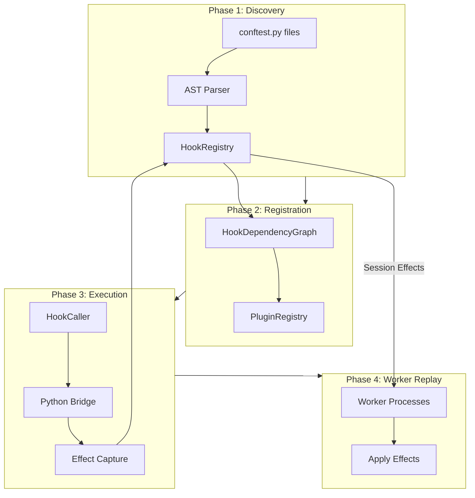

### Component Relationships

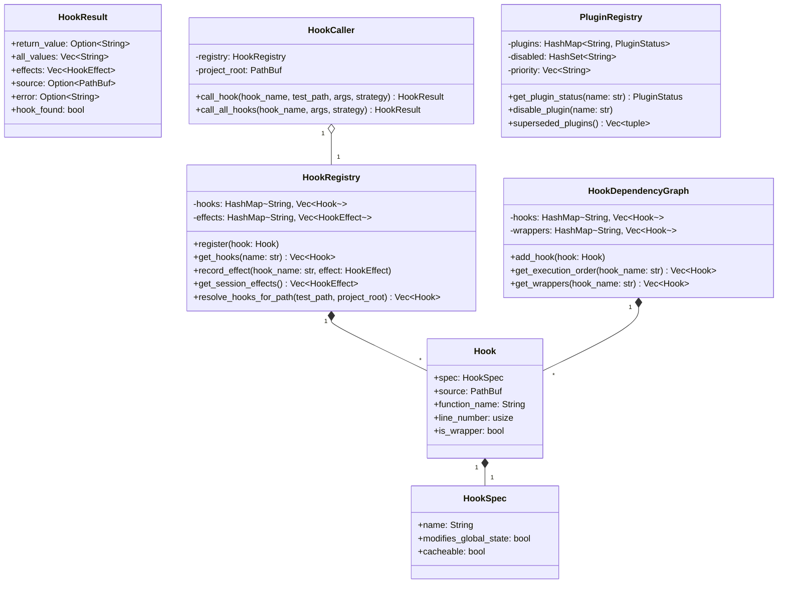

---

## 2. Hook Registry Design

### Core Data Structures

The `HookRegistry` is the central store for all discovered hooks and their recorded effects.

#### HookSpec

Defines the specification for a pytest hook:

| Field                   | Type     | Purpose                                          |
| ----------------------- | -------- | ------------------------------------------------ |
| `name`                  | `String` | Hook name (e.g., `pytest_configure`)             |
| `modifies_global_state` | `bool`   | Whether hook affects toxicity classification     |
| `cacheable`             | `bool`   | Whether results can be cached across invocations |

#### Hook

Represents a concrete hook implementation discovered in a conftest.py:

| Field           | Type       | Purpose                                           |
| --------------- | ---------- | ------------------------------------------------- |
| `spec`          | `HookSpec` | The hook specification                            |
| `source`        | `PathBuf`  | Path to conftest.py containing the hook           |
| `function_name` | `String`   | Python function name                              |
| `line_number`   | `usize`    | Location in source file                           |
| `is_wrapper`    | `bool`     | Whether uses `@pytest.hookimpl(hookwrapper=True)` |

#### HookResult

Captures the outcome of executing a hook:

| Field          | Type              | Purpose                                        |
| -------------- | ----------------- | ---------------------------------------------- |
| `return_value` | `Option<String>`  | JSON-serialized return value                   |
| `all_values`   | `Vec<String>`     | All values when using `AllResults` aggregation |
| `effects`      | `Vec<HookEffect>` | Side effects captured during execution         |
| `source`       | `Option<PathBuf>` | Source file that produced the result           |
| `error`        | `Option<String>`  | Error message if hook failed                   |
| `hook_found`   | `bool`            | Whether the hook function was found            |

### Hook Name Constants

The `hook_names` module provides constants to avoid magic strings:

```rust
pub mod hook_names {
    pub const PYTEST_CONFIGURE: &str = "pytest_configure";
    pub const PYTEST_SESSIONSTART: &str = "pytest_sessionstart";
    pub const PYTEST_SESSIONFINISH: &str = "pytest_sessionfinish";
    pub const PYTEST_COLLECTION_MODIFYITEMS: &str = "pytest_collection_modifyitems";
    pub const PYTEST_RUNTEST_SETUP: &str = "pytest_runtest_setup";
    pub const PYTEST_RUNTEST_CALL: &str = "pytest_runtest_call";
    pub const PYTEST_RUNTEST_TEARDOWN: &str = "pytest_runtest_teardown";
    pub const PYTEST_RUNTEST_MAKEREPORT: &str = "pytest_runtest_makereport";
}
```

### Builtin Hook Specifications

The `builtin_hook_specs()` function returns the 10 standard pytest hooks with their specifications:

| Hook                            | Modifies Global State | Cacheable |
| ------------------------------- | --------------------- | --------- |
| `pytest_configure`              | Yes                   | Yes       |
| `pytest_sessionstart`           | Yes                   | Yes       |
| `pytest_sessionfinish`          | Yes                   | Yes       |
| `pytest_unconfigure`            | Yes                   | Yes       |
| `pytest_collection_modifyitems` | No                    | Yes       |
| `pytest_collection_finish`      | No                    | Yes       |
| `pytest_runtest_setup`          | No                    | No        |
| `pytest_runtest_call`           | No                    | No        |
| `pytest_runtest_teardown`       | No                    | No        |
| `pytest_runtest_makereport`     | No                    | No        |

---

## 3. Hook Types and Their Purposes

### Session-Level Hooks

These hooks run once per test session and their effects are cached for replay in workers.

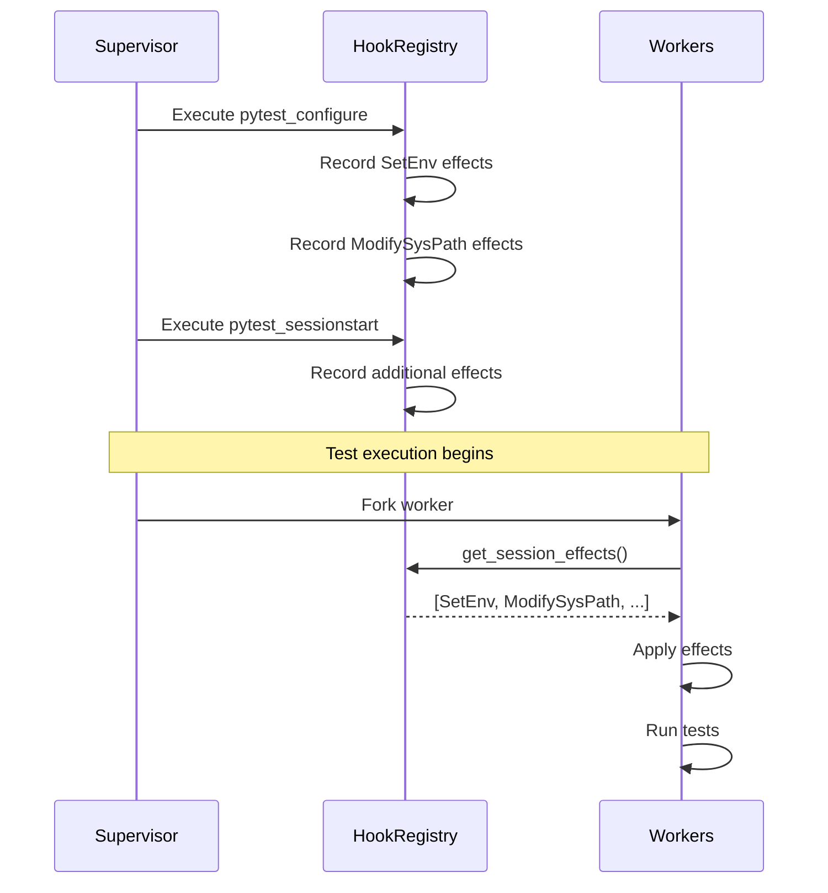

#### pytest_configure

- **Purpose**: Plugin configuration, environment setup
- **Effects**: Environment variables, sys.path modifications, marker registration
- **Toxicity**: Modifies global state (workers need effect replay)

#### pytest_sessionstart

- **Purpose**: Session initialization after configuration
- **Effects**: Additional environment setup
- **Toxicity**: Modifies global state

#### pytest_sessionfinish

- **Purpose**: Session cleanup before unconfigure
- **Effects**: Typically cleanup operations
- **Toxicity**: Modifies global state (counterpart to sessionstart)

#### pytest_unconfigure

- **Purpose**: Final cleanup after session
- **Effects**: Resource cleanup
- **Toxicity**: Modifies global state (counterpart to configure)

### Collection Hooks

These hooks modify how tests are discovered and ordered.

#### pytest_collection_modifyitems

- **Purpose**: Reorder or filter collected tests
- **Effects**: `ModifyItems` with removed test IDs and reorder flag
- **Toxicity**: Does not modify global state (operates on collection)

#### pytest_collection_finish

- **Purpose**: Post-collection processing
- **Effects**: Typically reporting or validation
- **Toxicity**: Does not modify global state

### Per-Test Hooks

These hooks run for each test and are not cached.

#### pytest_runtest_setup

- **Purpose**: Pre-test fixture setup
- **Cacheable**: No (runs per test)
- **Toxicity**: Does not modify global state

#### pytest_runtest_call

- **Purpose**: Actual test execution
- **Cacheable**: No (runs per test)
- **Toxicity**: Does not modify global state

#### pytest_runtest_teardown

- **Purpose**: Post-test fixture teardown
- **Cacheable**: No (runs per test)
- **Toxicity**: Does not modify global state

#### pytest_runtest_makereport

- **Purpose**: Generate test result report
- **Cacheable**: No (runs per test phase)
- **Toxicity**: Does not modify global state

---

## 4. Hook Calling Mechanism

### HookCaller Responsibilities

The `HookCaller` struct orchestrates hook execution:

1. **Resolve applicable hooks** based on test path hierarchy
2. **Order hooks** by conftest depth (root first, leaf last)
3. **Call each hook** via Python bridge
4. **Aggregate results** based on strategy

### Call Flow

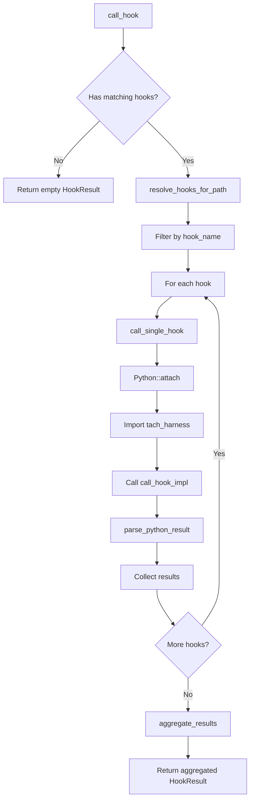

### Result Aggregation Strategies

The `AggregationStrategy` enum defines how multiple hook results are combined:

#### FirstResult (Default)

Returns the first non-None result, used by most hooks:

```rust
AggregationStrategy::FirstResult => {
    for result in results {
        if result.return_value.is_some() {
            aggregated.return_value = result.return_value.clone();
            break;
        }
    }
}
```

#### AllResults

Collects all results into a list:

```rust
AggregationStrategy::AllResults => {
    for result in results {
        if let Some(ref val) = result.return_value {
            aggregated.all_values.push(val.clone());
        }
    }
}
```

#### NoReturn

For side-effect-only hooks where return values are ignored.

### Python Bridge

The `call_single_hook` method uses PyO3 to call into Python:

```rust
fn call_single_hook(&self, hook: &Hook, args: &[(&str, &str)]) -> Result<HookResult> {
    Python::attach(|py| self.call_hook_python(py, hook, args))
}
```

Key steps in `call_hook_python`:

1. Import the `tach_harness` module
2. Get the `call_hook_impl` function
3. Build a Python dictionary from args
4. Call the function with conftest path, function name, and args
5. Parse the result dictionary into `HookResult`

---

## 5. Plugin Detection and Compatibility

### PluginRegistry

The `PluginRegistry` tracks known pytest plugins and their compatibility status with Tach.

### Plugin Status Categories

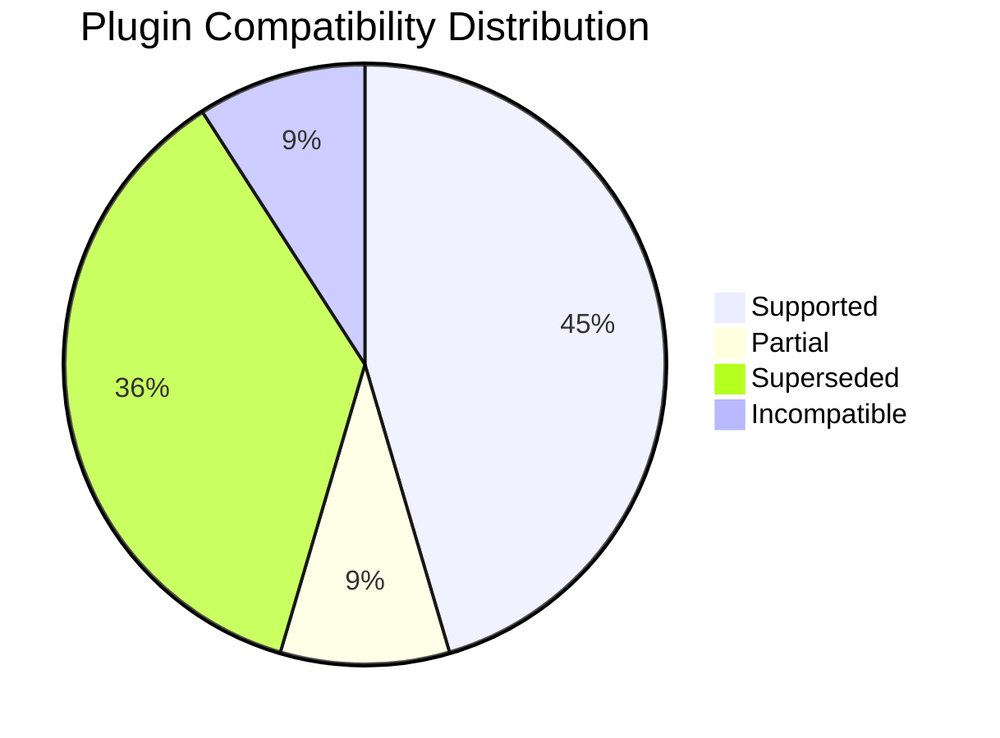

#### Supported Plugins

Full compatibility, work without modification:

| Plugin            | Description                                         |
| ----------------- | --------------------------------------------------- |
| `pytest-django`   | Django test support via marker detection            |
| `pytest-asyncio`  | Async test support via is_async detection           |
| `pytest-mock`     | Mocking fixtures work normally                      |
| `pytest-env`      | Environment variables captured via effect recording |
| `pytest-randomly` | Test randomization works normally                   |

#### Partial Support

Work with limitations:

| Plugin           | Limitations                                               |
| ---------------- | --------------------------------------------------------- |
| `pytest-timeout` | Use Tach's native `--timeout` flag for better integration |

#### Superseded Plugins

Functionality replaced by Tach's native features:

| Plugin            | Tach Equivalent                          |
| ----------------- | ---------------------------------------- |
| `pytest-xdist`    | Tach's native `-n` flag with worker pool |
| `pytest-forked`   | Tach's zygote/fork model                 |
| `pytest-parallel` | Tach's native parallelism                |
| `pytest-cov`      | Tach's `--coverage` flag with PEP 669    |

#### Incompatible Plugins

Known to conflict with Tach:

| Plugin         | Reason                                                       |
| -------------- | ------------------------------------------------------------ |
| `pytest-sugar` | Terminal manipulation conflicts with Tach's progress display |

### Plugin Management API

```rust
impl PluginRegistry {
    fn get_plugin_status(&self, plugin_name: &str) -> PluginStatus;
    fn disable_plugin(&mut self, plugin_name: &str);
    fn enable_plugin(&mut self, plugin_name: &str);
    fn is_disabled(&self, plugin_name: &str) -> bool;
    fn set_priority(&mut self, order: Vec<String>);
    fn superseded_plugins(&self) -> Vec<(&String, &str)>;
    fn incompatible_plugins(&self) -> Vec<(&String, &str)>;
}
```

---

## 6. Effect Recording and Replay

### Effect Types

The `HookEffect` enum captures observable side effects from hook execution:

```rust
pub enum HookEffect {
    SetEnv { key: String, value: String },
    ModifySysPath { action: SysPathAction, path: String },
    RegisterMarker { name: String, description: String },
    ModifyItems { removed: Vec<String>, reordered: bool },
    NoEffect,
}
```

#### SysPathAction

```rust
pub enum SysPathAction {
    Prepend,  // Add to beginning of sys.path
    Append,   // Add to end of sys.path (default)
    Remove,   // Remove from sys.path
}
```

### Effect Recording Flow

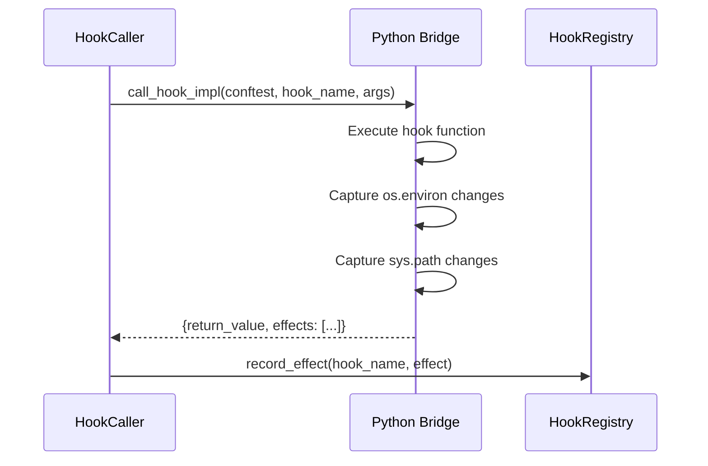

### Session Effect Replay

Workers receive session effects via `get_session_effects()`:

```rust
pub fn get_session_effects(&self) -> Vec<HookEffect> {
    const SESSION_HOOKS: &[&str] = &[
        hook_names::PYTEST_CONFIGURE,
        hook_names::PYTEST_SESSIONSTART,
    ];

    let mut effects = Vec::new();
    for hook_name in SESSION_HOOKS {
        effects.extend(self.get_effects(hook_name).iter().cloned());
    }
    effects
}
```

### Worker Effect Application

When a worker starts, it applies session effects:

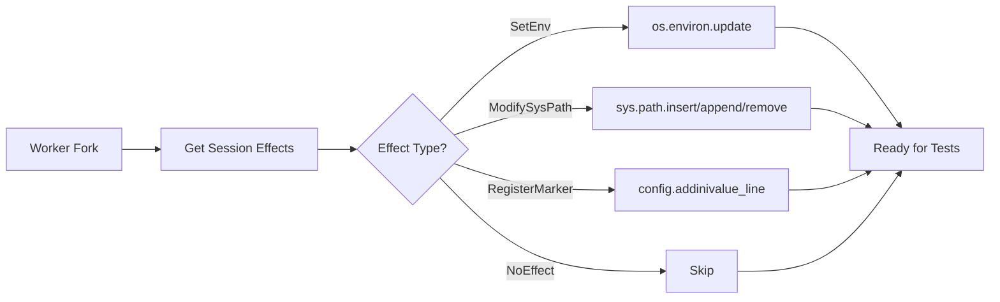

---

## 7. Dependency Graph for Hook Ordering

### HookDependencyGraph

The `HookDependencyGraph` manages hook execution order based on conftest hierarchy and wrapper specifications.

### Conftest Hierarchy Ordering

Hooks execute from root conftest to leaf conftest:

```
/project/conftest.py           # Executes first
/project/tests/conftest.py     # Executes second
/project/tests/unit/conftest.py # Executes last
```

This is implemented via the `sort_hooks_by_depth` function:

```rust
pub fn sort_hooks_by_depth(hooks: &mut [&Hook]) {
    hooks.sort_by_key(|h| h.source.components().count());
}
```

### Wrapper Hook Separation

Wrapper hooks (using `@pytest.hookimpl(hookwrapper=True)`) are tracked separately:

```rust
pub fn add_hook(&mut self, hook: Hook) {
    let name = hook.spec.name.clone();
    if hook.is_wrapper {
        self.wrappers.entry(name).or_default().push(hook);
    } else {
        self.hooks.entry(name).or_default().push(hook);
    }
}
```

### Execution Order Example

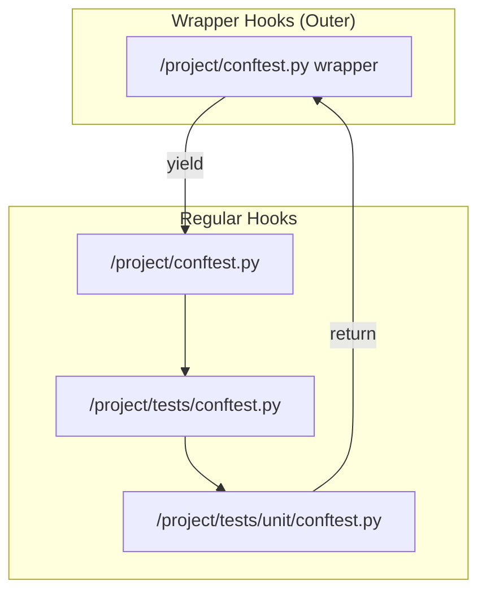

---

## 8. IPC Bridge for Session Effects

### Supervisor-Worker Communication

Session effects must be transmitted from the supervisor to forked workers.

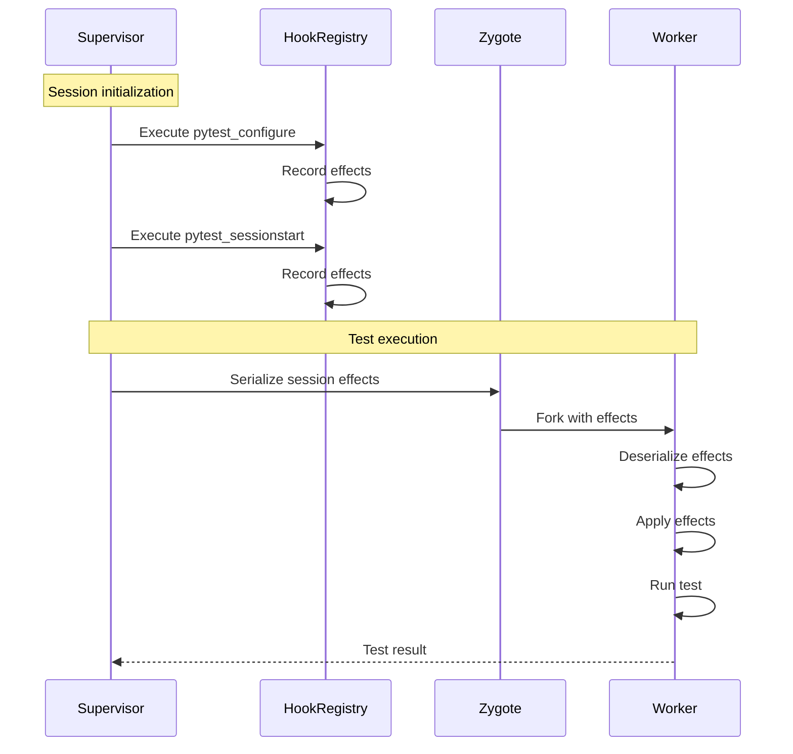

### Serialization Format

Effects are serialized using serde for IPC:

```rust
#[derive(Debug, Clone, PartialEq, Serialize, Deserialize)]
pub enum HookEffect {
    SetEnv { key: String, value: String },
    ModifySysPath { action: SysPathAction, path: String },
    // ...
}
```

Example JSON representation:

```json
{
  "SetEnv": {
    "key": "DATABASE_URL",
    "value": "sqlite:///:memory:"
  }
}
```

---

## 9. Comparison with Pluggy Architecture

### Pluggy Overview

Pluggy is pytest's plugin system, providing:

- Dynamic hook specification via `HookspecMarker`
- Plugin registration via `PluginManager`
- Hook calling with result aggregation
- Wrapper hooks via `hookwrapper=True`

### Tach's Simplified Approach

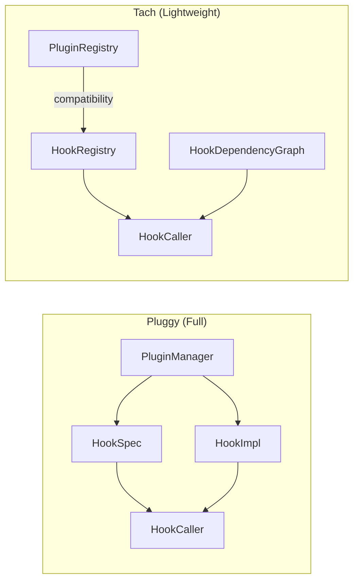

### Key Differences

| Aspect             | Pluggy                | Tach                              |
| ------------------ | --------------------- | --------------------------------- |
| Hook discovery     | Runtime introspection | Static AST analysis               |
| Plugin loading     | Dynamic import        | Conftest-only                     |
| Hook specification | Marker-based          | Predefined specs                  |
| Effect tracking    | None                  | First-class effects               |
| Result aggregation | Multiple strategies   | FirstResult, AllResults, NoReturn |
| Wrapper support    | Full                  | Tracked but simplified            |
| Performance        | Runtime overhead      | Pre-computed                      |

### Why Not Use Pluggy Directly?

1. **Performance**: Pluggy requires Python execution for hook discovery
2. **Forking**: Pluggy's plugin manager state is complex to fork
3. **Effect tracking**: Tach needs to record effects for replay
4. **Simplicity**: Tach only needs common pytest hooks, not full extensibility

---

## 10. Code Reference Guide

### Module Structure

```
src/hooks/
  mod.rs           # Module exports and sort_hooks_by_depth
  registry.rs      # HookRegistry, HookSpec, Hook, HookResult, HookEffect
  caller.rs        # HookCaller with Python bridge
  plugins.rs       # PluginRegistry and PluginStatus
  graph.rs         # HookDependencyGraph
```

### Key Functions

#### Registry Functions

| Function                               | Location      | Purpose                          |
| -------------------------------------- | ------------- | -------------------------------- |
| `HookRegistry::register`               | `registry.rs` | Register a hook from conftest    |
| `HookRegistry::get_hooks`              | `registry.rs` | Get all hooks for a name         |
| `HookRegistry::record_effect`          | `registry.rs` | Store effect from execution      |
| `HookRegistry::get_session_effects`    | `registry.rs` | Get effects for worker replay    |
| `HookRegistry::resolve_hooks_for_path` | `registry.rs` | Get hooks applicable to test     |
| `HookRegistry::file_has_toxic_hooks`   | `registry.rs` | Check toxicity for file          |
| `builtin_hook_specs`                   | `registry.rs` | Get standard hook specifications |
| `aggregate_results`                    | `registry.rs` | Combine multiple hook results    |

#### Caller Functions

| Function                          | Location    | Purpose                           |
| --------------------------------- | ----------- | --------------------------------- |
| `HookCaller::new`                 | `caller.rs` | Create caller with registry       |
| `HookCaller::call_hook`           | `caller.rs` | Call hook for specific test path  |
| `HookCaller::call_all_hooks`      | `caller.rs` | Call all hooks of a name          |
| `HookCaller::call_single_hook`    | `caller.rs` | Execute one hook via Python       |
| `HookCaller::parse_python_result` | `caller.rs` | Convert Python dict to HookResult |
| `HookCaller::parse_effect`        | `caller.rs` | Parse single effect from Python   |

#### Graph Functions

| Function                                   | Location   | Purpose                  |
| ------------------------------------------ | ---------- | ------------------------ |
| `HookDependencyGraph::add_hook`            | `graph.rs` | Add hook to graph        |
| `HookDependencyGraph::get_execution_order` | `graph.rs` | Get hooks in depth order |
| `HookDependencyGraph::get_wrappers`        | `graph.rs` | Get wrapper hooks        |
| `sort_hooks_by_depth`                      | `mod.rs`   | Sort hooks by path depth |

#### Plugin Functions

| Function                             | Location     | Purpose                   |
| ------------------------------------ | ------------ | ------------------------- |
| `PluginRegistry::new`                | `plugins.rs` | Create with known plugins |
| `PluginRegistry::get_plugin_status`  | `plugins.rs` | Check compatibility       |
| `PluginRegistry::disable_plugin`     | `plugins.rs` | Disable a plugin          |
| `PluginRegistry::superseded_plugins` | `plugins.rs` | Get Tach-replaced plugins |

---

## 11. Integration with Toxicity System

### Toxicity Classification

Hooks that set `modifies_global_state: true` affect test toxicity:

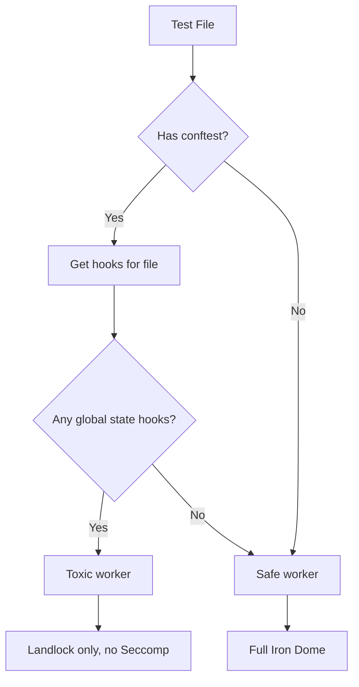

### file_has_toxic_hooks Implementation

The `file_has_toxic_hooks` method handles path normalization for robust matching:

1. Direct path comparison
2. Canonicalized path comparison
3. Cross-canonicalization (input vs stored)

This ensures hooks are found regardless of whether paths are relative or absolute.

---

## 12. Future Considerations

### Planned Improvements (v0.3.0+)

1. **Marker Registration Tracking**: Implement `RegisterMarker` effect emission when `config.addinivalue_line("markers", ...)` is called

2. **Fixture Hook Support**: Add hooks for fixture lifecycle:
   - `pytest_fixture_setup`
   - `pytest_fixture_post_setup`

3. **Database Transaction Hooks**: For Phase 3 database integration:
   - Transaction boundary tracking
   - Rollback effect recording

### Wrapper Hook Execution

Currently wrapper hooks are tracked but not fully executed in the pluggy-compatible way. Future work may include:

- Proper yield/resume semantics
- Inner hook result access
- Exception propagation

---

## References

### Internal Documentation

- [Roadmap - Phase 2](./roadmap.md) - Plugin ecosystem development plan
- [External Research](./external-research.md) - Related projects and technologies

### External Resources

- [pytest Hook Reference](https://docs.pytest.org/en/stable/reference/reference.html#hooks)
- [pluggy Documentation](https://pluggy.readthedocs.io/)
- [PyO3 User Guide](https://pyo3.rs/)

---

_Last Updated: 2026-01-17_
