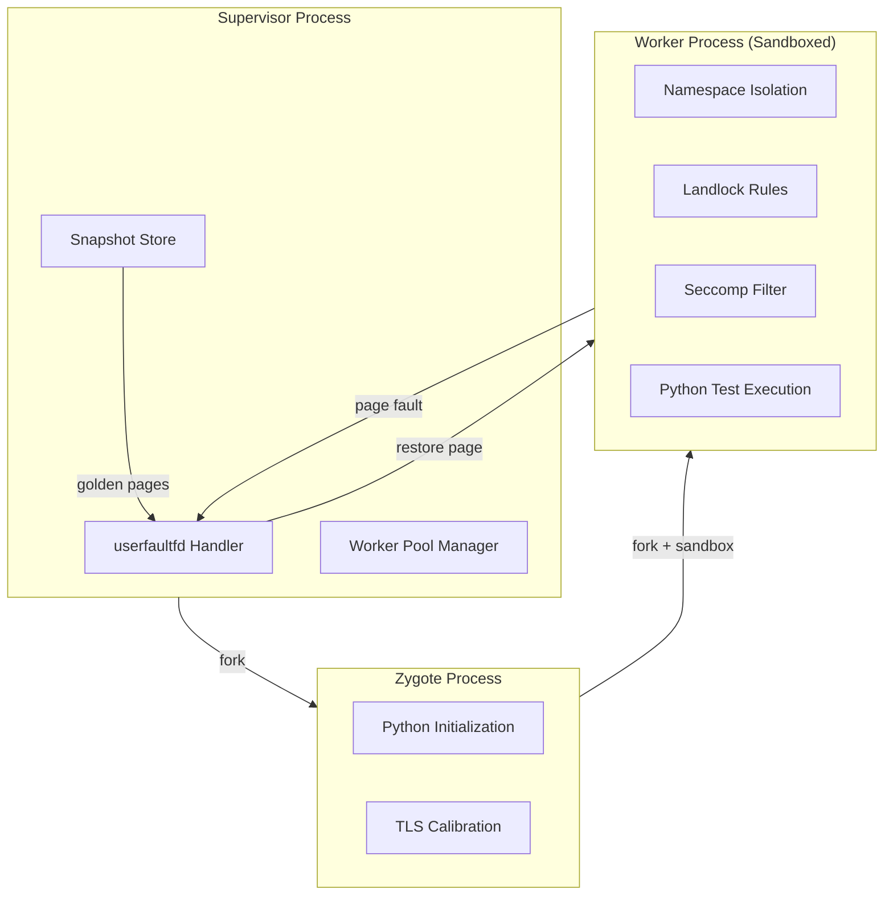
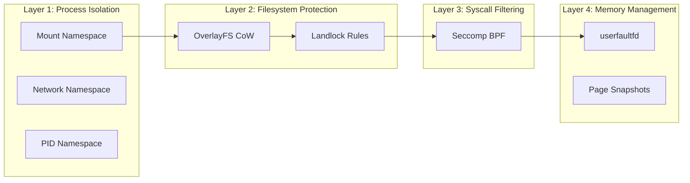
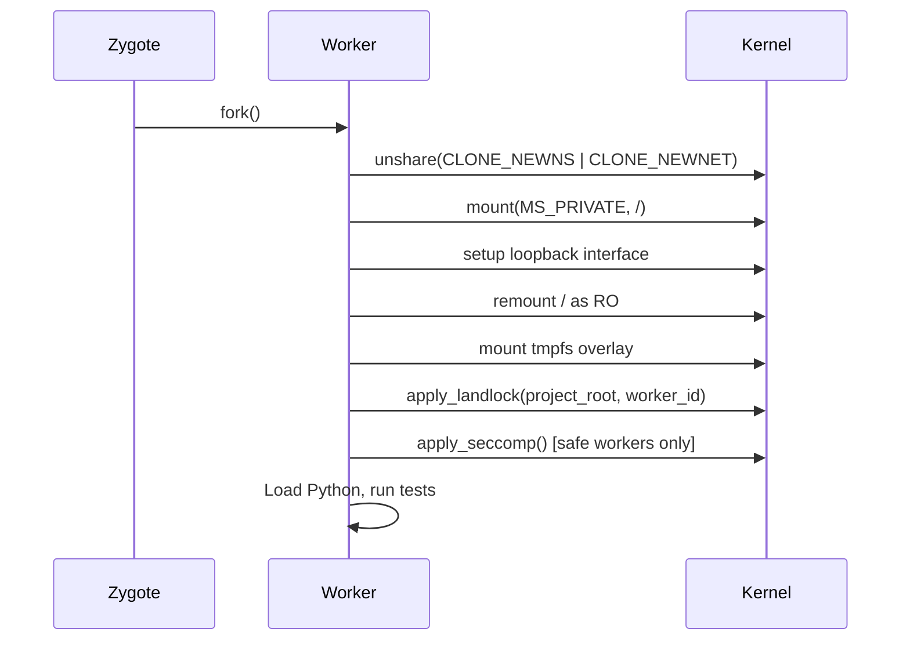
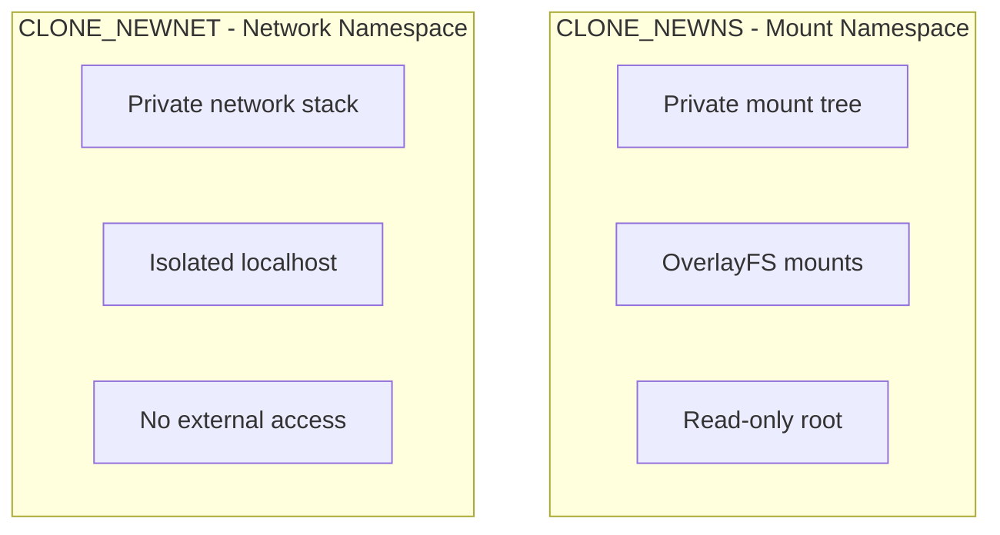
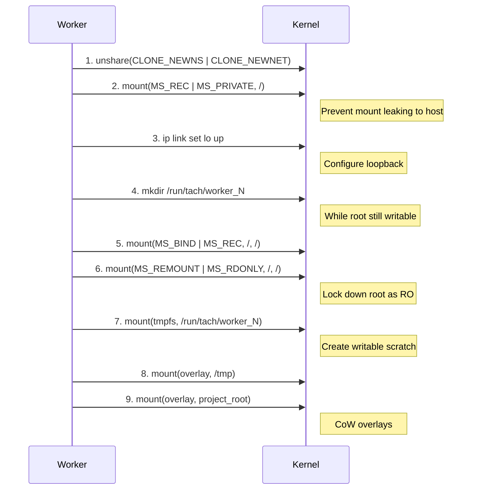
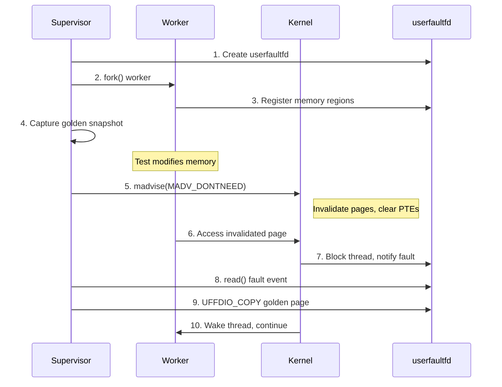
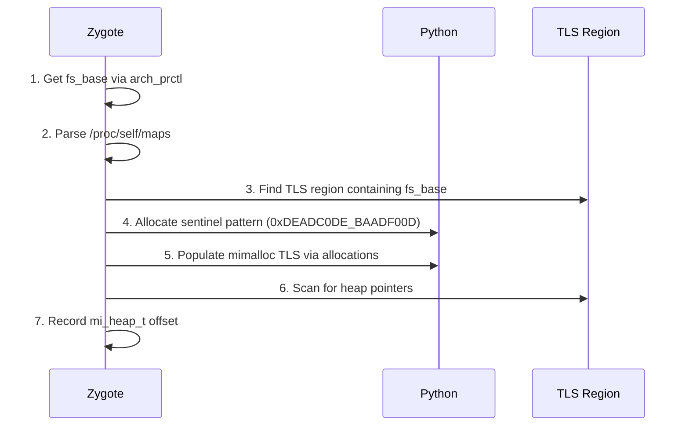
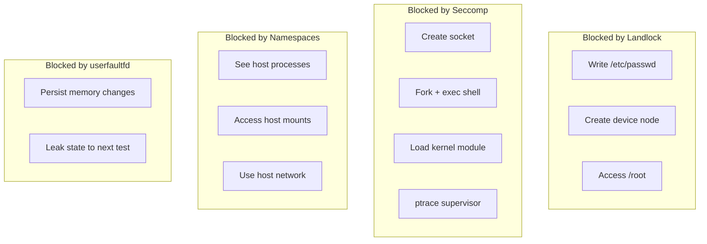

# Isolation Deep Dive: Tach's Security and Snapshotting Architecture

> **Purpose**: Comprehensive technical documentation of Tach's isolation subsystem, including Landlock, Seccomp, Linux namespaces, userfaultfd memory snapshotting, and kernel feature calibration.
>
> **Audience**: Contributors, security auditors, and users needing deep understanding of Tach internals.
>
> **Related**: [external-research.md](external-research.md), [container-compatibility.md](container-compatibility.md)

---

## Table of Contents

1. [Architecture Overview](#1-architecture-overview)
2. [The Iron Dome: Defense-in-Depth Security](#2-the-iron-dome-defense-in-depth-security)
3. [Landlock Filesystem Isolation](#3-landlock-filesystem-isolation)
4. [Seccomp Syscall Filtering](#4-seccomp-syscall-filtering)
5. [Linux Namespace Isolation](#5-linux-namespace-isolation)
6. [userfaultfd Memory Snapshotting](#6-userfaultfd-memory-snapshotting)
7. [Calibration System](#7-calibration-system)
8. [Performance Characteristics](#8-performance-characteristics)
9. [Security Model and Threat Analysis](#9-security-model-and-threat-analysis)
10. [Code Reference Guide](#10-code-reference-guide)

---

## 1. Architecture Overview

Tach's isolation system provides multiple layers of protection to ensure test isolation while maintaining high performance. The architecture combines Linux kernel security primitives with memory snapshotting for rapid worker recycling.

### High-Level Architecture



### Isolation Stack Layers



### Safe vs Toxic Worker Differentiation

| Aspect         | Safe Worker                | Toxic Worker                           |
| -------------- | -------------------------- | -------------------------------------- |
| Landlock       | ENFORCED                   | ENFORCED                               |
| Seccomp        | ENFORCED                   | SKIPPED                                |
| Network Access | BLOCKED                    | ALLOWED                                |
| Fork/Exec      | BLOCKED                    | ALLOWED                                |
| Worker Reuse   | YES (pool)                 | NO (exit after test)                   |
| Use Case       | Unit tests, pure functions | Integration tests, subprocess spawning |

**Rationale**: Toxic workers need subprocess support for integration tests that spawn child processes, make network calls, or use multiprocessing. Safe workers get full protection since they don't need these capabilities.

---

## 2. The Iron Dome: Defense-in-Depth Security

The "Iron Dome" is Tach's multi-layered security system that transforms each worker from a generic process into a restricted execution unit.

### Security Layer Integration Sequence

The order of operations is critical for security:



### Defense Layers Summary

| Layer | Technology       | Protects Against                       |
| ----- | ---------------- | -------------------------------------- |
| 1     | Linux Namespaces | Process visibility, mount leakage      |
| 2     | OverlayFS        | Persistent filesystem modifications    |
| 3     | Landlock         | Filesystem escape, unauthorized access |
| 4     | Seccomp          | Dangerous syscalls, network access     |
| 5     | userfaultfd      | Memory state leakage between tests     |

### Graceful Degradation Philosophy

Both Landlock and Seccomp are designed to fail gracefully:

- If kernel doesn't support Landlock (< 5.13): log warning, continue
- If Seccomp setup fails: log warning, continue
- The test runner must remain functional on older kernels (e.g., AWS Lambda)

**Key Function**: `apply_iron_dome` in `sandbox.rs`

---

## 3. Landlock Filesystem Isolation

Landlock is a Linux Security Module (LSM) that provides unprivileged filesystem sandboxing. Tach uses Landlock to restrict which paths workers can read/write.

### ABI Version Strategy

| ABI Version | Kernel | Features                                        | Tach Usage         |
| ----------- | ------ | ----------------------------------------------- | ------------------ |
| V1          | 5.13+  | Basic filesystem access                         | **Primary target** |
| V2          | 5.19+  | `LANDLOCK_ACCESS_FS_REFER` (rename across dirs) | Future             |
| V3          | 6.2+   | `LANDLOCK_ACCESS_FS_TRUNCATE`                   | Future             |
| V4          | 6.7+   | Network restrictions (TCP bind/connect)         | Future             |
| V5          | 6.10+  | `LANDLOCK_ACCESS_FS_IOCTL_DEV`                  | Future             |

**Design Decision**: Tach uses ABI V1 for maximum kernel compatibility (5.13+). Higher ABIs add features but reduce portability.

### Filesystem Access Rules

```mermaid
graph TD
    subgraph "READ-ONLY Access"
        RO1[/usr - System libraries]
        RO2[/lib, /lib64 - Libraries]
        RO3[/bin - Binaries]
        RO4[/etc - Configuration]
        RO5[/dev - Device nodes]
        RO6[/proc - Process info]
        RO7[/sys - Hardware info]
        RO8[/opt - CI environments]
    end

    subgraph "SAFE WRITE Access"
        SW1[project_root - With restrictions]
    end

    subgraph "FULL Access"
        FW1[/tmp - Overlay mount]
        FW2[/run/tach/worker_N - Scratch space]
    end

    subgraph "DENIED"
        D1[Everything else]
    end
```

### Safe Write Access Definition

Project root gets "safe write" access that excludes dangerous device/socket creation:

```
Safe write = ReadFile | WriteFile | ReadDir | RemoveDir |
             RemoveFile | MakeDir | MakeReg | MakeSym | Execute
```

**Excluded operations** (for security):

- `MAKE_CHAR` - Character device creation
- `MAKE_BLOCK` - Block device creation
- `MAKE_FIFO` - Named pipe creation
- `MAKE_SOCK` - Unix socket creation

**Security Rationale**: Prevents device node creation escape attacks where a malicious test could create `/dev/sda` inside project_root and access the host disk.

### Path Canonicalization

All paths are canonicalized before adding Landlock rules:

- Prevents symlink-based escapes
- Ensures absolute paths
- TOCTOU-safe: uses `PathFd::new()` directly instead of `path.exists()` check

**Key Functions**:

- `apply_landlock` - Main Landlock application
- `add_path_rule` - Add rule for required path (fails if missing)
- `add_path_rule_if_exists` - Add rule for optional path (TOCTOU-safe)

### Enforcement Status

```rust
pub enum SandboxStatus {
    FullyEnforced,      // All requested restrictions active
    PartiallyEnforced,  // Some features unavailable (older kernel)
    NotEnforced,        // Landlock not available (< 5.13)
}
```

---

## 4. Seccomp Syscall Filtering

Seccomp (Secure Computing Mode) provides syscall filtering via BPF programs. Tach uses a **blacklist approach** rather than whitelist.

### Why Blacklist Instead of Whitelist?

A whitelist approach is problematic for Python because:

1. Python's syscall footprint changes between versions (3.11 vs 3.12 vs 3.13)
2. C extensions may use arbitrary syscalls that we can't predict
3. A missed syscall causes SIGSYS crash, not a graceful error

The blacklist approach only blocks known-dangerous syscalls while allowing everything else.

### Blocked Syscalls

#### Network Syscalls

| Syscall              | Purpose                 | Why Blocked                        |
| -------------------- | ----------------------- | ---------------------------------- |
| `socket`             | Create network sockets  | Tests shouldn't make network calls |
| `bind`               | Bind to addresses       | Prevents server creation           |
| `connect`            | Connect to remote hosts | Prevents outbound connections      |
| `listen`             | Listen for connections  | Prevents server creation           |
| `accept` / `accept4` | Accept connections      | Prevents server creation           |

#### Process Syscalls

| Syscall               | Purpose                 | Why Blocked                         |
| --------------------- | ----------------------- | ----------------------------------- |
| `fork`                | Create child process    | Prevents process spawning           |
| `vfork`               | Fork with shared memory | Prevents process spawning           |
| `execve` / `execveat` | Execute new program     | Prevents running arbitrary binaries |

#### Memory Syscalls

| Syscall             | Purpose                        | Why Blocked                            |
| ------------------- | ------------------------------ | -------------------------------------- |
| `userfaultfd`       | User-space page fault handling | Could interfere with supervisor's UFFD |
| `process_vm_readv`  | Cross-process memory read      | Security boundary violation            |
| `process_vm_writev` | Cross-process memory write     | Security boundary violation            |

#### Privilege Escalation Syscalls

| Syscall                        | Purpose                     | Why Blocked                  |
| ------------------------------ | --------------------------- | ---------------------------- |
| `ptrace`                       | Debug/trace other processes | Sandbox escape vector        |
| `mount` / `umount2`            | Mount filesystems           | Privilege escalation         |
| `unshare`                      | Create new namespaces       | Sandbox escape               |
| `setns`                        | Join existing namespaces    | Sandbox escape               |
| `keyctl`                       | Kernel keyring manipulation | Privilege escalation         |
| `kexec_load`                   | Load new kernel             | Critical system modification |
| `init_module` / `finit_module` | Load kernel modules         | Critical system modification |

### Why clone() Must NEVER Be Blocked

Python's threading module uses `clone()` with `CLONE_VM | CLONE_THREAD` flags to create OS threads. Blocking clone() breaks:

- `threading.Thread()` - Cannot start threads
- `concurrent.futures.ThreadPoolExecutor` - Completely broken
- GIL release during I/O - Some implementations use threads

**Defense Strategy**: Block `execve` instead. A forked process that cannot exec and cannot write (Landlock) is effectively neutered:

```
Malicious test attempt:
  1. fork() -> ALLOWED (but clone() with CLONE_VM works)
  2. execve("/bin/sh") -> BLOCKED by Seccomp -> EPERM
  3. open("/etc/passwd", O_WRONLY) -> BLOCKED by Landlock -> EACCES
```

### Filter Action

Blocked syscalls return `EPERM` (not `SIGSYS/Trap`) to allow Python code to handle errors gracefully via `OSError`.

**Key Function**: `apply_seccomp` in `sandbox.rs`

---

## 5. Linux Namespace Isolation

Tach uses Linux namespaces to provide process and filesystem isolation without Docker.

### Namespaces Used



### Mount Namespace Setup Sequence

The sequence is critical - steps must happen in order:



### OverlayFS Configuration

Each worker gets private overlay filesystems for `/tmp` and project directory:

```
/run/tach/worker_N/
  ├── tmp_upper/      # Writes to /tmp go here
  ├── tmp_work/       # OverlayFS workdir
  ├── proj_upper/     # Writes to project go here
  └── proj_work/      # OverlayFS workdir

Overlay mount options:
  lowerdir=/tmp,upperdir=tmp_upper,workdir=tmp_work
  lowerdir=<project>,upperdir=proj_upper,workdir=proj_work
```

### Network Namespace

Each worker gets its own network namespace with:

- Private network stack
- Isolated localhost (127.0.0.1)
- Loopback interface brought up via `ip link set lo up`

**Dependency**: Requires `iproute2` package for the `ip` command.

### TACH_NO_ISOLATION Mode

Setting `TACH_NO_ISOLATION=1` skips all isolation for benchmarking/debugging. This bypasses namespaces, overlays, and returns early from `setup_filesystem`.

**Key Functions**:

- `setup_filesystem` - Main isolation setup
- `setup_loopback` - Network namespace loopback configuration
- `worker_base_dir` - Calculate worker scratch directory path
- `tmp_overlay_options` / `project_overlay_options` - Generate overlay mount strings

---

## 6. userfaultfd Memory Snapshotting

userfaultfd is the core technology enabling Tach's sub-millisecond worker reset. This section documents the snapshotting mechanics.

> **Note**: This section provides an overview. For full implementation details (2500+ lines), see `snapshot.rs`.

### How userfaultfd Works



### Key Concepts

#### 1. Registration

Memory regions are registered with `UFFDIO_REGISTER`. The kernel marks these as "userfaultfd-managed."

#### 2. Invalidation

`madvise(MADV_DONTNEED)` discards pages without unmapping:

- Virtual address range remains valid
- Physical pages released
- PTEs cleared (Present bit = 0)

#### 3. Fault Handling

When worker accesses an invalidated page:

- CPU raises page fault
- Kernel checks: is region registered with userfaultfd?
- If yes: block thread, notify UFFD owner (supervisor)
- Supervisor receives fault via `read()` on UFFD fd

#### 4. Page Restoration

Supervisor copies golden page via `UFFDIO_COPY`:

- Source: stored snapshot data
- Destination: faulted address
- Wake: resume blocked thread

### Snapshot Regions

The snapshot manager tracks multiple memory region types:

| Region Type | Description               | Snapshot Strategy   |
| ----------- | ------------------------- | ------------------- |
| Heap        | Python object allocations | Full snapshot       |
| BSS         | Uninitialized data        | Full snapshot       |
| Data        | Initialized globals       | Full snapshot       |
| TLS         | Thread-local storage      | Calibrated offsets  |
| Stack       | Call stack                | Per-thread handling |

### Vectorized Restore

For performance, Tach uses vectorized restore operations that handle multiple pages in a single syscall:

```rust
pub struct VectorizedRestoreResult {
    pub pages_restored: usize,
    pub bytes_copied: usize,
    pub faults_handled: usize,
}
```

### Performance Target

- **Goal**: < 50 microseconds reset (vs ~1ms fork)
- **Method**: Lazy page restoration - only restore pages actually accessed
- **Optimization**: Pre-fault hot pages during worker initialization

**Key Module**: `snapshot.rs` (2500+ lines - consider splitting if expanding)

---

## 7. Calibration System

The calibration system automatically discovers TLS (Thread-Local Storage) offsets at Zygote warm-up time, eliminating hardcoded values.

### The Problem

TLS offsets vary with:

- Python version (3.13.x vs 3.14.x)
- glibc version
- libpython build configuration
- Number of loaded C-extensions (TensorFlow, PyTorch expand the DTV)

Hardcoding offsets like `0xad8` makes Tach brittle. A glibc security patch could shift offsets, causing heap corruption.

### The Solution: Runtime Sentinel Scan



### Sentinel Pattern

```rust
pub const SENTINEL_PATTERN: u64 = 0xDEADC0DE_BAADF00D;
```

Properties:

- Unlikely to appear naturally in memory
- Properly aligned (8-byte boundary)
- Triggers mimalloc TLS population when allocated via Python

### Calibration Process

1. **Get fs_base**: Use `arch_prctl(ARCH_GET_FS)` to get Thread Control Block base
2. **Parse memory maps**: Read `/proc/self/maps` to find mapped regions
3. **Find TLS region**: Locate region containing fs_base
4. **Populate mimalloc TLS**: Allocate Python objects to populate thread-local bins
5. **Allocate sentinel**: Create ctypes.c_uint64 with sentinel pattern
6. **Scan for heap pointers**: Walk TLS region looking for heap region pointers
7. **Record offsets**: Store discovered `mi_heap_t` offset for snapshot restoration

### Calibration Result

```rust
pub struct TlsCalibration {
    pub fs_base: usize,
    pub mi_heap_offset: Option<usize>,
    pub heap_pointer_offsets: Vec<HeapPointerInfo>,
    pub tls_region_size: usize,
    pub calibrated: bool,
}
```

### When Calibration Fails

If no heap pointers are found in TLS:

- May indicate Python < 3.13 (uses pymalloc, no TLS caching)
- Tach should exit with `ERR_CALIBRATION_FAILED`
- Log diagnostic information for debugging

**Key Functions**:

- `TlsCalibration::calibrate` - Main calibration entry point
- `get_fs_base` - Get Thread Control Block base address
- `parse_memory_maps` - Parse /proc/self/maps
- `scan_tls_for_pointers` - Scan TLS for heap references
- `allocate_sentinel` - Create sentinel in Python heap
- `populate_mimalloc_tls` - Force TLS structure population

---

## 8. Performance Characteristics

### Isolation Overhead

| Operation           | Time               | Notes                  |
| ------------------- | ------------------ | ---------------------- |
| Namespace creation  | ~100-200 us        | One-time per worker    |
| Landlock setup      | ~50-100 us         | One-time per worker    |
| Seccomp filter load | ~20-50 us          | One-time per worker    |
| OverlayFS mount     | ~200-500 us        | One-time per worker    |
| **Total setup**     | **~500 us - 1 ms** | Amortized across tests |

### Snapshot Performance

| Operation           | Time        | Notes                 |
| ------------------- | ----------- | --------------------- |
| Page fault handling | ~5-10 us    | Per faulted page      |
| UFFDIO_COPY         | ~2-5 us     | Per 4KB page          |
| madvise(DONTNEED)   | ~1-3 us     | Per page              |
| **Full reset**      | **< 50 us** | Target (vs ~1ms fork) |

### Memory Overhead

| Component            | Overhead             | Notes                      |
| -------------------- | -------------------- | -------------------------- |
| Golden snapshot      | Proportional to heap | Only modified pages stored |
| OverlayFS upperdir   | Only modified files  | CoW semantics              |
| Worker scratch space | ~100MB tmpfs         | Configurable               |

### Comparison with Alternatives

| Technique             | Reset Time    | Memory     | Isolation |
| --------------------- | ------------- | ---------- | --------- |
| Fork per test         | ~500-1000 us  | High (CoW) | Complete  |
| Fork server           | ~100-200 us   | Medium     | Complete  |
| **Tach userfaultfd**  | **~10-50 us** | Low        | Complete  |
| Kernel snapshot (LKM) | ~1-5 us       | Minimal    | Complete  |
| No isolation          | 0             | None       | None      |

---

## 9. Security Model and Threat Analysis

### Threat Model

Tach protects against:

1. **Malicious test code** attempting to:
   - Modify system files (/etc, /usr, /bin)
   - Spawn persistent processes
   - Make network connections
   - Access other tests' state
   - Escape sandbox to host

2. **Buggy test code** that might:
   - Corrupt shared state
   - Leave behind temporary files
   - Leak file descriptors
   - Modify environment variables

### Security Guarantees

| Threat             | Mitigation                      | Enforcement |
| ------------------ | ------------------------------- | ----------- |
| Write to /etc      | Landlock read-only rule         | Kernel      |
| Network access     | Seccomp socket block            | Kernel      |
| Process spawn      | Seccomp fork/exec block         | Kernel      |
| Mount manipulation | Seccomp mount block + namespace | Kernel      |
| State leakage      | userfaultfd reset               | Supervisor  |
| File leakage       | OverlayFS isolation             | Kernel      |

### Attack Surface Analysis



### Residual Risks

| Risk                        | Severity | Mitigation Status                          |
| --------------------------- | -------- | ------------------------------------------ |
| Kernel vulnerability        | High     | Out of scope - kernel responsibility       |
| Time-based side channels    | Low      | Not addressed - low priority for tests     |
| CPU cache side channels     | Low      | Not addressed - requires microarch changes |
| Privileged container escape | Medium   | Relies on container security               |

### Safe vs Toxic Classification

Tests are classified as "toxic" if they:

- Use `subprocess` or `os.system()`
- Create threads with native extensions
- Use `ctypes` for FFI
- Access network resources
- Use multiprocessing

Toxic tests skip Seccomp filtering but still get Landlock filesystem protection.

---

## 10. Code Reference Guide

### Module Structure

```
src/isolation/
  ├── mod.rs           # Module exports
  ├── sandbox.rs       # Landlock + Seccomp (Iron Dome)
  ├── namespace.rs     # Linux namespace setup
  ├── snapshot.rs      # userfaultfd memory management
  └── calibration.rs   # TLS offset discovery
```

### Key Functions by Module

#### sandbox.rs

| Function                  | Purpose                                |
| ------------------------- | -------------------------------------- |
| `apply_landlock`          | Apply Landlock filesystem restrictions |
| `apply_seccomp`           | Apply Seccomp syscall blacklist        |
| `apply_iron_dome`         | Combined sandbox application           |
| `add_path_rule`           | Add required path to Landlock ruleset  |
| `add_path_rule_if_exists` | Add optional path (TOCTOU-safe)        |

#### namespace.rs

| Function                  | Purpose                               |
| ------------------------- | ------------------------------------- |
| `setup_filesystem`        | Complete isolation setup              |
| `setup_loopback`          | Configure network namespace loopback  |
| `worker_base_dir`         | Calculate worker scratch path         |
| `tmp_overlay_options`     | Generate /tmp overlay mount string    |
| `project_overlay_options` | Generate project overlay mount string |
| `is_isolation_disabled`   | Check TACH_NO_ISOLATION env var       |

#### calibration.rs

| Function                    | Purpose                        |
| --------------------------- | ------------------------------ |
| `TlsCalibration::calibrate` | Main calibration entry point   |
| `get_fs_base`               | Get fs_base via arch_prctl     |
| `parse_memory_maps`         | Parse /proc/self/maps          |
| `find_containing_region`    | Find region containing address |
| `allocate_sentinel`         | Create sentinel in Python heap |
| `populate_mimalloc_tls`     | Force TLS structure population |
| `scan_tls_for_pointers`     | Scan TLS for heap references   |

#### snapshot.rs

> Note: This module is extensive (2500+ lines). Key areas include:
>
> - Snapshot capture and storage
> - userfaultfd registration and handling
> - Page fault processing
> - Vectorized restore operations
> - Memory region tracking

### Key Types

| Type              | Module         | Purpose                     |
| ----------------- | -------------- | --------------------------- |
| `SandboxStatus`   | sandbox.rs     | Landlock enforcement status |
| `TlsCalibration`  | calibration.rs | Calibration result          |
| `HeapPointerInfo` | calibration.rs | Discovered heap pointer     |
| `MemoryRegion`    | calibration.rs | Parsed memory map entry     |

### Error Handling Patterns

All functions use `anyhow::Result` for error handling with context:

```rust
// Good: Error with context
path.canonicalize()
    .context("Failed to canonicalize project_root for Landlock")?;

// Graceful degradation pattern
match apply_landlock(project_root, worker_id) {
    Ok(SandboxStatus::FullyEnforced) => { /* Ideal */ }
    Ok(SandboxStatus::NotEnforced) => {
        eprintln!("[worker] WARNING: Landlock not enforced");
    }
    Err(e) => {
        eprintln!("[worker] WARNING: Landlock failed: {}", e);
    }
}
```

---

## Appendix: Kernel Requirements

### Minimum Kernel Versions

| Feature         | Minimum Kernel | Tach Behavior if Missing |
| --------------- | -------------- | ------------------------ |
| Landlock ABI V1 | 5.13           | Graceful degradation     |
| Seccomp BPF     | 3.5            | Graceful degradation     |
| userfaultfd     | 4.3            | Feature disabled         |
| CLONE_NEWNS     | 2.4.19         | Always available         |
| CLONE_NEWNET    | 2.6.24         | Always available         |
| OverlayFS       | 3.18           | Required for isolation   |

### Recommended Configuration

```bash
# Verify kernel support
./target/release/tach-core self-test

# Enable unprivileged userfaultfd (if needed)
sudo sysctl vm.unprivileged_userfaultfd=1
```

### Container Requirements

See [container-compatibility.md](container-compatibility.md) for Docker/Kubernetes configuration.

---

_Last Updated: 2026-01-17_
