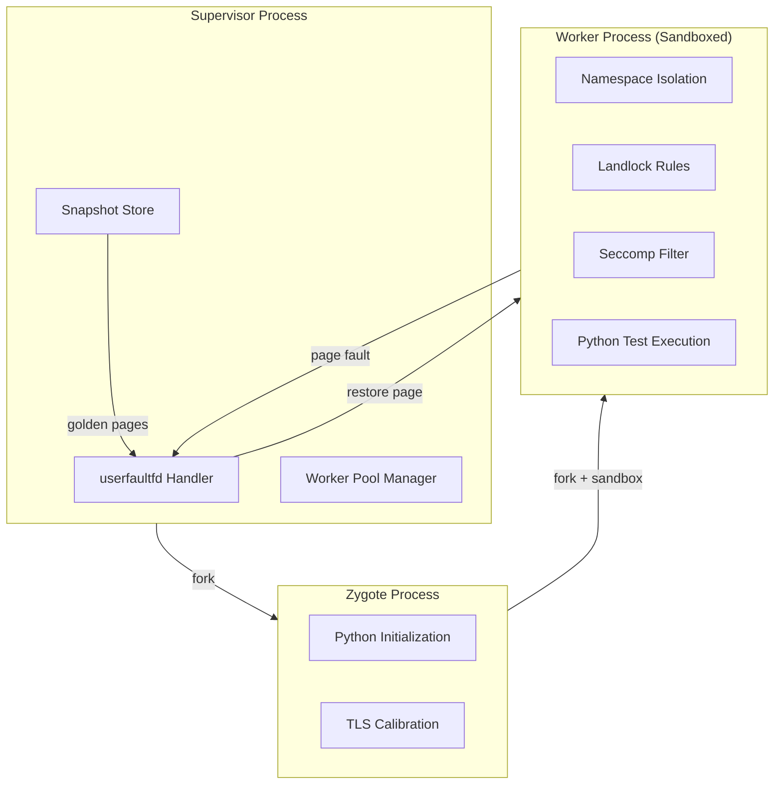
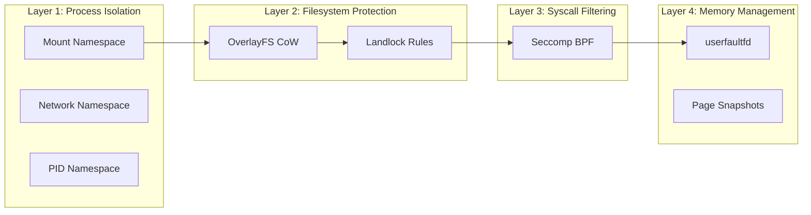
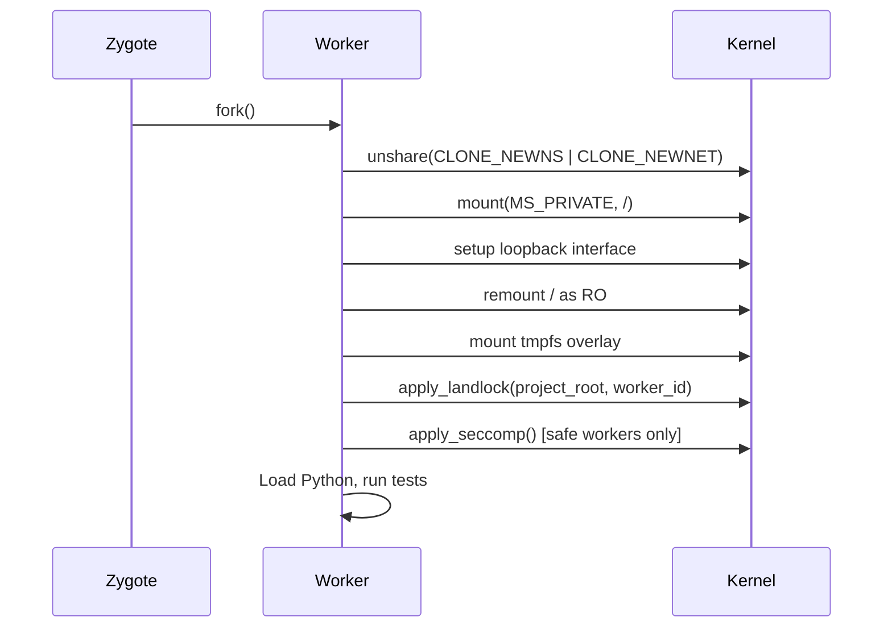
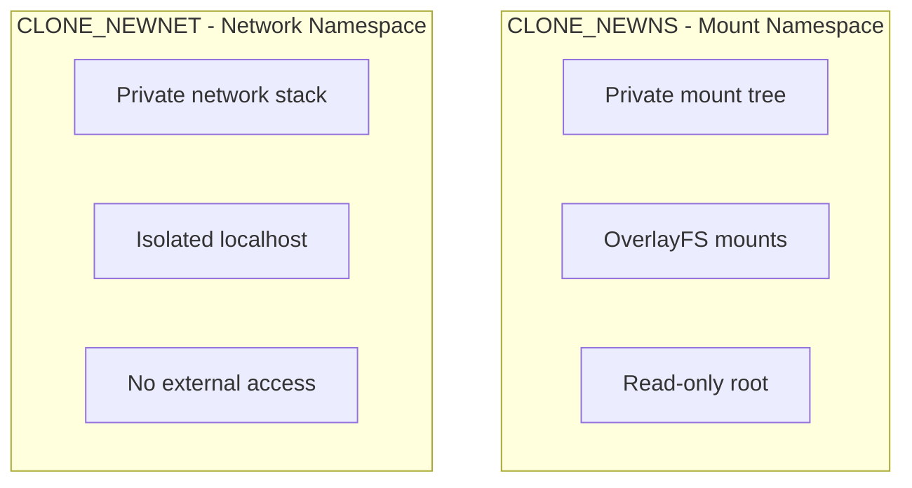
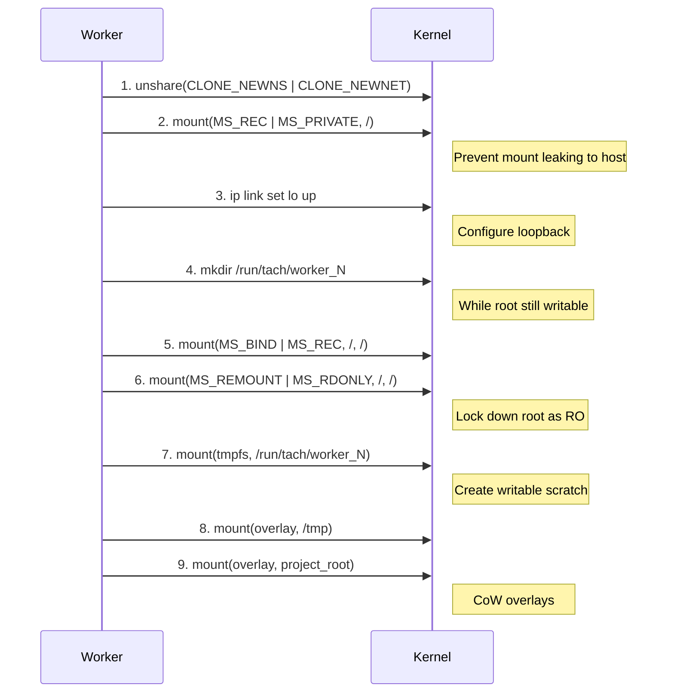
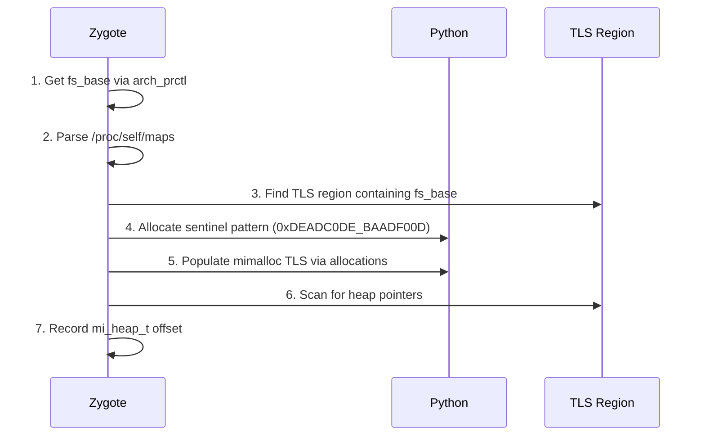

# Isolation Overview: Tach's Security and Snapshotting Architecture

> **Purpose**: High-level overview of Tach's isolation subsystem with links to detailed component documentation.
>
> **Audience**: Contributors, security auditors, and users needing understanding of Tach internals.
>
> **Related**: [external-research.md](external-research.md), [container-compatibility.md](container-compatibility.md)

---

## Component Documentation

This document provides an overview. For detailed documentation on each isolation component:

| Component       | Document                                             | Description                                     |
| --------------- | ---------------------------------------------------- | ----------------------------------------------- |
| **Landlock**    | [isolation-landlock.md](isolation-landlock.md)       | Filesystem sandboxing via Linux Security Module |
| **Seccomp**     | [isolation-seccomp.md](isolation-seccomp.md)         | Syscall filtering via BPF programs              |
| **userfaultfd** | [isolation-userfaultfd.md](isolation-userfaultfd.md) | Memory snapshotting and restoration             |

---

## Architecture Overview

Tach's isolation system provides multiple layers of protection to ensure test isolation while maintaining high performance. The architecture combines Linux kernel security primitives with memory snapshotting for rapid worker recycling.

### High-Level Architecture



### Isolation Stack Layers



### Safe vs Toxic Worker Differentiation

| Aspect         | Safe Worker                | Toxic Worker                           |
| -------------- | -------------------------- | -------------------------------------- |
| Landlock       | ENFORCED                   | ENFORCED                               |
| Seccomp        | ENFORCED                   | SKIPPED                                |
| Network Access | BLOCKED                    | ALLOWED                                |
| Fork/Exec      | BLOCKED                    | ALLOWED                                |
| Worker Reuse   | YES (pool)                 | NO (exit after test)                   |
| Use Case       | Unit tests, pure functions | Integration tests, subprocess spawning |

**Rationale**: Toxic workers need subprocess support for integration tests that spawn child processes, make network calls, or use multiprocessing. Safe workers get full protection since they don't need these capabilities.

---

## The Iron Dome: Defense-in-Depth Security

The "Iron Dome" is Tach's multi-layered security system that transforms each worker from a generic process into a restricted execution unit.

### Security Layer Integration Sequence

The order of operations is critical for security:



### Defense Layers Summary

| Layer | Technology       | Protects Against                       |
| ----- | ---------------- | -------------------------------------- |
| 1     | Linux Namespaces | Process visibility, mount leakage      |
| 2     | OverlayFS        | Persistent filesystem modifications    |
| 3     | Landlock         | Filesystem escape, unauthorized access |
| 4     | Seccomp          | Dangerous syscalls, network access     |
| 5     | userfaultfd      | Memory state leakage between tests     |

### Graceful Degradation Philosophy

Both Landlock and Seccomp are designed to fail gracefully:

- If kernel doesn't support Landlock (< 5.13): log warning, continue
- If Seccomp setup fails: log warning, continue
- The test runner must remain functional on older kernels (e.g., AWS Lambda)

**Key Function**: `apply_iron_dome` in `sandbox.rs`

---

## Linux Namespace Isolation

Tach uses Linux namespaces to provide process and filesystem isolation without Docker.

### Namespaces Used



### Mount Namespace Setup Sequence

The sequence is critical - steps must happen in order:



### OverlayFS Configuration

Each worker gets private overlay filesystems for `/tmp` and project directory:

```
/run/tach/worker_N/
  ├── tmp_upper/      # Writes to /tmp go here
  ├── tmp_work/       # OverlayFS workdir
  ├── proj_upper/     # Writes to project go here
  └── proj_work/      # OverlayFS workdir

Overlay mount options:
  lowerdir=/tmp,upperdir=tmp_upper,workdir=tmp_work
  lowerdir=<project>,upperdir=proj_upper,workdir=proj_work
```

### Network Namespace

Each worker gets its own network namespace with:

- Private network stack
- Isolated localhost (127.0.0.1)
- Loopback interface brought up via `ip link set lo up`

**Dependency**: Requires `iproute2` package for the `ip` command.

### TACH_NO_ISOLATION Mode

Setting `TACH_NO_ISOLATION=1` skips all isolation for benchmarking/debugging. This bypasses namespaces, overlays, and returns early from `setup_filesystem`.

**Key Functions**:

- `setup_filesystem` - Main isolation setup
- `setup_loopback` - Network namespace loopback configuration
- `worker_base_dir` - Calculate worker scratch directory path
- `tmp_overlay_options` / `project_overlay_options` - Generate overlay mount strings

---

## Calibration System

The calibration system automatically discovers TLS (Thread-Local Storage) offsets at Zygote warm-up time, eliminating hardcoded values.

### The Problem

TLS offsets vary with:

- Python version (3.13.x vs 3.14.x)
- glibc version
- libpython build configuration
- Number of loaded C-extensions (TensorFlow, PyTorch expand the DTV)

Hardcoding offsets makes Tach brittle. A glibc security patch could shift offsets, causing heap corruption.

### The Solution: Runtime Sentinel Scan



### Calibration Result

```rust
pub struct TlsCalibration {
    pub fs_base: usize,
    pub mi_heap_offset: Option<usize>,
    pub heap_pointer_offsets: Vec<HeapPointerInfo>,
    pub tls_region_size: usize,
    pub calibrated: bool,
}
```

**Key Functions**:

- `TlsCalibration::calibrate` - Main calibration entry point
- `get_fs_base` - Get Thread Control Block base address
- `parse_memory_maps` - Parse /proc/self/maps
- `scan_tls_for_pointers` - Scan TLS for heap references

---

## Performance Characteristics

### Isolation Overhead

| Operation           | Time               | Notes                  |
| ------------------- | ------------------ | ---------------------- |
| Namespace creation  | ~100-200 us        | One-time per worker    |
| Landlock setup      | ~50-100 us         | One-time per worker    |
| Seccomp filter load | ~20-50 us          | One-time per worker    |
| OverlayFS mount     | ~200-500 us        | One-time per worker    |
| **Total setup**     | **~500 us - 1 ms** | Amortized across tests |

### Snapshot Performance

| Operation           | Time        | Notes                 |
| ------------------- | ----------- | --------------------- |
| Page fault handling | ~5-10 us    | Per faulted page      |
| UFFDIO_COPY         | ~2-5 us     | Per 4KB page          |
| madvise(DONTNEED)   | ~1-3 us     | Per page              |
| **Full reset**      | **< 50 us** | Target (vs ~1ms fork) |

### Comparison with Alternatives

| Technique             | Reset Time    | Memory     | Isolation |
| --------------------- | ------------- | ---------- | --------- |
| Fork per test         | ~500-1000 us  | High (CoW) | Complete  |
| Fork server           | ~100-200 us   | Medium     | Complete  |
| **Tach userfaultfd**  | **~10-50 us** | Low        | Complete  |
| Kernel snapshot (LKM) | ~1-5 us       | Minimal    | Complete  |
| No isolation          | 0             | None       | None      |

---

## Security Model and Threat Analysis

### Threat Model

Tach protects against:

1. **Malicious test code** attempting to:
   - Modify system files (/etc, /usr, /bin)
   - Spawn persistent processes
   - Make network connections
   - Access other tests' state
   - Escape sandbox to host

2. **Buggy test code** that might:
   - Corrupt shared state
   - Leave behind temporary files
   - Leak file descriptors
   - Modify environment variables

### Security Guarantees

| Threat             | Mitigation                      | Enforcement |
| ------------------ | ------------------------------- | ----------- |
| Write to /etc      | Landlock read-only rule         | Kernel      |
| Network access     | Seccomp socket block            | Kernel      |
| Process spawn      | Seccomp fork/exec block         | Kernel      |
| Mount manipulation | Seccomp mount block + namespace | Kernel      |
| State leakage      | userfaultfd reset               | Supervisor  |
| File leakage       | OverlayFS isolation             | Kernel      |

### Safe vs Toxic Classification

Tests are classified as "toxic" if they:

- Use `subprocess` or `os.system()`
- Create threads with native extensions
- Use `ctypes` for FFI
- Access network resources
- Use multiprocessing

Toxic tests skip Seccomp filtering but still get Landlock filesystem protection.

---

## Code Reference Guide

### Module Structure

```
src/isolation/
  ├── mod.rs           # Module exports
  ├── sandbox.rs       # Landlock + Seccomp (Iron Dome)
  ├── namespace.rs     # Linux namespace setup
  ├── snapshot.rs      # userfaultfd memory management
  └── calibration.rs   # TLS offset discovery
```

### Key Types

| Type              | Module         | Purpose                     |
| ----------------- | -------------- | --------------------------- |
| `SandboxStatus`   | sandbox.rs     | Landlock enforcement status |
| `TlsCalibration`  | calibration.rs | Calibration result          |
| `HeapPointerInfo` | calibration.rs | Discovered heap pointer     |
| `MemoryRegion`    | calibration.rs | Parsed memory map entry     |

---

## Kernel Requirements

### Minimum Kernel Versions

| Feature         | Minimum Kernel | Tach Behavior if Missing |
| --------------- | -------------- | ------------------------ |
| Landlock ABI V1 | 5.13           | Graceful degradation     |
| Seccomp BPF     | 3.5            | Graceful degradation     |
| userfaultfd     | 4.3            | Feature disabled         |
| CLONE_NEWNS     | 2.4.19         | Always available         |
| CLONE_NEWNET    | 2.6.24         | Always available         |
| OverlayFS       | 3.18           | Required for isolation   |

### Recommended Configuration

```bash
# Verify kernel support
./target/release/tach-core self-test

# Enable unprivileged userfaultfd (if needed)
sudo sysctl vm.unprivileged_userfaultfd=1
```

### Container Requirements

See [container-compatibility.md](container-compatibility.md) for Docker/Kubernetes configuration.

---

## External References

- [Linux Kernel Landlock Documentation](https://docs.kernel.org/userspace-api/landlock.html)
- [rust-landlock crate](https://docs.rs/landlock/)
- [Linux Kernel userfaultfd Documentation](https://docs.kernel.org/admin-guide/mm/userfaultfd.html)
- [Seccomp BPF man page](https://man7.org/linux/man-pages/man2/seccomp.2.html)

---

_Last Updated: 2026-01-17_
