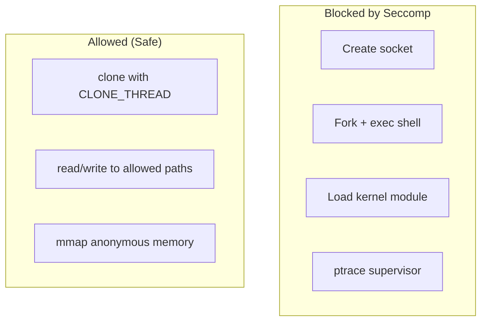

# Seccomp Syscall Filtering

> **Parent Document**: [isolation-overview.md](isolation-overview.md)
>
> **Purpose**: Detailed documentation of Tach's Seccomp syscall filtering implementation.

---

## Overview

Seccomp (Secure Computing Mode) provides syscall filtering via BPF programs. Tach uses a **blacklist approach** rather than whitelist.

---

## Why Blacklist Instead of Whitelist?

A whitelist approach is problematic for Python because:

1. Python's syscall footprint changes between versions (3.11 vs 3.12 vs 3.13)
2. C extensions may use arbitrary syscalls that we can't predict
3. A missed syscall causes SIGSYS crash, not a graceful error

The blacklist approach only blocks known-dangerous syscalls while allowing everything else.

> **Best Practice**: This aligns with common security guidance for dynamic runtimes where the full syscall surface cannot be predicted.

---

## Blocked Syscalls

### Network Syscalls

| Syscall              | Purpose                 | Why Blocked                        |
| -------------------- | ----------------------- | ---------------------------------- |
| `socket`             | Create network sockets  | Tests shouldn't make network calls |
| `bind`               | Bind to addresses       | Prevents server creation           |
| `connect`            | Connect to remote hosts | Prevents outbound connections      |
| `listen`             | Listen for connections  | Prevents server creation           |
| `accept` / `accept4` | Accept connections      | Prevents server creation           |

### Process Syscalls

| Syscall               | Purpose                 | Why Blocked                         |
| --------------------- | ----------------------- | ----------------------------------- |
| `fork`                | Create child process    | Prevents process spawning           |
| `vfork`               | Fork with shared memory | Prevents process spawning           |
| `execve` / `execveat` | Execute new program     | Prevents running arbitrary binaries |

### Memory Syscalls

| Syscall             | Purpose                        | Why Blocked                            |
| ------------------- | ------------------------------ | -------------------------------------- |
| `userfaultfd`       | User-space page fault handling | Could interfere with supervisor's UFFD |
| `process_vm_readv`  | Cross-process memory read      | Security boundary violation            |
| `process_vm_writev` | Cross-process memory write     | Security boundary violation            |

### Privilege Escalation Syscalls

| Syscall                        | Purpose                     | Why Blocked                  |
| ------------------------------ | --------------------------- | ---------------------------- |
| `ptrace`                       | Debug/trace other processes | Sandbox escape vector        |
| `mount` / `umount2`            | Mount filesystems           | Privilege escalation         |
| `unshare`                      | Create new namespaces       | Sandbox escape               |
| `setns`                        | Join existing namespaces    | Sandbox escape               |
| `keyctl`                       | Kernel keyring manipulation | Privilege escalation         |
| `kexec_load`                   | Load new kernel             | Critical system modification |
| `init_module` / `finit_module` | Load kernel modules         | Critical system modification |

---

## Why clone() Must NEVER Be Blocked

Python's threading module uses `clone()` with `CLONE_VM | CLONE_THREAD` flags to create OS threads. Blocking clone() breaks:

- `threading.Thread()` - Cannot start threads
- `concurrent.futures.ThreadPoolExecutor` - Completely broken
- GIL release during I/O - Some implementations use threads

**Defense Strategy**: Block `execve` instead. A forked process that cannot exec and cannot write (Landlock) is effectively neutered:

```
Malicious test attempt:
  1. fork() -> ALLOWED (but clone() with CLONE_VM works)
  2. execve("/bin/sh") -> BLOCKED by Seccomp -> EPERM
  3. open("/etc/passwd", O_WRONLY) -> BLOCKED by Landlock -> EACCES
```

---

## Filter Action

Blocked syscalls return `EPERM` (not `SIGSYS/Trap`) to allow Python code to handle errors gracefully via `OSError`.

**Key Function**: `apply_seccomp` in `sandbox.rs`

---

## Safe vs Toxic Workers

| Worker Type | Seccomp Status | Rationale                                |
| ----------- | -------------- | ---------------------------------------- |
| Safe        | ENFORCED       | Unit tests don't need subprocess/network |
| Toxic       | SKIPPED        | Integration tests may spawn subprocesses |

Toxic workers still get Landlock filesystem protection even without Seccomp.

---

## Attack Surface Analysis



---

## External References

- [seccomp(2) man page](https://man7.org/linux/man-pages/man2/seccomp.2.html) - Linux seccomp syscall
- [Seccomp BPF Documentation](https://www.kernel.org/doc/html/latest/userspace-api/seccomp_filter.html) - Kernel documentation

---

_Last Updated: 2026-01-17_
