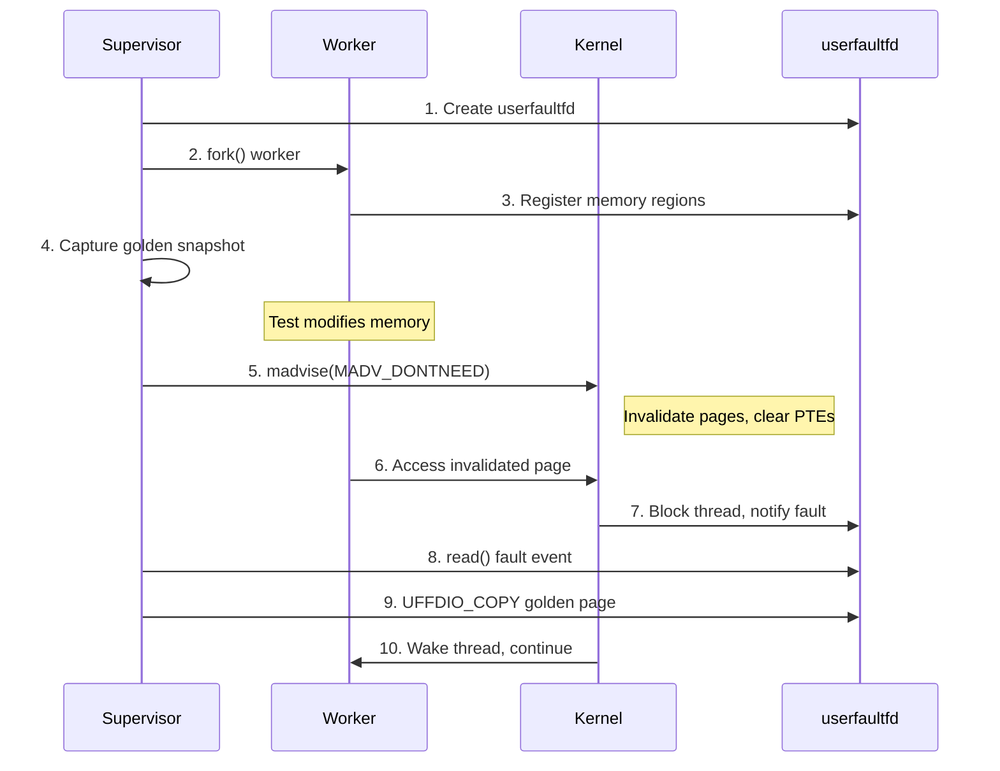

# userfaultfd Memory Snapshotting

> **Parent Document**: [isolation-overview.md](isolation-overview.md)
>
> **Purpose**: Detailed documentation of Tach's userfaultfd-based memory snapshotting and restoration.

---

## Overview

userfaultfd is the core technology enabling Tach's sub-millisecond worker reset. This document covers the snapshotting mechanics.

> **Note**: For full implementation details, see `snapshot.rs` in the source code.

---

## Kernel Requirements

| Feature             | Minimum Kernel | Notes                                    |
| ------------------- | -------------- | ---------------------------------------- |
| Basic userfaultfd   | 4.3            | Initial support                          |
| UFFD_EVENT_FORK     | 4.11           | Fork tracking                            |
| UFFD_EVENT_REMAP    | 4.11           | mremap tracking                          |
| UFFD_EVENT_REMOVE   | 4.11           | MADV_DONTNEED integration                |
| Unprivileged access | Varies         | Requires `vm.unprivileged_userfaultfd=1` |

> **Verified**: Kernel version requirements confirmed via [Linux Kernel userfaultfd Documentation](https://docs.kernel.org/admin-guide/mm/userfaultfd.html).

---

## How userfaultfd Works



---

## Key Concepts

### 1. Registration

Memory regions are registered with `UFFDIO_REGISTER`. The kernel marks these as "userfaultfd-managed."

### 2. Invalidation

`madvise(MADV_DONTNEED)` discards pages without unmapping:

- Virtual address range remains valid
- Physical pages released
- PTEs cleared (Present bit = 0)

> **Verified**: MADV_DONTNEED behavior confirmed via [madvise(2) man page](https://man7.org/linux/man-pages/man2/madvise.2.html) - "subsequent accesses of pages in the range will succeed, but will result in either repopulating the memory contents from the up-to-date contents of the underlying mapped file (for shared file mappings) or zero-fill-on-demand pages for anonymous private mappings."

### 3. Fault Handling

When worker accesses an invalidated page:

- CPU raises page fault
- Kernel checks: is region registered with userfaultfd?
- If yes: block thread, notify UFFD owner (supervisor)
- Supervisor receives fault via `read()` on UFFD fd

### 4. Page Restoration

Supervisor copies golden page via `UFFDIO_COPY`:

- Source: stored snapshot data
- Destination: faulted address
- Wake: resume blocked thread

---

## Snapshot Regions

The snapshot manager tracks multiple memory region types:

| Region Type | Description               | Snapshot Strategy   |
| ----------- | ------------------------- | ------------------- |
| Heap        | Python object allocations | Full snapshot       |
| BSS         | Uninitialized data        | Full snapshot       |
| Data        | Initialized globals       | Full snapshot       |
| TLS         | Thread-local storage      | Calibrated offsets  |
| Stack       | Call stack                | Per-thread handling |

---

## Vectorized Restore

For performance, Tach uses vectorized restore operations that handle multiple pages in a single syscall:

```rust
pub struct VectorizedRestoreResult {
    pub pages_restored: usize,
    pub bytes_copied: usize,
    pub faults_handled: usize,
}
```

---

## Performance Characteristics

| Operation           | Time        | Notes                 |
| ------------------- | ----------- | --------------------- |
| Page fault handling | ~5-10 us    | Per faulted page      |
| UFFDIO_COPY         | ~2-5 us     | Per 4KB page          |
| madvise(DONTNEED)   | ~1-3 us     | Per page              |
| **Full reset**      | **< 50 us** | Target (vs ~1ms fork) |

### Performance Target

- **Goal**: < 50 microseconds reset (vs ~1ms fork)
- **Method**: Lazy page restoration - only restore pages actually accessed
- **Optimization**: Pre-fault hot pages during worker initialization

---

## Memory Overhead

| Component            | Overhead             | Notes                      |
| -------------------- | -------------------- | -------------------------- |
| Golden snapshot      | Proportional to heap | Only modified pages stored |
| OverlayFS upperdir   | Only modified files  | CoW semantics              |
| Worker scratch space | ~100MB tmpfs         | Configurable               |

---

## Comparison with Alternatives

| Technique             | Reset Time    | Memory     | Isolation |
| --------------------- | ------------- | ---------- | --------- |
| Fork per test         | ~500-1000 us  | High (CoW) | Complete  |
| Fork server           | ~100-200 us   | Medium     | Complete  |
| **Tach userfaultfd**  | **~10-50 us** | Low        | Complete  |
| Kernel snapshot (LKM) | ~1-5 us       | Minimal    | Complete  |
| No isolation          | 0             | None       | None      |

---

## Enabling Unprivileged userfaultfd

By default, userfaultfd may require root. To enable for unprivileged users:

```bash
# Check current setting
cat /proc/sys/vm/unprivileged_userfaultfd

# Enable (temporary)
sudo sysctl vm.unprivileged_userfaultfd=1

# Enable (persistent)
echo "vm.unprivileged_userfaultfd=1" | sudo tee /etc/sysctl.d/99-userfaultfd.conf
sudo sysctl -p /etc/sysctl.d/99-userfaultfd.conf
```

---

## External References

- [Linux Kernel userfaultfd Documentation](https://docs.kernel.org/admin-guide/mm/userfaultfd.html) - Official kernel documentation
- [userfaultfd(2) man page](https://man7.org/linux/man-pages/man2/userfaultfd.2.html) - Syscall reference
- [UFFDIO_API man page](https://man7.org/linux/man-pages/man2/UFFDIO_API.2const.html) - ioctl operations

---

_Last Updated: 2026-01-17_
