# Python Harness Deep Dive

> **Purpose**: Comprehensive technical documentation of Tach's Python harness (`tach_harness.py`), the embedded Python module that executes tests within worker processes.

---

## Table of Contents

1. [Architecture Overview](#1-architecture-overview)
2. [Harness Entry Point and Initialization](#2-harness-entry-point-and-initialization)
3. [Pytest Compatibility Layer](#3-pytest-compatibility-layer)
4. [Fixture Execution Flow](#4-fixture-execution-flow)
5. [Test Result Collection](#5-test-result-collection)
6. [Coverage Integration (PEP 669)](#6-coverage-integration-pep-669)
7. [Exception Handling and Traceback Capture](#7-exception-handling-and-traceback-capture)
8. [Communication with Rust Supervisor](#8-communication-with-rust-supervisor)
9. [Module Import Interception](#9-module-import-interception)
10. [Hook Effect Recording and Replay](#10-hook-effect-recording-and-replay)

---

## 1. Architecture Overview

The Python harness is the bridge between Tach's Rust supervisor and Python's pytest ecosystem. It is embedded directly into worker processes via `include_str!` in the Rust `zygote.rs` module.

### High-Level Architecture

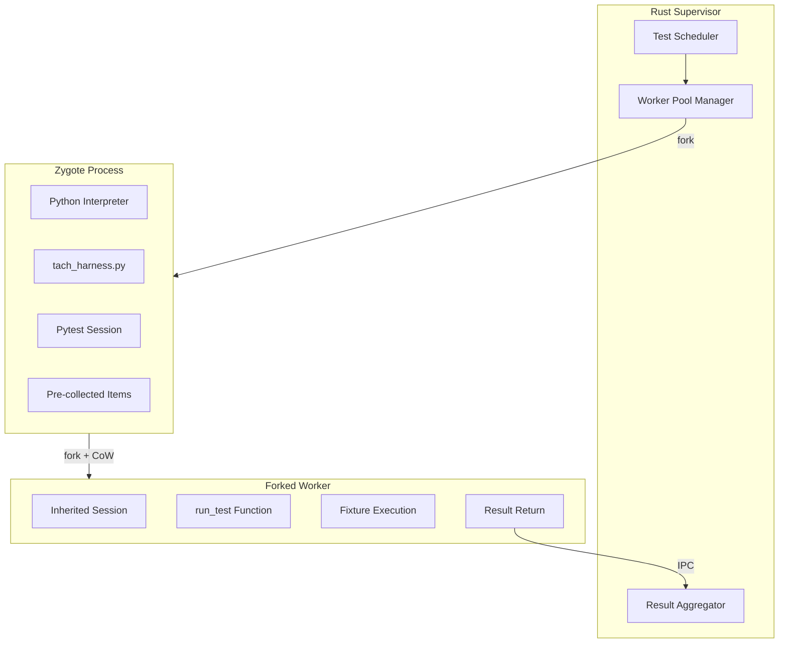

### Dual-Path Execution Model

The harness supports two execution modes based on test toxicity:

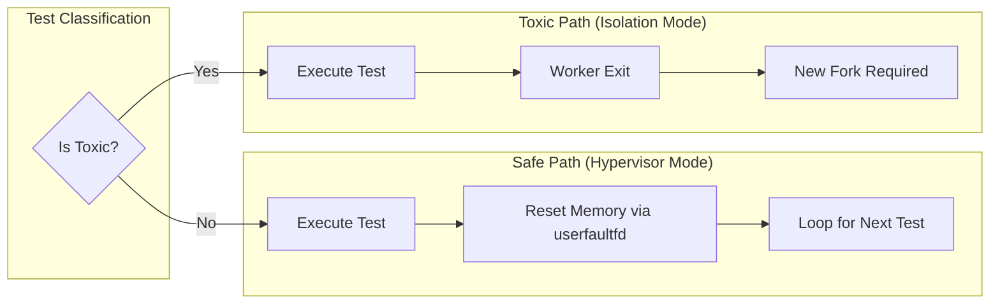

### Key Design Principles

| Principle                    | Implementation                                                    |
| ---------------------------- | ----------------------------------------------------------------- |
| **Zero Collection Overhead** | Pytest session initialized once in Zygote, inherited via fork CoW |
| **O(1) Test Lookup**         | `_ITEMS_MAP` dictionary maps node_id to pytest Item               |
| **Minimal Serialization**    | Results returned as tuples, not complex objects                   |
| **Graceful Degradation**     | Coverage, snapshot mode, import hooks all fail safely             |

---

## 2. Harness Entry Point and Initialization

### Initialization Sequence

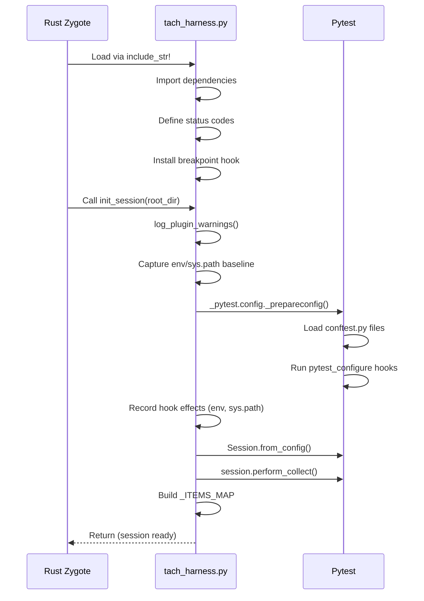

### Core Initialization Functions

#### `init_session(root_dir: str)`

Initializes the pytest session in the Zygote process BEFORE forking workers. This "pays the pytest tax" exactly once.

**Key Operations**:

1. Calls `log_plugin_warnings()` to detect unsupported plugins
2. Captures environment and sys.path state before pytest configuration
3. Configures pytest with disabled plugins (terminal, cacheprovider, cov, xdist, sugar, asyncio, trio, django)
4. Runs `_do_configure()` which triggers `pytest_configure` hooks
5. Captures environment/sys.path delta as session hook effects
6. Creates pytest Session and performs collection
7. Builds `_ITEMS_MAP` for O(1) test lookup

#### `post_fork_init() -> bool`

Called ONCE at the start of each worker's lifecycle after fork.

**Key Operations**:

1. Calls `inject_entropy()` for post-fork RNG reseeding
2. Installs the Tach import hook via `install_tach_import_hook()`
3. Captures baseline `sys.modules` for hot reloading (`_INITIAL_MODULES`)
4. Initiates snapshot handshake with Supervisor if `TACH_SUPERVISOR_SOCK` is set
5. Returns whether snapshot mode (userfaultfd recycling) is enabled

#### `inject_entropy()`

Re-seeds RNGs and resets fork-unsafe state to prevent the "Clone Curse" (identical random sequences in forked processes).

**Reseeded Systems**:

- Python's `random` module
- OpenSSL DRBG (via ctypes)
- Logging module locks (critical for preventing segfaults)
- NumPy random (if loaded)
- PyTorch random (if loaded)

---

## 3. Pytest Compatibility Layer

The harness provides pytest-compatible implementations of core testing primitives. This allows tests to work without modification.

### Exception Context Managers

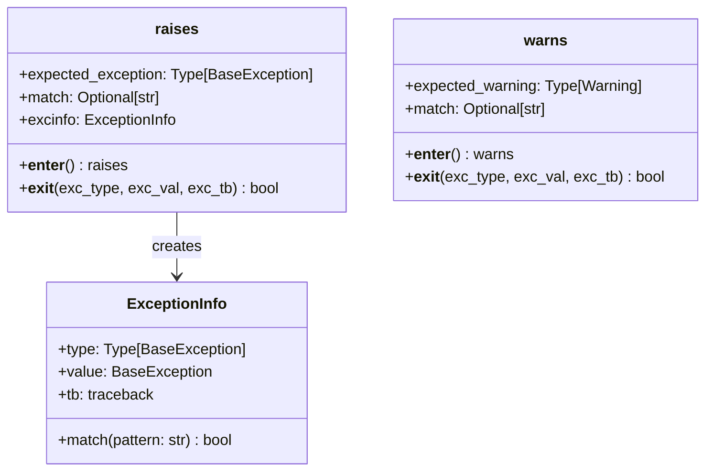

#### `raises` Context Manager

Compatible with `pytest.raises()`. Captures and validates expected exceptions.

**Usage Pattern**:

```python
with raises(ValueError, match="invalid"):
    int("not_a_number")
```

**Validation Logic**:

1. If no exception raised: raises `AssertionError("DID NOT RAISE ...")`
2. If wrong exception type: re-raises the unexpected exception
3. If `match` pattern provided and doesn't match: raises `AssertionError`
4. On success: populates `excinfo` attribute and suppresses exception

#### `warns` Context Manager

Compatible with `pytest.warns()`. Uses `warnings.catch_warnings(record=True)`.

### Skip/XFail Exceptions

| Exception        | Purpose               | Raised By       |
| ---------------- | --------------------- | --------------- |
| `SkipException`  | Skip test with reason | `skip(reason)`  |
| `XFailException` | Mark expected failure | `xfail(reason)` |

### Utility Functions

#### `approx` Class

Approximate floating-point comparison compatible with `pytest.approx()`.

**Algorithm**:

```
tolerance = max(rel * abs(expected), abs_tolerance)
return abs(expected - actual) <= tolerance
```

**Special Cases**:

- NaN: Never equal (IEEE 754 semantics)
- Infinity: Exact comparison required
- Lists/Tuples: Element-wise comparison

#### `importorskip(modname, minversion=None)`

Imports a module or skips the test if unavailable.

**Version Parsing** (`_parse_version`):

- Splits on dots
- Extracts numeric prefix from each part
- Handles suffixes like "a1", "dev0"

---

## 4. Fixture Execution Flow

The harness delegates fixture execution to pytest's internal machinery while wrapping it with Tach-specific handling.

### Execution Sequence

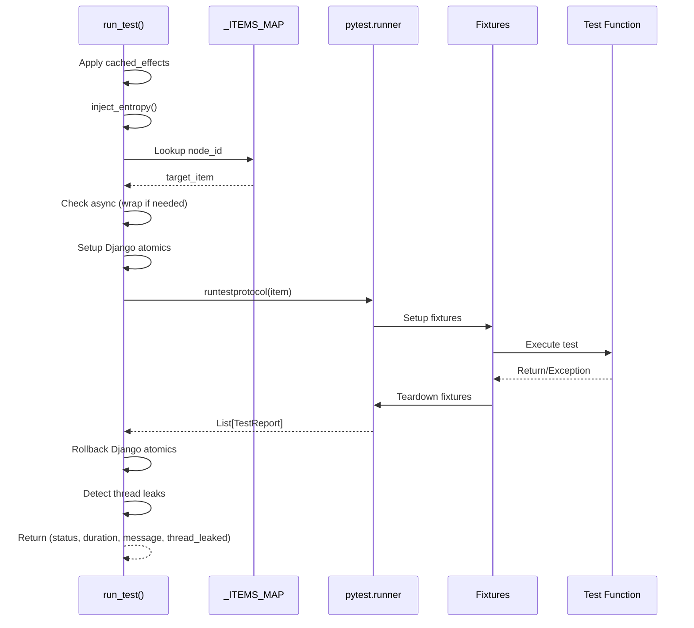

### Django Transaction Isolation

For Django projects, the harness wraps test execution in database transactions:

**Setup Phase**:

1. Close all existing connections (`connections.close_all()`)
2. For each database alias, create atomic transaction (`transaction.atomic(using=alias)`)
3. Store atomics in `django_atomics` list

**Teardown Phase**:

1. Mark all transactions for rollback (`transaction.set_rollback(True)`)
2. Exit atomic blocks in reverse order

### Native Async Support

The harness detects and wraps coroutine functions:

```python
if inspect.iscoroutinefunction(func_to_check):
    def sync_wrapper(*args, **kwargs):
        loop = asyncio.new_event_loop()
        asyncio.set_event_loop(loop)
        try:
            return loop.run_until_complete(async_fn(*args, **kwargs))
        finally:
            loop.close()
            asyncio.set_event_loop(None)
    target_item.obj = sync_wrapper
```

---

## 5. Test Result Collection

### Status Codes

Must match `protocol.rs` in the Rust codebase:

| Code | Constant               | Meaning                             |
| ---- | ---------------------- | ----------------------------------- |
| 0    | `STATUS_PASS`          | Test passed                         |
| 1    | `STATUS_FAIL`          | Test failed (assertion error)       |
| 2    | `STATUS_SKIP`          | Test skipped                        |
| 3    | `STATUS_CRASH`         | Test crashed (unexpected exception) |
| 4    | `STATUS_HARNESS_ERROR` | Harness itself failed               |

### Result Tuple Format

`run_test()` returns a 4-tuple:

```python
(status: int, duration: float, message: str, thread_leaked: bool)
```

| Field           | Type  | Description                                        |
| --------------- | ----- | -------------------------------------------------- |
| `status`        | int   | One of STATUS\_\* constants                        |
| `duration`      | float | Execution time in seconds                          |
| `message`       | str   | Error message, skip reason, or empty               |
| `thread_leaked` | bool  | Whether test spawned threads that didn't terminate |

### Report Processing

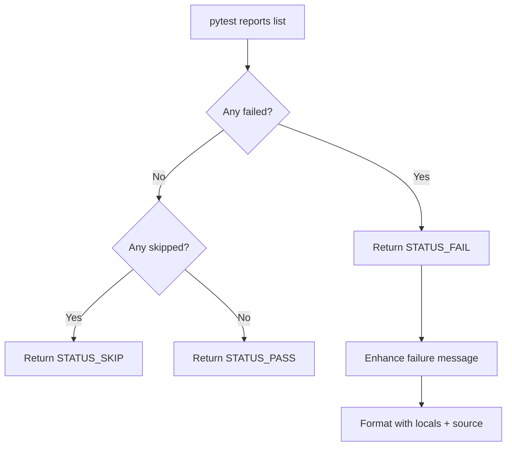

---

## 6. Coverage Integration (PEP 669)

The harness implements zero-overhead coverage using Python 3.12+'s `sys.monitoring` API.

### Architecture

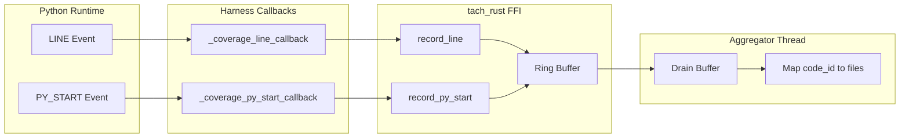

### Key Functions

#### `_coverage_py_start_callback(code, instruction_offset)`

PY_START event callback - called on function entry.

**Purpose**: Register code_id -> filename mapping
**Optimization**: Returns `sys.monitoring.DISABLE` after first registration to avoid repeated calls

#### `_coverage_line_callback(code, instruction_offset)`

LINE event callback - the hot path, called for every executed line.

**Operations**:

1. Get code object ID via `id(code)`
2. Map instruction offset to line number via `code.co_lines()`
3. Call `tach_rust.record_line(code_id, lineno)` which writes to ring buffer

#### `enable_coverage() -> bool`

Enables PEP 669 coverage collection:

1. Verifies `sys.monitoring` is available (Python 3.12+)
2. Checks `tach_rust.is_coverage_enabled()` (ring buffer initialized)
3. Registers tool with `sys.monitoring.COVERAGE_ID`
4. Registers PY_START and LINE callbacks
5. Enables events globally

#### `disable_coverage()`

Safely tears down coverage:

1. Sets events to 0
2. Unregisters callbacks (sets to None)
3. Frees tool ID

---

## 7. Exception Handling and Traceback Capture

### Enhanced Failure Introspection

The harness provides rich failure messages with local variables and source context.

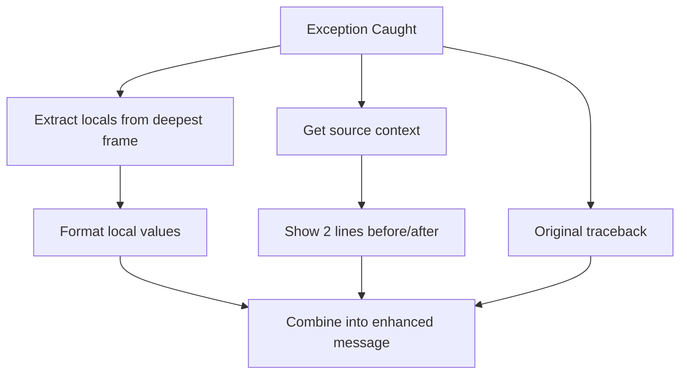

### Key Functions

#### `_extract_locals_from_traceback(tb) -> Optional[dict]`

Walks to deepest frame and extracts local variables.

**Filtering Rules**:

- Skip dunder variables (`__name__`, etc.)
- Skip module imports
- Skip callables without `__dict__`

#### `_get_source_context(filename, lineno, context_lines=2) -> Optional[str]`

Uses `linecache` to retrieve source code around failing line.

**Output Format**:

```
    42 | some_code()
>>> 43 | failing_line()
    44 | more_code()
```

#### `_format_enhanced_failure(exc_type, exc_value, exc_tb, original_longrepr) -> str`

Combines all introspection into formatted message:

```
Source context:
    10 | expected = 42
>>> 11 | assert result == expected
    12 | return result

Local variables:
    result = 41
    expected = 42

Traceback:
[original pytest traceback]
```

#### `_truncate_value(value, max_length=200) -> str`

Intelligently truncates long values with length indicator:

```
{'key1': 'value1', 'key2': 'va... (len=1523)
```

---

## 8. Communication with Rust Supervisor

### IPC Mechanisms

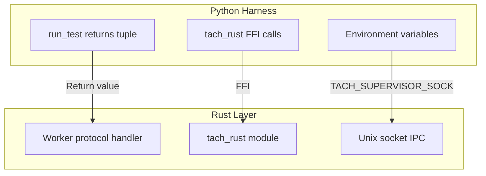

### tach_rust FFI Interface

The harness communicates with Rust via the `tach_rust` PyO3 module:

| Function                             | Purpose                                   |
| ------------------------------------ | ----------------------------------------- |
| `init_snapshot_mode(sock)`           | Initialize userfaultfd snapshot handshake |
| `reset_memory()`                     | Reset worker memory state                 |
| `get_module(name)`                   | Get pre-compiled bytecode from registry   |
| `get_module_path(name)`              | Get source path for module                |
| `is_module_package(name)`            | Check if module is a package              |
| `load_module(name, path, bytecode)`  | Load module via PyMarshal                 |
| `record_line(code_id, lineno)`       | Record coverage line hit                  |
| `record_py_start(code_id, filename)` | Register code object                      |
| `is_coverage_enabled()`              | Check if coverage ring buffer ready       |
| `get_coverage_overflow()`            | Get overflow count                        |
| `get_mapping_overflow()`             | Get mapping overflow count                |

### Debug Socket for Interactive Debugging

The harness supports `breakpoint()` via Unix socket tunneling:

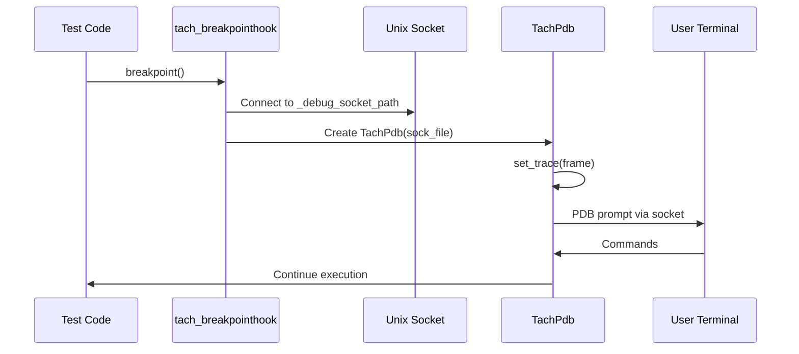

---

## 9. Module Import Interception

### Zero-Copy Module Loading

The harness installs a custom import hook to bypass standard file I/O and use pre-compiled bytecode from the Rust registry.

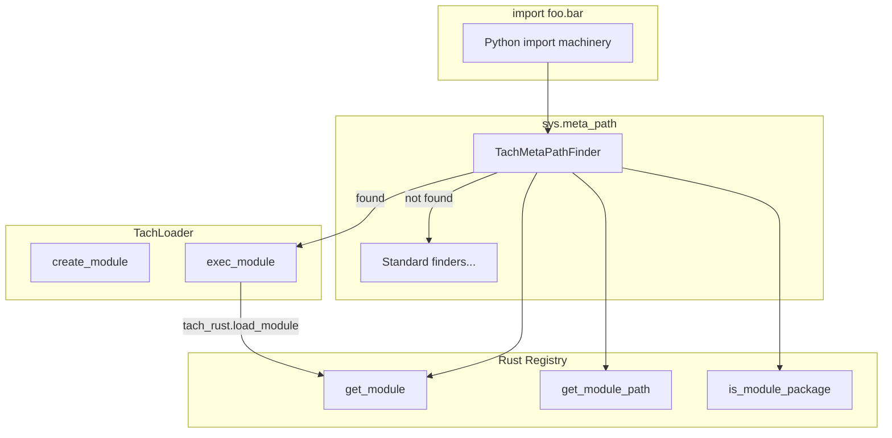

### Key Classes

#### `TachMetaPathFinder`

Installed at `sys.meta_path[0]` for highest priority.

**`find_spec(fullname, path, target)` Logic**:

1. Call `tach_rust.get_module(fullname)`
2. If None, return None (fall through to standard importlib)
3. Get source path via `tach_rust.get_module_path()`
4. Check package status via `tach_rust.is_module_package()`
5. Create `TachLoader` and `ModuleSpec`

#### `TachLoader`

Custom loader using Rust FFI for bytecode injection.

**`exec_module(module)` Implementation**:

- Calls `tach_rust.load_module(name, source_path, bytecode)`
- Uses `PyMarshal_ReadObjectFromString` and `PyImport_ExecCodeModuleObject` internally

### Hot Reloading Support

#### `cleanup_test_modules() -> int`

Removes test-imported modules from `sys.modules` for clean state between tests.

**Protected Prefixes** (never removed):

```python
_PROTECTED_PREFIXES = (
    "sys", "builtins", "__main__", "_thread", "threading",
    "importlib", "_frozen_importlib", "_imp", "tach_rust",
    "tach_harness", "_pytest", "pytest", "pluggy", "py",
    "django", "encodings", "codecs", "io", "_io", "os",
    "posix", "errno", "stat", "_stat", "abc", "typing",
    "types", "functools", "collections", "warnings",
    "weakref", "contextlib", "logging", "_logging",
)
```

**Algorithm**:

1. Compare current `sys.modules` to baseline `_INITIAL_MODULES`
2. Filter out protected prefixes
3. Sort by depth (children before parents)
4. Delete modules from `sys.modules`

---

## 10. Hook Effect Recording and Replay

### Session-Level Hook Effects

The harness captures environment and sys.path changes made by `pytest_configure` hooks.

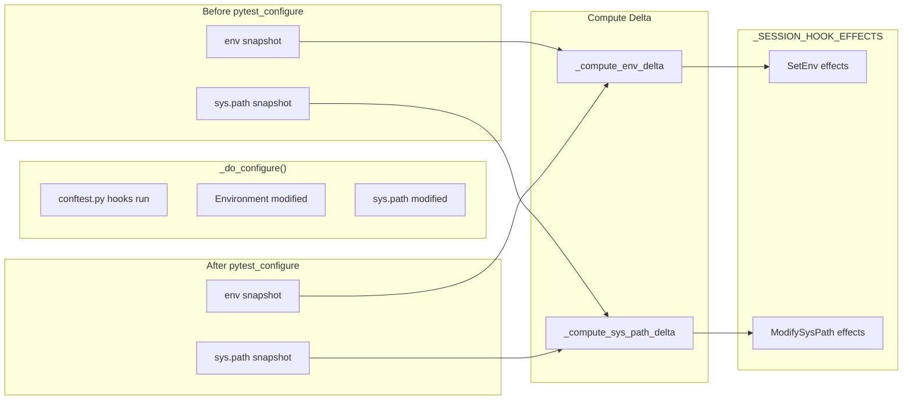

### Effect Types

#### SetEnv Effect

```python
{
    "type": "SetEnv",
    "key": "DATABASE_URL",
    "value": "sqlite:///:memory:"
}
```

#### ModifySysPath Effect

```python
{
    "type": "ModifySysPath",
    "action": "prepend",  # or "append" or "remove"
    "path": "/project/src"
}
```

### Key Functions

#### `call_hook_impl(hook_name, hook_module_path, hook_function_name, hook_args) -> dict`

Executes a hook and captures its effects.

**Return Structure**:

```python
{
    "success": bool,
    "effects": [/* SetEnv and ModifySysPath effects */],
    "error": str | None,
    "result": Any
}
```

**Important**: Uses try/finally to ALWAYS capture effects, even if hook raises exception.

#### `call_collection_modifyitems(hook_module_path, config, items) -> dict`

Special handling for `pytest_collection_modifyitems` hook.

**Additional Return Fields**:

- `items_before`: Count before hook
- `items_after`: Count after hook
- `removed`: List of removed node IDs
- `reordered`: Whether items were reordered

#### `apply_cached_effects(effects) -> int`

Applies cached effects to worker process before test execution.

**Called By**: `run_test()` before test execution
**Returns**: Number of effects successfully applied

### Thread Leak Detection

#### `_detect_thread_leak(initial_count, allow_threads) -> bool`

Detects if test spawned threads that outlive execution.

**Algorithm**:

1. Compare current thread count to initial
2. If threads increased and `allow_threads` is False:
   - Wait up to 500ms grace period
   - If still running, return True (leak detected)
3. Leaked tests cause worker to exit (cannot be recycled)

#### `@pytest.mark.allow_threads` Marker

Tests can opt-in to thread spawning:

```python
@pytest.mark.allow_threads
def test_background_task():
    thread = threading.Thread(target=long_running)
    thread.start()
    # Thread may still be running after test
```

---

## Appendix A: Global State Variables

| Variable                | Type            | Purpose                                  |
| ----------------------- | --------------- | ---------------------------------------- |
| `_SESSION`              | pytest.Session  | Pre-collected pytest session             |
| `_ITEMS_MAP`            | dict[str, Item] | nodeid -> pytest Item mapping            |
| `_INITIAL_MODULES`      | set[str]        | Baseline sys.modules for hot reload      |
| `_SESSION_HOOK_EFFECTS` | list[dict]      | Cached hook effects                      |
| `_CAN_RECYCLE`          | bool            | Whether worker can use userfaultfd reset |
| `_coverage_enabled`     | bool            | PEP 669 coverage active                  |
| `_coverage_tool_id`     | int             | sys.monitoring tool ID                   |
| `_debug_socket_path`    | str             | Unix socket for debugging                |
| `_thread_leak_detected` | bool            | Thread leak flag for current test        |

---

## Appendix B: Plugin Detection

### Supported Plugins

Plugins known to work with Tach (or explicitly disabled):

- pytest-timeout, pytest-xdist, pytest-cov, pytest-sugar
- pytest-asyncio, pytest-trio, pytest-django, pytest-mock
- pytest-env, pytest-randomly, pytest-order
- pytest-lazy-fixture, pytest-factoryboy, pytest-freezegun
- pytest-httpx, pytest-responses, pytest-vcr, pytest-benchmark

### Unsupported Plugins

| Plugin          | Reason                                                     |
| --------------- | ---------------------------------------------------------- |
| pytest-parallel | Uses multiprocessing, conflicts with Tach workers          |
| pytest-forked   | Fork-based isolation conflicts with Tach's fork model      |
| pytest-testmon  | Requires file watching, not compatible with snapshot model |
| pytest-picked   | Git-based selection conflicts with static discovery        |
| pytest-split    | Test splitting conflicts with Tach's scheduler             |

---

## Related Documentation

- [External Research](./external-research.md) - Related projects and technologies
- [Roadmap](./roadmap.md) - Development trajectory
- [docs/configuration.md](../configuration.md) - CLI and pyproject.toml options
- [docs/troubleshooting.md](../troubleshooting.md) - Common issues and solutions

---

_Last Updated: 2026-01-17_
