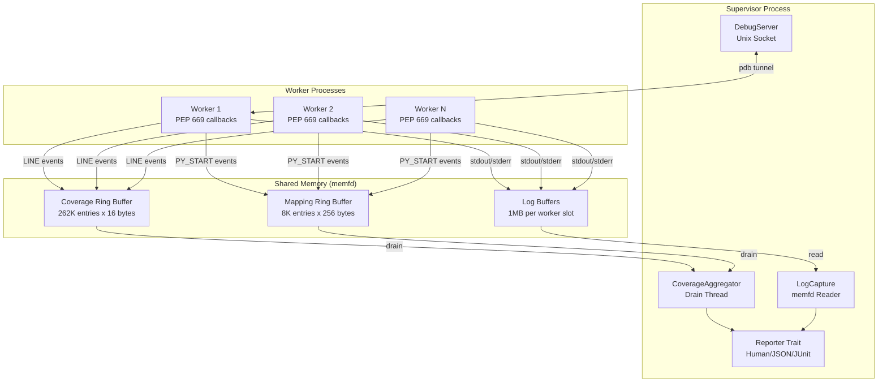
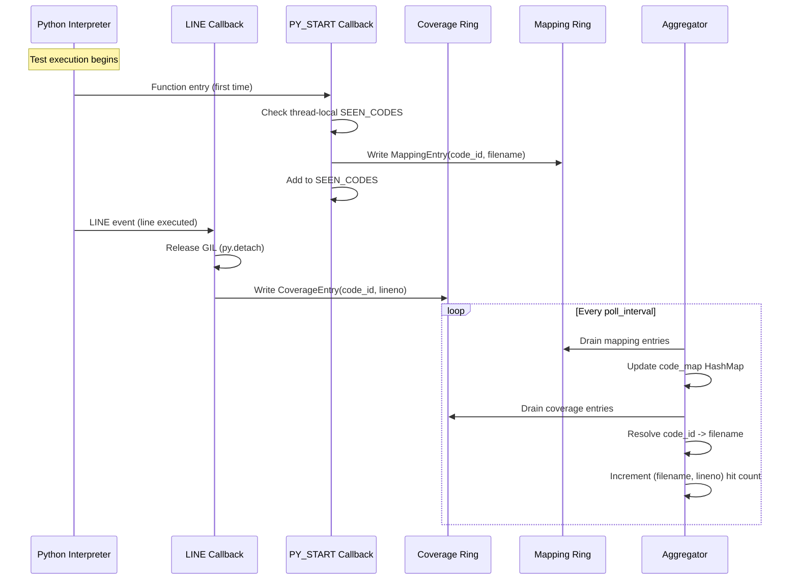
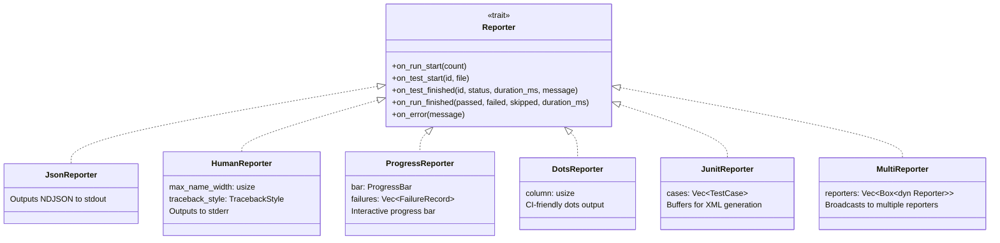
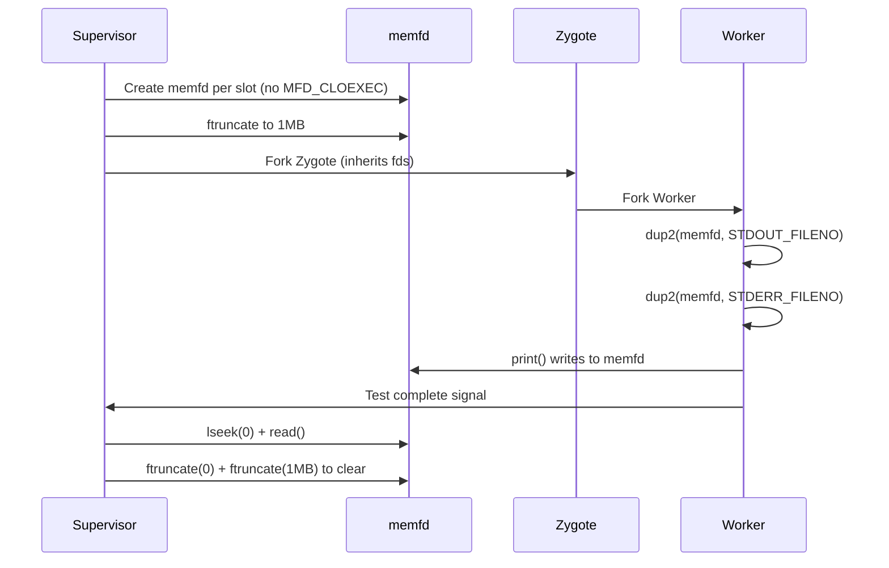

# Reporting and Coverage System Deep Dive

> **Purpose**: Comprehensive technical documentation of Tach's reporting and coverage infrastructure, including PEP 669 coverage collection, output formats, and debugging integration.

---

## Table of Contents

1. [Architecture Overview](#1-architecture-overview)
2. [PEP 669 Coverage Implementation](#2-pep-669-coverage-implementation)
3. [Coverage Data Structures](#3-coverage-data-structures)
4. [Ring Buffer Design](#4-ring-buffer-design)
5. [Output Formats](#5-output-formats)
6. [Reporter System](#6-reporter-system)
7. [JUnit XML Generation](#7-junit-xml-generation)
8. [Log Capture Mechanism](#8-log-capture-mechanism)
9. [Debugger Integration](#9-debugger-integration)
10. [Traceback Formatting](#10-traceback-formatting)
11. [Code References](#11-code-references)

---

## 1. Architecture Overview

Tach's reporting subsystem is designed around three core principles:

1. **Zero-Copy IPC**: Shared memory ring buffers for coverage data transfer
2. **Stdout Purity**: JSON output only to stdout; all other output to stderr
3. **Lock-Free Hot Paths**: Atomic operations for minimal coverage overhead

### System Architecture



### Component Responsibilities

| Component            | Location        | Purpose                                 |
| -------------------- | --------------- | --------------------------------------- |
| `CoverageRingBuffer` | `coverage.rs`   | Lock-free shared memory for LINE events |
| `MappingRingBuffer`  | `coverage.rs`   | Code object ID to filename resolution   |
| `CoverageAggregator` | `coverage.rs`   | Background thread draining ring buffers |
| `Reporter` trait     | `reporter.rs`   | Abstract output interface               |
| `JunitReporter`      | `junit.rs`      | XML report generation                   |
| `LogCapture`         | `logcapture.rs` | Worker stdout/stderr capture            |
| `DebugServer`        | `debugger.rs`   | Interactive pdb support                 |

---

## 2. PEP 669 Coverage Implementation

Tach uses Python 3.12+ `sys.monitoring` (PEP 669) for low-overhead coverage collection.

### Why PEP 669?

| Approach                   | Overhead | Mechanism                                |
| -------------------------- | -------- | ---------------------------------------- |
| `sys.settrace`             | ~200%    | Function call per line                   |
| `sys.monitoring` (PEP 669) | ~5%      | Event-based, can disable after first hit |

### Event Flow



### GIL Discipline

The coverage callbacks release the GIL before writing to shared memory:

```rust
// From py_record_line in coverage.rs
#[pyfunction]
pub fn py_record_line(py: Python<'_>, code_id: u64, lineno: u32) -> bool {
    // Release GIL before writing to ring buffer
    // This prevents serialization with Supervisor's aggregator thread
    py.detach(|| {
        if let Some(buffer) = get_coverage_buffer() {
            buffer.write(CoverageEntry::line(code_id, lineno))
        } else {
            false
        }
    })
}
```

### Thread-Local Seen Codes

To avoid duplicate registrations, each thread maintains a local set:

```rust
thread_local! {
    static SEEN_CODES: RefCell<HashSet<u64>> = RefCell::new(HashSet::with_capacity(1024));
}

fn mark_code_seen(code_id: u64) -> bool {
    SEEN_CODES.with(|seen| {
        let mut set = seen.borrow_mut();
        if set.contains(&code_id) {
            false  // Already seen
        } else {
            set.insert(code_id);
            true   // First encounter
        }
    })
}
```

---

## 3. Coverage Data Structures

### CoverageEntry (16 bytes)

Written by workers for each LINE event:

```rust
#[repr(C, align(16))]
pub struct CoverageEntry {
    pub code_id: u64,   // Memory address of Python code object
    pub lineno: u32,    // Line number within file
    pub flags: u32,     // Event type (0x01 = LINE)
}
```

**Design Decisions**:

- 16-byte alignment for efficient memory access
- `code_id` is `id(code)` in Python (stable within process lifetime)
- `flags` reserved for future CALL/RETURN/EXCEPTION events

### MappingEntry (256 bytes)

Maps code object IDs to filenames:

```rust
#[repr(C, align(8))]
pub struct MappingEntry {
    pub code_id: u64,       // Memory address of code object
    pub filename_len: u16,  // Length of filename (max 240)
    pub _padding: [u8; 6],  // Alignment padding
    pub filename: [u8; 240], // UTF-8 filename bytes
}
```

**Filename Truncation**: Long paths are truncated from the LEFT to preserve the actual filename:

```rust
// Example: "/very/long/path/.../important_file.py"
// Becomes: "...ath/.../important_file.py" (240 bytes max)
```

### RingBufferHeader (64 bytes)

Shared header for both ring buffer types:

```rust
#[repr(C, align(64))]
pub struct RingBufferHeader {
    pub write_idx: AtomicU64,     // Worker increments atomically
    pub read_idx: AtomicU64,      // Supervisor increments
    pub capacity: u64,            // Total slots
    pub overflow_count: AtomicU64, // Dropped entries
    _padding: [u8; 32],           // Cache line alignment
}
```

---

## 4. Ring Buffer Design

### Memory Layout

```
┌─────────────────────────────────────────────────────────────────────────┐
│                           SHARED MEMORY                                  │
│  ┌─────────────────────────────────────────────────────────────────┐   │
│  │  RingBufferHeader (64 bytes)                                     │   │
│  │  ┌──────────────┬──────────────┬──────────────┬──────────────┐  │   │
│  │  │ write_idx    │ read_idx     │ capacity     │ overflow_cnt │  │   │
│  │  │ (AtomicU64)  │ (AtomicU64)  │ (u64)        │ (AtomicU64)  │  │   │
│  │  └──────────────┴──────────────┴──────────────┴──────────────┘  │   │
│  └─────────────────────────────────────────────────────────────────┘   │
│  ┌─────────────────────────────────────────────────────────────────┐   │
│  │  CoverageEntry[0..capacity] (16 bytes each)                      │   │
│  │  ┌──────────────┬──────────────┐                                 │   │
│  │  │ code_id (u64)│ lineno (u32) │ flags (u32)                     │   │
│  │  └──────────────┴──────────────┘                                 │   │
│  └─────────────────────────────────────────────────────────────────┘   │
└─────────────────────────────────────────────────────────────────────────┘
          ▲                                           │
          │ mmap (MAP_SHARED)                         │ mmap (MAP_SHARED)
          │                                           ▼
   ┌──────────────┐                           ┌──────────────┐
   │   WORKER     │                           │  SUPERVISOR  │
   │  (Python)    │                           │  (Aggregator)│
   └──────────────┘                           └──────────────┘
```

### Lock-Free Write Algorithm

Uses Compare-And-Swap (CAS) to prevent TOCTOU races:

```rust
pub fn write(&self, entry: CoverageEntry) -> bool {
    let header = self.header();

    loop {
        let write = header.write_idx.load(Ordering::Acquire);
        let read = header.read_idx.load(Ordering::Acquire);

        // Check if buffer is full
        if write.wrapping_sub(read) >= header.capacity {
            header.overflow_count.fetch_add(1, Ordering::Relaxed);
            return false;
        }

        // Try to reserve a slot atomically using CAS
        match header.write_idx.compare_exchange_weak(
            write,
            write.wrapping_add(1),
            Ordering::AcqRel,
            Ordering::Relaxed,
        ) {
            Ok(_) => {
                // Successfully reserved slot
                let slot = (write % self.capacity as u64) as usize;
                unsafe {
                    let entry_ptr = self.entries_ptr().add(slot);
                    std::ptr::write_volatile(entry_ptr, entry);
                }
                return true;
            }
            Err(_) => {
                // CAS failed, spin and retry
                std::hint::spin_loop();
                continue;
            }
        }
    }
}
```

### Buffer Sizing

| Buffer   | Capacity | Entry Size | Total Size |
| -------- | -------- | ---------- | ---------- |
| Coverage | 262,144  | 16 bytes   | 4 MB       |
| Mapping  | 8,192    | 256 bytes  | 2 MB       |

**Rationale**: 4MB coverage buffer handles ~260K line events before overflow. At 10K lines/second, this provides 26 seconds of buffering.

---

## 5. Output Formats

### LCOV Format

Industry-standard format for coverage visualization:

```
SF:/path/to/file.py
DA:10,5
DA:11,3
DA:15,0
LF:3
LH:2
end_of_record
```

**Field Definitions**:

- `SF`: Source file path
- `DA:line,hits`: Line data (line number, execution count)
- `LF`: Lines found (total instrumented)
- `LH`: Lines hit (lines with hits > 0)

### JSON Format

Programmatic access with aggregated statistics:

```json
{
  "files": {
    "/path/to/file.py": {
      "lines": { "10": 5, "11": 3 },
      "lines_found": 2,
      "lines_hit": 2
    }
  },
  "totals": {
    "lines_found": 100,
    "lines_hit": 80,
    "line_coverage": 0.8
  }
}
```

### Format Selection

Determined by file extension or explicit format parameter:

```rust
pub fn write_coverage_report(
    data: &CoverageData,
    path: &Path,
    format: Option<&str>,
) -> Result<()> {
    let format = format.unwrap_or_else(|| {
        path.extension()
            .and_then(|ext| ext.to_str())
            .unwrap_or("lcov")
    });

    match format.to_lowercase().as_str() {
        "json" => write_json(data, path),
        "lcov" | "info" => write_lcov(data, path),
        _ => write_lcov(data, path),
    }
}
```

---

## 6. Reporter System

### Trait Definition

```rust
pub trait Reporter {
    fn on_run_start(&mut self, count: usize);
    fn on_test_start(&mut self, id: &str, file: &str);
    fn on_test_finished(&mut self, id: &str, status: &str, duration_ms: u64, message: Option<&str>);
    fn on_run_finished(&mut self, passed: usize, failed: usize, skipped: usize, duration_ms: u64);
    fn on_error(&mut self, message: &str);
}
```

### Reporter Implementations



### Output Routing

| Reporter           | stdout        | stderr          | Use Case                               |
| ------------------ | ------------- | --------------- | -------------------------------------- |
| `JsonReporter`     | NDJSON events | (none)          | Machine parsing, IDE integration       |
| `HumanReporter`    | (none)        | Test results    | Interactive terminal                   |
| `ProgressReporter` | (none)        | Progress bar    | Interactive terminal with live updates |
| `DotsReporter`     | (none)        | `.F.s` pattern  | CI environments, narrow terminals      |
| `JunitReporter`    | (none)        | Status messages | XML file generation                    |

### Machine Event Schema

```rust
#[derive(Serialize)]
#[serde(tag = "event", rename_all = "snake_case")]
pub enum MachineEvent<'a> {
    RunStart { count: usize },
    TestStart { id: &'a str, file: &'a str },
    TestFinished {
        id: &'a str,
        status: &'a str,  // "pass", "fail", "skip"
        duration_ms: u64,
        message: Option<&'a str>,
    },
    RunFinished {
        passed: usize,
        failed: usize,
        skipped: usize,
        duration_ms: u64,
    },
    Error { message: &'a str },
}
```

---

## 7. JUnit XML Generation

### XML Schema

```xml
<?xml version="1.0" encoding="UTF-8"?>
<testsuites>
  <testsuite name="tach" tests="10" failures="2" errors="0" skipped="1" time="5.234">
    <testcase name="test_foo" classname="tests.test_module" time="0.042"/>
    <testcase name="test_bar" classname="tests.test_module" time="0.100">
      <failure message="Test failed">AssertionError: expected True</failure>
    </testcase>
    <testcase name="test_skip" classname="tests.test_module" time="0.005">
      <skipped/>
    </testcase>
  </testsuite>
</testsuites>
```

### ANSI Code Stripping

JUnit XML must be clean text without terminal escape codes:

```rust
pub fn strip_ansi_codes(s: &str) -> String {
    let mut result = String::with_capacity(s.len());
    let mut chars = s.chars().peekable();

    while let Some(c) = chars.next() {
        if c == '\x1b' {
            // Skip escape sequence
            if chars.peek() == Some(&'[') {
                chars.next(); // consume '['
                // Skip until we hit a letter (terminator)
                while let Some(&next) = chars.peek() {
                    chars.next();
                    if next.is_ascii_alphabetic() {
                        break;
                    }
                }
            }
        } else if c != '\0' {
            result.push(c);
        }
    }
    result
}
```

### Test ID Parsing

Converts pytest-style IDs to JUnit classname/name:

```
Input:  "path/to/test_module.py::test_func"
Output: classname="path.to.test_module", name="test_func"
```

---

## 8. Log Capture Mechanism

### Design Goals

1. Capture worker stdout/stderr without blocking
2. Prevent log interleaving between workers
3. Support reading logs after test completion

### Architecture



### Key Implementation Details

**No MFD_CLOEXEC**: The memfd must survive fork:

```rust
fn create_memfd(name: &str) -> Result<RawFd> {
    let c_name = CString::new(name)?;
    // NO MFD_CLOEXEC - fd must be inherited by forked children
    let fd = unsafe { libc::syscall(libc::SYS_memfd_create, c_name.as_ptr(), 0) as RawFd };
    // ...
}
```

**Output Redirection** (called in worker after fork):

```rust
pub fn redirect_output(fd: RawFd) -> Result<()> {
    unsafe {
        libc::lseek(fd, 0, libc::SEEK_SET);
        libc::dup2(fd, libc::STDOUT_FILENO);
        libc::dup2(fd, libc::STDERR_FILENO);

        // Make stdout line-buffered
        let stdout_file = libc::fdopen(libc::STDOUT_FILENO, c"w".as_ptr());
        if !stdout_file.is_null() {
            libc::setvbuf(stdout_file, std::ptr::null_mut(), libc::_IOLBF, 0);
        }
    }
    Ok(())
}
```

### Buffer Management

| Constant          | Value | Purpose                   |
| ----------------- | ----- | ------------------------- |
| `LOG_BUFFER_SIZE` | 1 MB  | Per-worker capture buffer |

---

## 9. Debugger Integration

### Problem Statement

Workers run in isolated, sandboxed processes. Interactive debugging with `breakpoint()` or `pdb` requires:

1. Terminal access (stdin/stdout)
2. Pausing other workers (no log interleaving)
3. Raw terminal mode (character-by-character input)

### Architecture

```mermaid
graph TB
    subgraph Supervisor
        DS[DebugServer<br/>Unix Socket Listener]
        TM[TerminalManager<br/>Raw/Cooked Mode]
    end

    subgraph Worker
        BP[breakpoint()]
        PDB[pdb.Pdb]
        SC[Socket Client]
    end

    BP --> PDB
    PDB <--> SC
    SC <-->|bidirectional| DS
    DS <--> TM
    TM <-->|stdin/stdout| Terminal

    style DS fill:#f9f,stroke:#333
    style TM fill:#ff9,stroke:#333
```

### Terminal Mode States

```rust
pub enum TerminalMode {
    /// Normal line-buffered mode with echo
    Cooked,
    /// Character-by-character, no echo, no signal processing
    Raw,
}
```

### Debug Session Flow

1. **Worker hits breakpoint**: Connects to `/tmp/tach_debug_{pid}.sock`
2. **Supervisor detects connection**: `try_accept()` returns connected stream
3. **Pause other workers**: Send `SIGSTOP` to prevent log interleaving
4. **Enter raw mode**: Disable line buffering, echo, signal processing
5. **Bidirectional tunnel**: stdin <-> socket, socket <-> stdout
6. **Session ends**: Socket closes, restore cooked mode, `SIGCONT` to workers

### Panic Safety

Terminal must be restored on crash:

```rust
pub fn install_panic_hook() {
    let default_hook = std::panic::take_hook();

    std::panic::set_hook(Box::new(move |info| {
        if IN_RAW_MODE.load(Ordering::SeqCst) {
            if let Ok(guard) = ORIGINAL_TERMIOS.lock()
                && let Some(ref original) = *guard
            {
                let stdin = io::stdin();
                let _ = tcsetattr(&stdin, SetArg::TCSANOW, original);
            }
            IN_RAW_MODE.store(false, Ordering::SeqCst);
            eprintln!("\n[tach] Terminal restored after panic.\n");
        }
        default_hook(info);
    }));
}
```

---

## 10. Traceback Formatting

### Style Options

```rust
pub enum TracebackStyle {
    Short,   // First and last frames only
    Long,    // Full traceback (default)
    Line,    // Single line: file:line: message
    Native,  // Same as Long (Python native format)
    No,      // Suppress traceback output
}
```

### Colorization

ANSI color codes enhance readability in terminals:

| Element                | Color    | ANSI Code    |
| ---------------------- | -------- | ------------ |
| File paths             | Cyan     | `\x1b[36m`   |
| Line numbers           | Yellow   | `\x1b[33m`   |
| Function names         | Green    | `\x1b[32m`   |
| Error messages         | Red      | `\x1b[31m`   |
| Failing assertion line | Bold Red | `\x1b[1;31m` |

### Short Format Algorithm

```rust
fn format_traceback_short(traceback: &str) -> String {
    let lines: Vec<&str> = traceback.lines().collect();

    if lines.len() <= 6 {
        return traceback.to_string();  // Already short
    }

    // Find frame indices (lines starting with "File ")
    let frame_indices: Vec<usize> = lines.iter()
        .enumerate()
        .filter(|(_, line)| line.trim_start().starts_with("File \""))
        .map(|(i, _)| i)
        .collect();

    if frame_indices.len() <= 2 {
        return traceback.to_string();  // Only 2 frames
    }

    // Output: first frame + "... (N frames omitted) ..." + last frame + error
    // ...
}
```

### Line Format

Extracts file:line from traceback for compact display:

```
Input:  Traceback (most recent call last):
          File "test.py", line 42, in test_something
            assert 1 == 2
        AssertionError: 1 != 2

Output: test.py:42: AssertionError: 1 != 2
```

---

## 11. Code References

### Key Functions by Module

**coverage.rs**:

- `CoverageRingBuffer::new` - Creates memfd-backed ring buffer
- `CoverageRingBuffer::write` - Lock-free CAS write loop
- `CoverageRingBuffer::drain` - Supervisor-side batch read
- `CoverageAggregator::start` - Background drain thread
- `py_record_line` - PyO3 callback for LINE events
- `py_record_py_start` - PyO3 callback for code registration
- `write_lcov` - LCOV format output
- `write_json` - JSON format output

**reporter.rs**:

- `Reporter` trait - Output abstraction
- `JsonReporter::on_test_finished` - NDJSON event emission
- `HumanReporter::on_test_finished` - Terminal output with colors
- `ProgressReporter::on_run_finished` - Failure summary display
- `format_traceback` - Traceback style application
- `colorize_traceback_line` - ANSI color injection

**junit.rs**:

- `JunitReporter::on_run_finished` - XML serialization
- `strip_ansi_codes` - Clean text for XML

**logcapture.rs**:

- `LogCapture::new` - Creates memfd per slot
- `LogCapture::read_and_clear` - Read and reset buffer
- `redirect_output` - Worker-side dup2 setup

**debugger.rs**:

- `DebugServer::new` - Unix socket listener setup
- `DebugServer::handle_session` - Interactive debug loop
- `TerminalManager::enter_raw_mode` - cfmakeraw application
- `install_panic_hook` - Terminal restoration on crash

---

## Future Considerations

### Potential Enhancements

1. **HTML Coverage Reports**: Generate standalone HTML with source annotation
2. **Cobertura XML**: Additional CI tool compatibility
3. **Branch Coverage**: Extend PEP 669 to BRANCH events
4. **Coverage Diff**: Show coverage changes between commits
5. **Real-time Streaming**: WebSocket-based live coverage updates

### Performance Optimizations

1. **Ring Buffer Batching**: Write multiple entries per atomic operation
2. **SIMD Aggregation**: Vectorized hit count updates
3. **Memory-Mapped Output**: Direct LCOV file writing without buffering

---

_Last Updated: 2026-01-17_
