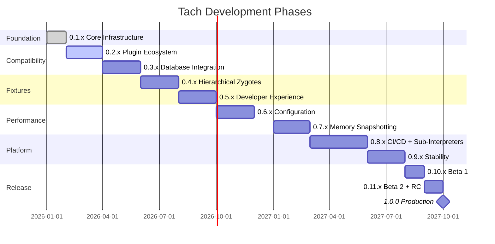

# Tach Roadmap

> **Current Version:** See [CHANGELOG.md](../../CHANGELOG.md) for the latest release and version history.

This document outlines the planned development trajectory for Tach. Items are aspirational and subject to change based on community feedback and technical discoveries.

---

## Version Overview



---

## Complete Development Flow

```mermaid
flowchart TB
    subgraph Phase1["Phase 1: Foundation ✅ COMPLETE"]
        direction TB
        P1_1["0.1.1 Docs & Polish"]
        P1_2["0.1.2 Test Compatibility"]
        P1_3["0.1.3 Error Handling"]
        P1_4["0.1.4 Dependency Updates"]
        P1_5["0.1.5 Tooling Research"]

        P1_1 --> P1_2
        P1_2 --> P1_3
        P1_3 --> P1_4
        P1_4 --> P1_5
    end

    subgraph Phase2["Phase 2: Plugin Compatibility 🔨 IN PROGRESS"]
        direction TB
        P2_0["0.2.0 Hook Framework ✅"]
        P2_1["0.2.1 pytest-django ✅"]
        P2_2["0.2.2 pytest-asyncio ✅"]
        P2_3["0.2.3 pytest-mock/env/timeout ✅"]
        P2_4["0.2.4 Landlock V4-V6"]
        P2_5["0.2.5 Plugin Stabilization"]

        P2_0 --> P2_1
        P2_0 --> P2_2
        P2_0 --> P2_3
        P2_0 --> P2_4
        P2_1 --> P2_5
        P2_2 --> P2_5
        P2_3 --> P2_5
        P2_4 -.->|optional| P2_5
    end

    subgraph Phase3["Phase 3: Database Integration"]
        direction TB
        P3_0["0.3.0 Django DB<br>(Transaction Rollback)"]
        P3_1["0.3.1 SQLAlchemy<br>(Session Mgmt)"]
        P3_2["0.3.2 Connection Mgmt<br>(FD Teleportation)"]
        P3_3["0.3.3 Additional DBs<br>(Postgres/MySQL/SQLite)"]

        P3_0 --> P3_2
        P3_1 --> P3_2
        P3_2 --> P3_3
    end

    subgraph Phase4["Phase 4: Fixture Lifecycle"]
        direction TB
        P4_0["0.4.0 Session Fixtures<br>(Shared Memory Cache)"]
        P4_1["0.4.1 Module Fixtures<br>(Boundary Detection)"]
        P4_2["0.4.2 Class Fixtures"]
        P4_3["0.4.3 Autouse Injection<br>(Auto-inject autouse=True)"]
        P4_4["0.4.4 Parametrized Fixtures<br>(Expand params at discovery)"]
        P4_5["0.4.5 Zygote Warmup<br>(Configurable pre-imports)"]
        P4_6["0.4.6 Zygote Pool<br>(Per-scope pools)"]

        P4_0 --> P4_1
        P4_1 --> P4_2
        P4_2 --> P4_5
        P4_3 --> P4_5
        P4_4 --> P4_5
        P4_5 --> P4_6
    end

    subgraph Phase5["Phase 5: Developer Experience"]
        direction TB
        P5_0["0.5.0 Enhanced Tracebacks ✅<br>(Colorization done)"]
        P5_1["0.5.1 Debug Mode"]
        P5_2["0.5.2 Interactive Debugging<br>(pdb/breakpoint)"]
        P5_3["0.5.3 Watch Mode Enhancements<br>(Targeted re-discovery)"]
        P5_4["0.5.4 Smart Watch Filtering<br>(.tachignore support)"]
        P5_5["0.5.5 Log Capture<br>(Structured parsing)"]
        P5_6["0.5.6 Coverage Optimization ✅<br>(PEP 669 done)"]

        P5_1 --> P5_2
        P5_3 --> P5_4
    end

    subgraph Phase6["Phase 6: Configuration"]
        direction TB
        P6_0["0.6.0 pyproject.toml Schema"]
        P6_1["0.6.1 ENV_DENYLIST<br>(Security filtering)"]
        P6_2["0.6.2 Toxicity Config<br>(Configurable blocklist)"]
        P6_3["0.6.3 Plugin Config<br>(Priority/disabled)"]
        P6_4["0.6.4 Scheduler Persistence<br>(Resume interrupted runs)"]
        P6_5["0.6.5 Config Profiles"]

        P6_0 --> P6_1
        P6_0 --> P6_2
        P6_0 --> P6_3
        P6_0 --> P6_4
        P6_4 --> P6_5
    end

    subgraph Phase7["Phase 7: Performance"]
        direction TB
        P7_0["0.7.0 Test History Store<br>(SQLite duration cache)"]
        P7_1["0.7.1 Memory Optimization<br>(Snapshot Compression)"]
        P7_2["0.7.2 UFFD Write-Protect<br>(Dirty Page Tracking)"]
        P7_3["0.7.3 Vectorized Restore<br>(Batch UFFDIO_COPY)"]
        P7_4["0.7.4 TLS Calibration ✅<br>(Sentinel scan done)"]
        P7_5["0.7.5 Adaptive Scheduling<br>(Duration Prediction)"]
        P7_6["0.7.6 Lazy Loading<br>(On-demand Import)"]
        P7_7["0.7.7 Advanced Snapshots<br>(Kernel LKM Research)"]
        P7_8["0.7.8 UFFD_EVENT_FORK<br>(Fork Tracking)"]
        P7_9["0.7.9 UFFD_EVENT_REMAP<br>(mremap Tracking)"]

        P7_0 --> P7_5
        P7_1 --> P7_2
        P7_2 --> P7_3
        P7_3 --> P7_7
        P7_1 --> P7_8
        P7_8 --> P7_9
    end

    subgraph Phase8["Phase 8: Platform Integration"]
        direction TB
        P8_0["0.8.0 GitHub Actions<br>(Annotations/Summary)"]
        P8_1["0.8.1 JUnit XML ✅<br>(Already implemented)"]
        P8_2["0.8.2 Other CI Platforms<br>(TeamCity/Azure DevOps)"]
        P8_3["0.8.3 Coverage Formats<br>(Cobertura/HTML)"]
        P8_4["0.8.4 Sub-Interp Architecture<br>(Design: Zygote hybrid)"]
        P8_5["0.8.5 Sub-Interpreters<br>(PEP 684 Experimental)"]
        P8_6["0.8.6 Sub-Interp State Reset<br>(Module re-init)"]

        P8_0 --> P8_2
        P8_2 --> P8_3
        P8_4 --> P8_5
        P8_5 --> P8_6
    end

    subgraph Phase9["Phase 9: Stability"]
        direction TB
        P9_0["0.9.0 Crash Recovery<br>(SIGCHLD detection)"]
        P9_1["0.9.1 Signal Routing<br>(Debug mode handling)"]
        P9_2["0.9.2 CleanupGuard<br>(Mutex poison immunity)"]
        P9_3["0.9.3 UFFD FD Limits<br>(Per-worker tracking)"]
        P9_4["0.9.4 Snapshot Memory<br>(Golden page budget)"]
        P9_5["0.9.5 OverlayFS Cleanup<br>(Upperdir pruning)"]
        P9_6["0.9.6 Seccomp Limits<br>(BPF instruction count)"]
        P9_7["0.9.7 Protocol Versioning<br>(Upgrade path)"]
        P9_8["0.9.8 Stress Testing<br>(10k+ Tests)"]

        P9_0 --> P9_1
        P9_1 --> P9_2
        P9_2 --> P9_3
        P9_3 --> P9_4
        P9_4 --> P9_5
        P9_5 --> P9_6
        P9_6 --> P9_7
        P9_7 --> P9_8
    end

    subgraph Phase10["Phase 10: Release 🔵 MILESTONE"]
        direction TB
        P10_0["0.10.0 Beta 1<br>(Feature Freeze)"]
        P10_1["0.10.1 Beta 1 Fixes"]
        P10_2["0.11.0 Beta 2"]
        P10_3["0.11.1 RC1"]
        P10_4["0.11.2 RC2"]
        P10_5["1.0.0 Production<br>(API Stability)"]

        P10_0 --> P10_1
        P10_1 --> P10_2
        P10_2 --> P10_3
        P10_3 --> P10_4
        P10_4 --> P10_5
    end

    subgraph Future["Future (Post-1.0)"]
        %% Details in "Future Phases (Post-1.0)" table below
        direction LR
        F0["1.1.x Maintenance"]
        F1["1.2.x Features"]
        F2["0.12.x Remote Execution"]
        F3["0.13.x Test Sharding"]
        F4["0.14.x Visual Testing"]
        F5["0.15.x AI-Powered"]
        F6["0.16.x Mutation Testing"]
        F7["0.17.x Property-Based"]
        F8["0.18.x Contract Testing"]
        F9["0.19.x Benchmarking"]
        F10["0.20.x Observability"]
    end

    %% Phase Dependencies (Phase 1 enables parallel work)
    Phase1 --> Phase2
    Phase1 --> Phase5
    Phase1 --> Phase6
    Phase1 --> Phase7
    Phase1 --> Phase8
    Phase1 --> Phase9
    Phase2 --> Phase3
    Phase3 --> Phase4
    Phase4 --> Phase10
    Phase9 --> Phase10
    Phase10 --> Future

    %% Cross-phase dependencies
    P2_1 -.->|"Django fixtures"| P3_0
    P3_0 -.->|"DB transactions"| P4_0
    P5_6 -.->|"PEP 669 coverage"| P8_3
    P7_8 -.->|"fork tracking"| P9_0

    %% Note: Some nodes (P5_0, P5_5, P5_6, P7_4, P7_6, P8_1) are intentionally disconnected
    %% They represent completed standalone work or items that can start independently

    %% Styling
    classDef done fill:#22c55e,stroke:#16a34a,color:#fff
    classDef inProgress fill:#f59e0b,stroke:#d97706,color:#fff
    classDef canStart fill:#3b82f6,stroke:#1d4ed8,color:#fff
    classDef pending fill:#94a3b8,stroke:#64748b,color:#fff
    classDef milestone fill:#8b5cf6,stroke:#7c3aed,color:#fff,stroke-width:2px

    class P1_1,P1_2,P1_3,P1_4,P1_5 done
    class P2_0,P2_1,P2_2,P2_3,P5_0,P5_6,P7_4,P8_1 done
    class P5_1 inProgress
    class P5_3,P5_5,P6_0,P6_2,P7_0,P7_1,P7_6,P8_0,P9_2,P9_5,P9_6,P9_7 canStart
    class P2_4 canStart
    class P2_5 pending
    class P3_0,P3_1,P3_2,P3_3 pending
    class P4_0,P4_1,P4_2,P4_3,P4_4,P4_5,P4_6 pending
    class P5_2,P5_4 pending
    class P6_1,P6_3,P6_4,P6_5 pending
    class P7_2,P7_3,P7_5,P7_7,P7_8,P7_9 pending
    class P8_2,P8_3,P8_4,P8_5,P8_6 pending
    class P9_0,P9_1,P9_3,P9_4,P9_8 pending
    class P10_0,P10_1,P10_2,P10_3,P10_4 pending
    class P10_5 milestone
    class F0,F1,F2,F3,F4,F5,F6,F7,F8,F9,F10 pending
```



**Legend:** 🟢 Done | 🟠 In Progress | 🔵 Can Start Now | ⚪ Pending | 🟣 Milestone

**Current Status:**

- Phase 1 (0.1.x): Complete
- Phase 2 (0.2.x): In Progress - 0.2.0 done, 0.2.1 done, 0.2.2 done, 0.2.3 done, 0.2.4 can start
- Phases 3-4: Blocked by Phase 2 plugin work
- Phases 5-9: **Many items can start NOW** - see blue "Can Start" nodes in flowchart
- Phase 10: Not started

---

## Strategic Context

> **Research Foundation**: This roadmap is informed by 12 research papers and competitive analysis of 10+ Rust-Python test tools. See [research/README.md](README.md) for paper analysis and implementation mapping, and [external-research.md](external-research.md) for competitive landscape.

### Competitive Landscape Summary

| Tool          | Approach            | Startup     | Tach Advantage            |
| ------------- | ------------------- | ----------- | ------------------------- |
| pytest-xdist  | execnet workers     | ~50-100ms   | 1000x faster isolation    |
| pytest-forked | fork() per test     | ~500-1000μs | 10x faster reset          |
| Maelstrom     | Container per test  | 50-100ms    | 1000x faster startup      |
| rtest/karva   | No isolation        | N/A         | Full isolation + fixtures |
| snob          | Test selection only | N/A         | Full execution engine     |

> **Key Insight**: No existing tool combines Tach's speed (<50μs reset), isolation (userfaultfd), and compatibility (full pytest fixtures). See [external-research.md §2.3](external-research.md#23-rust-based-python-test-runners) for detailed analysis.

### Competitive Feature Matrix

| Feature            | Tach        | pytest-xdist | Maelstrom  | snob    | rtest |
| ------------------ | ----------- | ------------ | ---------- | ------- | ----- |
| Per-test isolation | userfaultfd | None         | Containers | None    | None  |
| Reset time         | <50μs       | N/A          | 50-100ms   | N/A     | N/A   |
| Full fixtures      | Yes         | Yes          | Limited    | N/A     | No    |
| Test selection     | Planned     | No           | No         | **Yes** | No    |
| Distributed        | Planned     | Yes          | Yes        | No      | No    |
| Mutation testing   | Planned     | No           | No         | No      | No    |
| Static discovery   | Yes         | No           | Yes        | Yes     | Yes   |

> **Key Differentiator**: Tach is the only tool combining sub-millisecond isolation with full pytest fixture support. Competitors sacrifice either speed (Maelstrom) or compatibility (rtest, karva).

### Container Compatibility

> **Full Matrix:** See [container-compatibility.md](container-compatibility.md) for Docker, Podman, and Kubernetes configurations with capability requirements.

### Python Version Compatibility

> **Full Matrix:** See [../python-compatibility.md](../python-compatibility.md) for Python 3.10-3.14 support, PyPy status, and free-threading implications.

### Kernel Version Requirements

> **Full Matrix:** See [isolation-landlock.md](isolation-landlock.md) for Landlock ABI V1-V6 requirements and [isolation-userfaultfd.md](isolation-userfaultfd.md) for userfaultfd kernel requirements.

### What Tach Must Implement for pytest Parity

**Critical (Blocking Adoption)**:

- [ ] **Plugin Shim** (0.2.x): pytest-django, pytest-asyncio, pytest-mock support
  > Most real-world projects use at least one plugin. Without shims, adoption is blocked.
- [ ] **Database Rollback** (0.3.x): Transaction savepoint/rollback for Django ORM, SQLAlchemy
  > Database tests are ~40% of enterprise test suites. Memory snapshots don't restore DB state.
- [ ] **Session/Module Fixtures** (0.4.x): Fixtures persisting across tests
  > Expensive setup (DB migrations, API clients) must be cached, not re-run per test.

**Important (Adoption Friction)**:

- [ ] **pytest.raises/warns**: Exception and warning assertion helpers
- [ ] **Parametrized Fixtures**: `@pytest.fixture(params=[...])`
- [ ] **Marker Expressions**: Full `-m` expression support (`-m "slow and not db"`)
- [ ] **conftest.py Hooks**: `pytest_configure`, `pytest_collection_modifyitems`

**Nice-to-Have (Competitive Edge)**:

- [ ] **Test Impact Analysis**: snob-style "only run affected tests" mode
  > Ref: [alexpasmantier/snob](https://github.com/alexpasmantier/snob) - dependency graph analysis
  > **Implementation approach:**
  >
  > 1. Build code-to-test dependency graph during discovery
  > 2. Track which source files affect which tests via import analysis
  > 3. Integrate with `git diff` for "affected tests only" mode
  > 4. Cache dependency graph with file hash invalidation
  > 5. Provide `--affected` CLI flag for CI integration
- [ ] **Flaky Test Detection**: nextest-style retry and flakiness tracking
- [ ] **Distributed Execution**: Maelstrom-style cluster mode for CI farms

### What Tach Must Learn From Competitors

Based on [external-research.md §24](external-research.md#24-what-tach-must-learn-priority-order):

**From snob (Test Impact Analysis):**

- Dependency graph analysis for test selection
- Git commit range integration (`--affected --commit-range HEAD~5..HEAD`)
- Cache dependency graph with file hash invalidation

**From nextest (CI Integration):**

- Test partitioning for parallel CI jobs
- Flaky test detection with automatic retry
- Progress reporting UX patterns

**From Maelstrom (Distribution):**

- Broker/worker architecture for cluster mode
- OCI-like container images for reproducibility
- Cross-node result aggregation

**From pymute (Quality):**

- Mutation testing integration
- Parallel mutant execution patterns
- Quality score reporting

### Research-to-Implementation Mapping

| Version | Research Phase    | Primary Paper                                    | Key Deliverable                                     |
| ------- | ----------------- | ------------------------------------------------ | --------------------------------------------------- |
| 0.1.x   | Static Discovery  | _Python Testing Engine Rust Breakthroughs_       | AST-based test discovery eliminating "Import Tax"   |
| 0.2.x   | Plugin Isolation  | _Project Tach Compatibility Layer Blueprint_     | Shadow plugin shim with syscall interception        |
| 0.3.x   | Database Safety   | _Fork Safety of Python C-Extensions_             | Transactional rollback, connection dispose pattern  |
| 0.4.x   | Zygote Hierarchy  | _Forklift_, _Python Monorepo Zygote Tree Design_ | DAAC clustering for hierarchical pre-initialization |
| 0.5.x   | Observability     | _Rust-CPython Execution Blueprint Research_      | PEP 669 low-impact monitoring integration           |
| 0.6.x   | Zero-Copy Loading | _Zero-Copy Python Module Loading_                | mmap-based bytecode loading bypassing importlib     |
| 0.7.x   | Memory Snapshots  | _Python Memory Snapshotting with Userfaultfd_    | userfaultfd + MADV_DONTNEED microsecond reset       |
| 0.8.x+  | Cross-Platform    | _Cross-Platform Process Cloning Research_        | mach_vm_remap (macOS), NT Section Objects (Windows) |

### Research Verification Checklist

Before 1.0.0, verify all critical research requirements are met.

**Tooling and Container Compatibility (Q1 2026):**

| Requirement                        | Status | Documentation                                            |
| ---------------------------------- | ------ | -------------------------------------------------------- |
| `.ignore` File Interactions        | Done   | [tooling-conflicts.md](tooling-conflicts.md)             |
| Container Sandbox Behavior         | Done   | [container-compatibility.md](container-compatibility.md) |
| Ignored Test Categories (24 total) | Done   | [test-discovery-analysis.md](test-discovery-analysis.md) |

**Original Research Requirements:**

| Requirement                               | Research Source                            | External Ref                                                                         | Status   |
| ----------------------------------------- | ------------------------------------------ | ------------------------------------------------------------------------------------ | -------- |
| Allocator Quiesce (`thread.tcache.flush`) | _Memory Snapshotting with Userfaultfd_     | [jemalloc mallctl](https://jemalloc.net/jemalloc.3.html)                             | Pending  |
| Toxicity Detection (fork-unsafe patterns) | _Static Analysis for Toxic Python Modules_ | [POSIX fork()](https://pubs.opengroup.org/onlinepubs/9699919799/functions/fork.html) | Pending  |
| Namespace Isolation (CLONE_NEWNS/NET)     | _Compatibility Layer Blueprint_            | [Landlock docs](https://docs.kernel.org/userspace-api/landlock.html)                 | Pending  |
| Database Dispose (connection pools)       | _Fork Safety of Python C-Extensions_       | —                                                                                    | Pending  |
| TLS Restoration (mimalloc, Python 3.13+)  | _Userfaultfd and CPython Allocator_        | [mimalloc](https://github.com/microsoft/mimalloc)                                    | **Done** |
| TLS Calibration (sentinel scan)           | _Userfaultfd and CPython Allocator_        | See `src/isolation/calibration.rs`                                                   | **Done** |
| Landlock Path Canonicalization            | _Compatibility Layer Blueprint_            | [PathFd TOCTOU safety](https://docs.rs/landlock/)                                    | **Done** |
| Seccomp Blacklist (22 syscalls)           | _Compatibility Layer Blueprint_            | See `src/isolation/sandbox.rs`                                                       | **Done** |
| Iron Dome Integration                     | _Compatibility Layer Blueprint_            | `apply_iron_dome()` in sandbox.rs                                                    | **Done** |
| Graceful Degradation (kernel < 5.13)      | _Compatibility Layer Blueprint_            | `SandboxStatus::NotEnforced` handling                                                | **Done** |
| GIL Management (`py.allow_threads()`)     | —                                          | [PyO3 Parallelism](https://pyo3.rs/main/parallelism)                                 | Pending  |
| PyO3 0.26+ API Migration                  | —                                          | [PyO3 Migration](https://pyo3.rs/main/migration)                                     | Pending  |
| TLS Segment Registration (`fs_base`)      | _Userfaultfd and CPython Allocator_        | [arch_prctl(2)](https://man7.org/linux/man-pages/man2/arch_prctl.2.html)             | Pending  |
| Free-Threaded Python (3.13t/3.14t)        | —                                          | [py-free-threading](https://py-free-threading.github.io/)                            | Pending  |

### Documentation Index

> **Complete Index:** See [README.md](README.md) for the full documentation map.

| Category            | Count | Key Documents                                                                |
| ------------------- | ----- | ---------------------------------------------------------------------------- |
| Deep Dives          | 7     | `isolation-deep-dive.md`, `discovery-deep-dive.md`, `execution-deep-dive.md` |
| Isolation Modules   | 4     | `isolation-landlock.md`, `isolation-seccomp.md`, `isolation-userfaultfd.md`  |
| Research & Analysis | 6     | `external-research.md`, `topic-archive.md`, `container-compatibility.md`     |
| User Documentation  | 7     | `../quickstart.md`, `../configuration.md`, `../troubleshooting.md`           |

### Future Phases (Post-1.0)

> Detailed specs in [external-research.md](external-research.md) and [topic-archive.md](topic-archive.md)

| Version | Feature          | Learn From                |
| ------- | ---------------- | ------------------------- |
| 0.12.x  | Remote Execution | Maelstrom broker/worker   |
| 0.13.x  | Test Sharding    | nextest `--shard N/M`     |
| 0.14.x  | Visual Testing   | Playwright snapshots      |
| 0.15.x  | AI-Powered       | Flaky detection, test gen |
| 0.16.x  | Mutation Testing | pymute patterns           |
| 0.17.x  | Property-Based   | hypothesis integration    |
| 0.18.x  | Contract Testing | OpenAPI validation        |
| 0.19.x  | Benchmarking     | `@benchmark` marker       |
| 0.20.x  | Observability    | OpenTelemetry, Prometheus |

---

## 0.1.x - Foundation (Complete)

> **Status:** All 5 milestones delivered. See [CHANGELOG.md](../../CHANGELOG.md) for release details.
>
> **Research Foundation:** Implements the "Kineton" engine from _Python Testing Engine Rust Breakthroughs_.

### Delivered Features

| Version | Focus              | Key Deliverables                                                             |
| ------- | ------------------ | ---------------------------------------------------------------------------- |
| 0.1.1   | Docs & Polish      | Examples directory, quickstart guide, shell completions, `--dry-run`         |
| 0.1.2   | Test Compatibility | `pytest.raises/warns/approx`, traceback formatting, timeout handling         |
| 0.1.3   | Error Handling     | Error categorization (E001-E020), `--diagnose` flag, remediation suggestions |
| 0.1.4   | Dependencies       | PyO3 0.27.2, Rust 2024 Edition, Python 3.14 support                          |
| 0.1.5   | Tooling Research   | `.ignore` conflicts, container compatibility, test discovery analysis        |

> **Implementation Details:** For complete task breakdown and research references, see git history for v0.1.1-v0.1.5 tags.

---

## 0.2.x - Plugin Compatibility

> **Focus**: Shadow plugin shim for pytest ecosystem integration without full `pluggy` support.
>
> **Research Foundation**: Implements the "Matrix Layer" from _Project Tach Compatibility Layer Blueprint_ for syscall isolation.
>
> - "Isolation without overhead requires moving from userspace interception to kernel-level integration—combined with a pragmatic plugin shim that records and replays pytest internals" — _Project Tach Compatibility Layer Blueprint_
> - "Every syscall that modifies global state is transparently isolated per-worker with <5% overhead" — _Project Tach Compatibility Layer Blueprint_

The 0.2.x series introduces a plugin compatibility layer that intercepts common pytest plugin hooks. This is NOT full `pluggy` support - instead, we implement targeted shims for the most popular plugins.

> **Development Flow:** See the main flowchart at the top of this document for task dependencies. Items 0.2.1-0.2.4 can be developed in parallel after 0.2.0 is complete.

### 0.2.0 - Hook Interception Framework

**Target**: Core infrastructure for intercepting pytest hooks.

**Status**: Complete

> **Completed**: Hook registry types with Serde, 10 builtin hook specs, hook detection in conftest.py, marker extraction from decorators (with JSON output), autouse fixture detection, path canonicalization for hook matching, SysPathAction enum (type-safe), session effects IPC bridge (Zygote → Supervisor → Workers), debug logging for effect application, pytest_sessionstart in SESSION_HOOKS, HookEffect enum with all variants, toxicity integration for global-state-modifying hooks, conftest inheritance resolution, effect recording for pytest_configure/sessionstart, effect replay in workers, IPC protocol extension, plugin detection and warning system, HookResult type and aggregation strategies, HookCaller with PyO3 bridge, hook dependency graph, plugin shim registry.

#### Hook System Architecture

- [x] Design hook interception architecture
  > **Ref**: "Most pytest plugins perform one of three actions: Metadata modification, Fixture setup, or Reporting. Only (1) and (2) must be captured" — _Project Tach Compatibility Layer Blueprint_
  - [x] Hook registry for tracking available hooks
  - [x] Hook types with Serde derives for IPC serialization
  - [x] 10 builtin hook specs (pytest*configure, pytest_runtest*\*, etc.)
  - [x] Hook caller that invokes registered handlers
  - [x] Hook result aggregation (first-result, all-results)
  - [x] Hook wrapper specifications
- [x] Implement `conftest.py` discovery and loading
  - [x] Scan for `conftest.py` in test directories (existing)
  - [x] Parse hook function definitions
  - [x] Extract pytest markers from @pytest.mark.\* decorators
  - [x] Detect autouse fixtures
  - [x] Build hook dependency graph
  - [x] Handle conftest inheritance

#### Core Hook Support

- [x] `pytest_configure(config)` - Plugin configuration
- [x] `pytest_collection_modifyitems(items)` - Test collection modification
  > **Ref**: "By recording effects in the parent and replaying them in the child, Tach avoids the need to re-run complex plugin logic in every worker" — _Project Tach Compatibility Layer Blueprint_
- [x] `pytest_runtest_setup(item)` - Pre-test setup
- [x] `pytest_runtest_teardown(item)` - Post-test teardown
- [x] `pytest_runtest_makereport(item, call)` - Result reporting
- [x] `pytest_sessionstart(session)` - Session initialization
- [x] `pytest_sessionfinish(session)` - Session cleanup

#### Plugin Registration

- [x] Detect installed pytest plugins via `pkg_resources`
- [x] Create plugin shim registry
  > **Ref**: "The Tach supervisor creates a per-worker isolated namespace at clone time" — _Project Tach Compatibility Layer Blueprint_
- [x] Log warnings for unsupported plugins
- [x] Allow disabling specific plugins via config
- [x] Support plugin ordering/priority

### 0.2.1 - pytest-django Support

**Status**: ✅ COMPLETE (Core Infrastructure)

**Target**: First-class Django test support.

> **Parallelization**: Can be developed in parallel with 0.2.2, 0.2.3, and 0.2.3.1. Only requires 0.2.0 (hook framework) to be complete. No dependencies on other 0.2.x versions.

> **Note**: Marker detection (`django_db`, `urls`, etc.) is already implemented in core discovery. Tests marked with `@pytest.mark.django_db` are detected and the marker name is available in `TestCase.markers`. The items below are about _executing_ the marker behavior.

#### Implemented (v0.2.1)

- [x] `@pytest.mark.django_db` - Basic marker detection and savepoint isolation
- [x] `DjangoDbSetup` HookEffect for database configuration
- [x] SAVEPOINT-based transaction rollback in harness
- [x] pytest-django registered as "Supported" plugin
- [x] Integration tests in `tests/gauntlet_django/`

#### Deferred to 0.3.x (Database Integration)

See GitHub issues for tracking:

- [ ] `transaction=True` - Use real transactions (#40)
- [ ] `reset_sequences=True` - Reset auto-increment (#36)
- [ ] `databases=['default', 'secondary']` - Multi-db (#38)
- [ ] `@pytest.mark.urls('myapp.test_urls')` - URL override (#35)
- [ ] `@pytest.mark.ignore_template_errors` - Template error handling (#35)

#### Django Fixtures (Deferred to 0.3.x/0.4.x)

See #39 for tracking:

- [ ] `client` - Django test client
- [ ] `rf` - Request factory
- [ ] `admin_client` - Logged-in admin client
- [ ] `admin_user` - Admin user instance
- [ ] `django_user_model` - User model class
- [ ] `django_username_field` - Username field name
- [ ] `settings` - Settings override context manager
- [ ] `live_server` - Live server URL
- [ ] `db` - Database access fixture
- [ ] `transactional_db` - Transactional database

#### Database Handling (Deferred to 0.3.x)

- [x] Hook into Django's transaction management (savepoint-based)
- [ ] Preserve database connections across test resets
- [ ] Handle database migrations in test database
- [ ] Support `--reuse-db` flag for faster test runs (#37)
- [ ] Support `--create-db` flag for fresh database (#37)
- [ ] Handle multi-database configurations (#38)
- [ ] Support database aliases (#38)

### 0.2.2 - pytest-asyncio Support

**Target**: Native async/await test support.

> **Parallelization**: Can be developed in parallel with 0.2.1, 0.2.3, and 0.2.3.1. Only requires 0.2.0 (hook framework) to be complete. No dependencies on other 0.2.x versions.

#### Async Detection

- [x] Detect async test functions (`async def test_...`)
  > Already implemented in core discovery - TestCase.is_async field
- [x] Detect async fixtures (`@pytest.fixture` on async functions)
- [x] Handle sync tests that use async fixtures
- [x] Support async context managers
- [x] Handle async generators

#### Event Loop Management

- [x] Create event loop per test (default)
  > **Ref**: "To solve this, we employ tokio::task::LocalSet to pin interpreter-specific tasks to their originating thread" — _Rust-CPython Execution Blueprint Research_
- [x] Support session-scoped event loop via marker
- [x] Properly cleanup event loop after test
- [x] Handle `asyncio.run()` calls within tests
- [x] Support custom event loop policies
- [x] Handle uvloop integration

#### Marker Support

- [x] `@pytest.mark.asyncio` - Mark async tests
- [x] `@pytest.mark.asyncio(loop_scope="session")` - Shared loop
- [x] `@pytest.mark.asyncio(loop_scope="module")` - Module loop
- [x] Automatic async test detection mode

#### Coroutine Execution

- [x] Run async tests with proper timeout handling
- [x] Support `await` in async fixtures
- [x] Handle async context managers in fixtures
- [x] Proper cancellation on test timeout
- [x] Support gather/wait patterns
- [x] Handle TaskGroup cleanup

### 0.2.3 - Additional Plugin Support

**Target**: Support for commonly used pytest plugins.

**Status**: ✅ COMPLETE

> **Parallelization**: Can be developed in parallel with 0.2.1, 0.2.2, and 0.2.3.1. Only requires 0.2.0 (hook framework) to be complete. No dependencies on other 0.2.x versions.

#### pytest-mock

- [x] `mocker` fixture providing `unittest.mock` wrappers
  > Works natively via pytest's fixture resolution. Tach does not intercept.
- [x] `mocker.patch()` context manager
- [x] `mocker.patch.object()` method
- [x] `mocker.patch.dict()` dictionary patching
- [x] `mocker.spy()` for call tracking
- [x] `mocker.stub()` for stub creation
- [x] Automatic mock cleanup after each test
  > Handled by pytest-mock's built-in teardown
- [x] Support `mocker.stopall()`

#### pytest-env

- [x] Read `[pytest_env]` from `pyproject.toml`
- [x] Set environment variables before test collection
- [x] Support variable expansion (`{VAR}`)
  > Note: Uses `{VAR}` format per pytest-env convention, not `${VAR}`
- [x] ~~Preserve original values for restoration~~
  > Note: pytest-env does NOT restore values by design. This requirement was incorrect.
- [x] Support conditional env vars
  > Basic support via expansion. Full conditional syntax deferred.

#### pytest-timeout

- [x] `@pytest.mark.timeout(30)` marker support
- [x] Global timeout via config
- [x] Timeout methods: signal, thread
  > Note: Tach uses supervisor-level process termination (SIGTERM/SIGKILL)
- [x] Timeout callback for custom handling
  > Implemented via `timeout_hook` in config
- [x] Per-phase timeouts (setup, call, teardown)
  > Note: Current implementation is aggregate timeout. Per-phase is future enhancement.

#### pytest-cov (Deferred)

- [ ] Detect pytest-cov and warn about Tach's native coverage
  > **Ref**: "employs PEP 669 (Low-Impact Monitoring) to achieve observability with negligible overhead" — _Rust-CPython Execution Blueprint Research_
- [ ] Suggest using `--coverage` flag instead
- [ ] Disable pytest-cov when Tach coverage is active
- [ ] Support coverage configuration options

#### pytest-xdist (Compatibility)

- [ ] Detect pytest-xdist and warn about Tach's native parallelism
  > **Ref**: "Objects passed between orchestrator and worker processes must be serialized, a CPU-intensive operation that often negates the benefits of parallelism for short-running tests" — _Python Testing Engine Rust Breakthroughs_
- [ ] Support `-n` flag as alias for `--workers`
- [ ] Ignore xdist-specific markers gracefully

### 0.2.4 - Landlock V4-V6 Network Isolation (Kernel 6.7+)

**Target**: Use Landlock for network isolation when available, reducing reliance on CLONE_NEWNET.

> **Parallelization**: Fully independent. Can be developed at any time after 0.2.0. This is a kernel feature enhancement with no dependencies on plugin shims (0.2.1-0.2.3).

#### Network Restriction Rules

- [ ] Detect Landlock ABI V4+ at runtime
- [ ] Implement TCP bind restrictions per worker
  > Workers should only bind to assigned port ranges
- [ ] Implement TCP connect restrictions
  > Block outbound connections except to localhost and configured hosts
- [ ] Graceful fallback to `CLONE_NEWNET` on older kernels

#### Configuration

```toml
[tool.tach.network]
allow_localhost = true
allow_connect = ["api.example.com:443"]
allow_bind_ports = [8000, 8080]  # Empty = no binding allowed
```

> **External Ref:** [Landlock Kernel Docs - Network](https://docs.kernel.org/userspace-api/landlock.html)

### 0.2.5 - Plugin Testing and Stabilization

**Target**: Ensure plugin shims work correctly with real-world projects.

> **Parallelization**: SEQUENTIAL - Must wait for 0.2.1, 0.2.2, and 0.2.3 to complete. This version tests and stabilizes all plugin shims, so the plugins must exist first.

#### Testing

- [ ] Create plugin compatibility test suite
- [ ] Test against popular open-source Django projects
- [ ] Test against popular async projects (FastAPI, aiohttp)
- [ ] Document plugin compatibility matrix
- [ ] Create plugin integration tests

#### Performance

- [ ] Benchmark plugin overhead
- [ ] Optimize hook dispatch path
- [ ] Cache conftest.py parsing results
- [ ] Lazy-load plugin shims

---

## 0.3.x - Database Integration

> **Focus**: Transaction rollback and connection handling for database-heavy test suites.
>
> **Research Foundation**: Addresses the "Fork-Safety Paradox" from _Fork Safety of Python C-Extensions_ and database isolation from _Rust-Python Test Isolation Blueprint_.
>
> - "The fundamental assumptions of fork()—specifically regarding memory isolation and state duplication—are incompatible with the complex internal threading pools, global state mutexes, and hardware contexts managed by modern C libraries" — _Fork Safety of Python C-Extensions_
> - "Ensure that any connection pool created in the parent is explicitly discarded in the child process immediately after startup" — _Fork Safety of Python C-Extensions_
> - "Injecting SAVEPOINT and ROLLBACK TO SAVEPOINT to make DB tests I/O-free" — _Rust-Python Test Isolation Blueprint_

The 0.3.x series focuses on database test isolation. The key insight is that database state cannot be restored via memory snapshots - we need to hook into the database driver level to rollback transactions.

### 0.3.0 - Django Database Support

**Target**: Django ORM transaction rollback.

#### Transaction Management

- [ ] Hook into `django.db.transaction.atomic()`
  > **Ref**: "Regardless of success or failure, Tach injects ROLLBACK TO SAVEPOINT tach*test_start. This instantly reverts the database state" — \_Rust-Python Test Isolation Blueprint*
- [ ] Wrap each test in a savepoint
- [ ] Rollback savepoint after test completion
- [ ] Handle nested transactions correctly
- [ ] Support `transaction.on_commit()` hooks
- [ ] Handle transaction.non_atomic_requests

#### Multi-Database Support

- [ ] Track all database aliases in use
- [ ] Apply transaction wrapping to all databases
- [ ] Handle cross-database queries
- [ ] Support database routers
- [ ] Handle read replicas

#### Connection Preservation

- [ ] Keep database connections alive across tests
  > **Ref**: "Ensure that any connection pool created in the parent is explicitly discarded in the child process immediately after startup" — _Fork Safety of Python C-Extensions_
- [ ] Reset connection state without closing
- [ ] Handle connection pool exhaustion
- [ ] Reconnect on connection drop
- [ ] Monitor connection health

#### Migration Handling

- [ ] Detect migration state at startup
- [ ] Skip migration if test database exists and is current
- [ ] Support `--create-db` flag to force recreation
- [ ] Handle migration conflicts gracefully
- [ ] Support migration squashing

### 0.3.1 - SQLAlchemy Support

**Target**: SQLAlchemy session management.

#### Session Management

- [ ] Hook into `Session.commit()` to prevent actual commits
  > **Ref**: "Injecting SAVEPOINT and ROLLBACK TO SAVEPOINT to make DB tests I/O-free" — _Rust-Python Test Isolation Blueprint_
- [ ] Wrap sessions in nested transactions (savepoints)
- [ ] Handle `Session.rollback()` within tests
- [ ] Support scoped session patterns
- [ ] Handle session-per-request patterns

#### Engine Configuration

- [ ] Detect SQLAlchemy engine configuration
- [ ] Apply connection pooling optimizations
- [ ] Handle multiple engines (read replicas, etc.)
- [ ] Support async SQLAlchemy (asyncpg, aiosqlite)
- [ ] Handle engine disposal
  > **Ref**: "For applications using database drivers, adopt the 'dispose pattern.' Ensure that any connection pool created in the parent is explicitly discarded" — _Fork Safety of Python C-Extensions_

#### Alembic Integration

- [ ] Detect Alembic migration configuration
- [ ] Verify migration state matches expected
- [ ] Support running migrations before tests
- [ ] Handle migration downgrade on test database
- [ ] Support migration branching

### 0.3.2 - Connection Management

**Target**: Advanced connection pool handling.

#### Connection Pool Preservation

- [ ] Keep connection pools alive across worker restarts
- [ ] Implement FD handover via SCM_RIGHTS
  > **Ref**: "Pass FDs to worker processes via Unix sockets. Reconstruct connection objects from FDs" — _Project Tach Compatibility Layer Blueprint_
- [ ] Handle pool size limits correctly
- [ ] Monitor connection health
- [ ] Support connection aging

#### Database FD Handover

- [ ] Capture database connection file descriptors
- [ ] Pass FDs to worker processes via Unix sockets
- [ ] Reconstruct connection objects from FDs
- [ ] Handle SSL connections specially
  > **Ref**: "SSL error: decryption failed or bad record mac" — _Fork Safety of Python C-Extensions_
- [ ] Support connection metadata transfer

#### Health Checks

- [ ] Verify connection validity before test
- [ ] Detect stale connections
- [ ] Reconnect automatically on failure
- [ ] Log connection pool statistics
- [ ] Emit metrics for monitoring

### 0.3.3 - Additional Database Support

**Target**: Support for other database systems.

#### PostgreSQL Specific

- [ ] Support PostgreSQL savepoints natively
- [ ] Handle advisory locks
- [ ] Support LISTEN/NOTIFY cleanup
- [ ] Handle temp tables correctly
- [ ] Support PostgreSQL-specific types
- [ ] Handle pg_dump/pg_restore for fixtures

#### MySQL/MariaDB Specific

- [ ] Support MySQL savepoints
- [ ] Handle MySQL-specific locking
- [ ] Support MySQL 8.0+ features
- [ ] Handle character set issues
- [ ] Support MariaDB extensions

#### SQLite Specific

- [ ] In-memory database optimization
- [ ] File-based database snapshotting
- [ ] Handle WAL mode correctly
- [ ] Support shared cache mode
- [ ] Handle SQLite concurrent access

#### MongoDB (Experimental)

- [ ] Hook into PyMongo sessions
- [ ] Transaction support (requires replica set)
- [ ] Collection cleanup approach for non-transactional
- [ ] Document limitations
- [ ] Support Motor (async MongoDB)

#### Redis (Experimental)

- [ ] Support Redis transactions
- [ ] Handle Redis pub/sub cleanup
- [ ] Support Redis Cluster
- [ ] Handle connection pooling

#### gRPC Fork Safety

- [ ] Auto-detect gRPC usage in test dependencies
- [ ] Set `GRPC_ENABLE_FORK_SUPPORT=1` environment variable
  > **Ref**: "gRPC fork safety requires GRPC_ENABLE_FORK_SUPPORT=1 and epoll1 polling" — Fork Safety of Python C-Extensions
- [ ] Verify `epoll1` polling engine compatibility
- [ ] Warn if active RPCs detected before fork
  > gRPC fork support only works with no active RPCs
- [ ] Document gRPC-specific test patterns

> **External Ref:** [gRPC Fork Support](https://github.com/grpc/grpc/blob/master/doc/fork_support.md)

---

## 0.4.x - Fixture Lifecycle

> **Focus**: Proper handling of session-scoped and module-scoped fixtures.
>
> **Research Foundation**: Implements "Hierarchical Zygote Trees" from _Forklift_ and _Python Monorepo Zygote Tree Design_ using DAAC clustering.
>
> - "By moving beyond the traditional single-zygote model to a tiered, hierarchical structure, the proposed system maximizes memory sharing via Copy-on-Write (CoW) mechanisms" — _Python Monorepo Zygote Tree Design_
> - "The root node contains universally shared modules (e.g., os, sys). Child nodes branch off to specialize (e.g., a 'Data Science Zygote' adds numpy)" — _Python Monorepo Zygote Tree Design_
> - "A novel 'Dependency-Aware Agglomerative Clustering' (DAAC) algorithm that synthesizes the dependency graph into an optimal initialization tree" — _Python Monorepo Zygote Tree Design_

The 0.4.x series addresses one of the biggest gaps in the current implementation: fixtures that should persist across multiple tests. Session-scoped fixtures in particular are tricky because they must survive worker restarts.

### 0.4.0 - Session-Scoped Fixtures

**Target**: Fixtures that persist for the entire test session.

#### Session Fixture Caching

- [ ] Identify session-scoped fixtures at discovery time
  > **Ref**: "The forked process receives the list of modules to add via a pipe. It imports them. This process becomes the 'DataScience Zygote'" — _Python Monorepo Zygote Tree Design_
- [ ] Execute session fixtures before any tests run
- [ ] Store fixture values in shared memory
  > **Ref**: "This 'Zero-Copy' approach reduces the overhead of data transfer from O(N) (serialization) to O(1) (pointer passing)" — _Rust-Python Test Isolation Blueprint_
- [ ] Make values available to all workers
- [ ] Handle fixture dependencies

#### Serialization Strategy

- [ ] Define serialization protocol for fixture values
- [ ] Handle pickle-able objects directly
  > **Ref**: "Objects passed between orchestrator and worker processes must be serialized (pickled) and deserialized, a CPU-intensive operation" — _Python Testing Engine Rust Breakthroughs_
- [ ] Support custom serializers for complex objects
- [ ] Handle non-serializable fixtures (connections, etc.)
- [ ] Support cloudpickle for lambda functions

#### Finalization

- [ ] Track session fixture finalizers
- [ ] Run finalizers after all tests complete
- [ ] Handle finalizer errors gracefully
- [ ] Support async finalizers
- [ ] Ensure finalizer ordering

### 0.4.1 - Module-Scoped Fixtures

**Target**: Fixtures that persist for a single module.

#### Module Boundary Detection

- [ ] Group tests by module at scheduling time
  > **Ref**: "In this model, zygotes are specialized at different levels of a dependency tree. A root zygote might hold the OS-level dependencies; a second-level zygote might import pandas and numpy" — _Rust Static Analysis for Toxic Python Modules_
- [ ] Track module transitions during execution
- [ ] Trigger fixture finalization on module change
- [ ] Handle module re-entry

#### Fixture Lifecycle

- [ ] Setup module fixtures before first test in module
- [ ] Cache fixture values during module execution
- [ ] Teardown fixtures when leaving module
- [ ] Handle module import errors gracefully
- [ ] Support fixture reuse within module

#### Optimization

- [ ] Batch tests from same module to same worker
  > **Ref**: "We define a Weight Vector W where W[j] corresponds to the estimated cost of module m*j. These weights are derived from heuristics or optional historical profiling data" — \_Python Monorepo Zygote Tree Design*
- [ ] Minimize fixture setup/teardown overhead
- [ ] Share module fixtures between workers when safe
- [ ] Prefetch module fixtures

### 0.4.2 - Class-Scoped Fixtures

**Target**: Fixtures that persist for a test class.

#### Class Boundary Detection

- [ ] Group tests by class at scheduling time
- [ ] Track class transitions during execution
- [ ] Handle class inheritance correctly
- [ ] Support nested test classes

#### Fixture Lifecycle

- [ ] Setup class fixtures before first test in class
- [ ] Cache fixture values during class execution
- [ ] Teardown fixtures when leaving class
- [ ] Handle setup_class/teardown_class methods

### 0.4.3 - Advanced Fixture Features

**Target**: Complete fixture compatibility with pytest.

#### Autouse Fixtures

- [ ] Detect `@pytest.fixture(autouse=True)`
- [ ] Automatically apply to matching tests
- [ ] Respect fixture scope for autouse
- [ ] Handle autouse in conftest.py
- [ ] Support conditional autouse

#### Fixture Finalization Order

- [ ] Build fixture dependency graph
  > **Ref**: "A novel 'Dependency-Aware Agglomerative Clustering' (DAAC) algorithm that synthesizes the dependency graph into an optimal initialization tree" — _Python Monorepo Zygote Tree Design_
- [ ] Teardown in reverse dependency order
- [ ] Handle circular dependencies
- [ ] Support `yield` fixtures correctly
- [ ] Handle generator fixtures

#### Parametrized Fixtures

- [ ] Support `@pytest.fixture(params=[...])`
- [ ] Generate test variants for each param
- [ ] Handle fixture param ids
- [ ] Support indirect parametrization
- [ ] Support fixture param marks

#### Fixture Visualization

- [ ] Add `--fixtures` flag to show available fixtures
- [ ] Add `--fixture-graph` to visualize dependencies
  > **Ref**: "The Rust resolver calculates the module's fully qualified name based on its file path relative to the nearest **init**.py or namespace root" — _Python Monorepo Zygote Tree Design_
- [ ] Show fixture scope and autouse status
- [ ] Indicate where fixtures are defined
- [ ] Export fixture graph as DOT/Mermaid

---

## 0.5.x - Developer Experience

> **Focus**: Better error messages, debugging tools, and developer ergonomics.
>
> **Research Foundation**: Integrates PEP 669 low-impact monitoring from _Rust-CPython Execution Blueprint Research_ for observability.
>
> - "employs PEP 669 (Low-Impact Monitoring) to achieve observability with negligible overhead" — _Rust-CPython Execution Blueprint Research_
> - "the runner is a high-performance native binary—constructed in Rust—that acts as a hypervisor for the Python runtime" — _Rust-CPython Execution Blueprint Research_

The 0.5.x series focuses on making Tach a joy to use. Better error messages, powerful debugging tools, and smoother integration with development workflows.

### 0.5.0 - Enhanced Tracebacks

**Target**: pytest-quality error output.

#### Traceback Formatting

- [ ] Implement pytest-style short tracebacks
- [ ] Show only relevant frames (hide internal frames)
- [ ] Highlight the assertion line
- [ ] Support `--tb=short`, `--tb=long`, `--tb=native`
- [ ] Support `--tb=line` for one-line summaries
- [ ] Support `--tb=no` to disable tracebacks

#### Local Variable Display

- [ ] Capture local variables at assertion failure
  > **Ref**: "The evaluator inspects the f*code of the frame. It checks a high-performance Rust hash map to see if a mock has been registered" — \_Python Testing Engine Rust Breakthroughs*
- [ ] Display variable values inline with traceback
- [ ] Truncate large values intelligently
- [ ] Support `--showlocals` flag
- [ ] Color-code variable types

#### Assertion Introspection

- [ ] Parse assertion expressions
  > **Ref**: "The AST visitor walks the tree of a function. It serializes the nodes into a byte stream, deliberately excluding: Docstrings, Type hints, and Formatting" — _Python Testing Engine Rust Breakthroughs_
- [ ] Show sub-expression values
- [ ] Support comparison operators (`==`, `!=`, `<`, etc.)
- [ ] Handle complex expressions (`assert x in y`)
- [ ] Support `assert` with messages

#### Diff Display

- [ ] Show diffs for string comparisons
- [ ] Show diffs for dict comparisons
- [ ] Show diffs for list comparisons
- [ ] Color-code additions/deletions
- [ ] Support unified diff format

### 0.5.1 - Debug Mode

**Status**: 🔨 IN PROGRESS

**Target**: Deep visibility into Tach internals.

#### Verbose Logging

- [ ] `--debug` flag for detailed logging
- [ ] Log syscall activity (userfaultfd, fork, etc.)
  > **Ref**: "The userfaultfd subsystem fundamentally alters the contract between the memory management unit (MMU) and the user-space application" — _Python Memory Snapshotting with Userfaultfd_
- [ ] Log worker lifecycle events
- [ ] Log memory snapshot timing
- [ ] Log IPC message flow

#### Worker Visualization

- [ ] Show worker status in real-time
- [ ] Display which test each worker is running
- [ ] Show queue depth and scheduling decisions
- [ ] Indicate safe vs toxic workers
  > **Ref**: "The result is a binary classification for every module in the monorepo: Safe or Toxic" — _Rust Static Analysis for Toxic Python Modules_
- [ ] Show worker memory usage

#### Performance Profiling

- [ ] Measure time in discovery, execution, reporting
- [ ] Show per-test timing breakdown
- [ ] Identify slow fixture setup
- [ ] Profile memory snapshot overhead
  > **Ref**: "If a 1GB heap is snapshotted, but the subsequent execution only touches 50KB, only those 50KB are physically copied and mapped" — _Python Memory Snapshotting with Userfaultfd_
- [ ] Generate flamegraphs

### 0.5.2 - Interactive Debugging

**Target**: Seamless debugger integration.

#### pdb Support

- [ ] `--pdb` flag to drop into debugger on failure
- [ ] Detect `breakpoint()` calls in tests
- [ ] Disable worker isolation when debugging
  > **Ref**: "The Supervisor sets the user's physical terminal to Raw Mode. It enters a loop where it reads bytes from the user's stdin and writes them directly to the worker's PTY master" — _Project Tach Compatibility Layer Blueprint_
- [ ] Support `--pdb-first` for first failure only
- [ ] Support custom debuggers (ipdb, pudb)

#### Post-Mortem Debugging

- [ ] Capture exception state for post-mortem
- [ ] Support `pytest.set_trace()` equivalent
- [ ] Handle debugger in forked workers
- [ ] Serialize debugger context if needed

#### IDE Integration

- [ ] Document VS Code launch configurations
- [ ] Document PyCharm run configurations
- [ ] Support remote debugging
- [ ] Handle debugger attach to workers
- [ ] Support DAP (Debug Adapter Protocol)

### 0.5.3 - Output Customization

**Target**: Flexible output formatting.

#### Output Formats

- [ ] Support `--color=auto/always/never`
- [ ] Support `--no-header` for minimal output
- [ ] Support `--quiet` for summary only
- [ ] Support `--verbose` levels (-v, -vv, -vvv)
- [ ] Support custom output templates

#### Progress Display

- [ ] Support different progress styles (bar, dots, verbose)
- [ ] Support `--no-progress` for CI
- [ ] Show ETA for test completion
- [ ] Show test rate (tests/second)

### 0.5.4 - Coverage Optimization

**Target**: Near-zero overhead coverage using SlipCover patterns.

> **Research Foundation**: SlipCover achieves 5% overhead vs 218% for coverage.py via runtime de-instrumentation.

#### De-instrumentation Strategy

- [ ] Implement line-level de-instrumentation after first execution
  > **Ref**: "Periodically de-instrument covered lines. Overhead proportional to uncovered code" — SlipCover Paper
- [ ] Branch de-instrumentation for already-covered branches
- [ ] Hot-path detection to skip instrumentation entirely
- [ ] Incremental coverage mode (only instrument changed files)

#### PEP 669 Integration

- [ ] Use `sys.monitoring.DISABLE` return value for one-shot events
  > **Ref**: "Events can be disabled after first firing" — PEP 669
- [ ] Benchmark against coverage.py and SlipCover
- [ ] Target: <5% overhead for typical test suites

> **External Refs:**
>
> - [SlipCover Paper (ISSTA 2023)](https://dl.acm.org/doi/10.1145/3597926.3598128)
> - [SlipCover GitHub](https://github.com/plasma-umass/slipcover)

---

## 0.6.x - Configuration

> **Focus**: Complete configuration system with pyproject.toml support.
>
> **Research Foundation**: Enables "Zero-Copy" module loading configuration from _Zero-Copy Python Module Loading_.
>
> - "architecture treats the Python interpreter not as a standalone application that discovers code, but as an embedded execution engine that is fed pre-validated code objects" — _Zero-Copy Python Module Loading_
> - "This approach effectively shifts the computational costs of I/O, parsing, and compilation from the critical path of the Python process startup to a pre-computation phase" — _Zero-Copy Python Module Loading_

The 0.6.x series implements a full configuration system. Currently Tach has limited configuration - this series adds comprehensive pyproject.toml support.

### 0.6.0 - pyproject.toml Schema

**Target**: Full configuration via pyproject.toml.

#### Schema Definition

- [ ] Define complete `[tool.tach]` schema
  > **Ref**: "The Rust supervisor must pre-calculate the dependency graph of the modules and load them in Topological Order" — _Zero-Copy Python Module Loading_
- [ ] Document all configuration options
- [ ] Provide JSON schema for IDE completion
- [ ] Validate configuration on startup
- [ ] Support schema versioning

#### Core Options

```toml
[tool.tach]
testpaths = ["tests"]
python_files = ["test_*.py", "*_test.py"]
python_classes = ["Test*"]
python_functions = ["test_*"]
norecursedirs = [".git", "node_modules", ".venv"]
```

#### Execution Options

```toml
[tool.tach.execution]
workers = "auto"  # or integer
timeout = 60
exitfirst = false
maxfail = 0
```

### 0.6.1 - Test Configuration

**Target**: Fine-grained test behavior configuration.

#### Per-Test Timeout

- [ ] Support timeout in markers
- [ ] Support timeout in config by pattern
- [ ] Override global timeout per-test
- [ ] Handle timeout inheritance

#### Directory-Specific Settings

- [ ] Support `tach.toml` in subdirectories
- [ ] Merge settings from parent directories
- [ ] Override parent settings locally
- [ ] Document precedence rules

#### Marker-Based Configuration

- [ ] Configure behavior based on markers
  > **Ref**: "The visitor flags a module as Tier 3 if it encounters: Network I/O, Concurrency, System Mutation, or Global Locks" — _Python Monorepo Zygote Tree Design_
- [ ] Set default markers via config
- [ ] Filter tests by marker expression
- [ ] Support custom marker definitions

### 0.6.2 - Execution Configuration

**Target**: Control test execution behavior.

#### Test Ordering

- [ ] Random order: `--random-order`
- [ ] Dependency order: respect `@pytest.mark.dependency`
- [ ] Duration order: fastest first
  > **Ref**: "We profile packages and give more weight to those with slow module imports. We implement priority by replacing the 1's in the binary calls matrix with the weight values" — _Forklift_
- [ ] Reverse order: `--reverse`
- [ ] Alphabetical order

#### Environment Variables

- [ ] Define env vars in config
- [ ] Support env var files (`.env`)
- [ ] Expand variables in values
- [ ] Protect sensitive values
- [ ] Support per-environment configs

#### Isolation Modes

- [ ] Full isolation (default)
  > **Ref**: "Namespaces provide complete, kernel-enforced isolation with acceptable overhead. Every syscall is isolated at kernel level" — _Project Tach Compatibility Layer Blueprint_
- [ ] Relaxed isolation (faster, less safe)
- [ ] No isolation (`--no-isolation`)
- [ ] Per-test isolation override

### 0.6.3 - Configuration Profiles

**Target**: Support different configurations for different scenarios.

#### Profile System

- [ ] Define named profiles in config
- [ ] Switch profiles via `--profile` flag
- [ ] Support profile inheritance
- [ ] Document common profile patterns

#### Environment Detection

- [ ] Auto-detect CI environment
- [ ] Apply CI-specific defaults
- [ ] Support environment-based profiles
- [ ] Handle Docker/container detection

---

## 0.7.x - Performance

> **Focus**: Memory optimization, adaptive scheduling, and parallelism improvements.
>
> **Research Foundation**: Implements microsecond-scale memory reset using userfaultfd from _Python Memory Snapshotting with Userfaultfd_ and _Userfaultfd and CPython Allocator Interaction_.
>
> - "By 'snapshotting' the virtual memory state of a process and lazily restoring it upon access, engineers can achieve reset times measured in microseconds rather than milliseconds" — _Python Memory Snapshotting with Userfaultfd_
> - "If a 1GB heap is snapshotted, but the subsequent execution only touches 50KB, only those 50KB are physically copied and mapped. This O(N) cost... is the primary driver of UFFD's performance advantage" — _Python Memory Snapshotting with Userfaultfd_
> - "leverages jemalloc's manual cache flushing capabilities to establish a stable, high-performance test runner" — _Python Memory Snapshotting with Userfaultfd_

The 0.7.x series focuses on performance at scale. As test suites grow to thousands of tests, we need smarter scheduling and better memory management.

### 0.7.0 - Memory Optimization

**Target**: Reduce memory footprint and improve snapshot efficiency.

#### Memory Profiling

- [ ] Add `--memory-profile` flag
- [ ] Track memory usage per test
- [ ] Identify memory leaks
- [ ] Report peak memory usage
- [ ] Generate memory reports

#### Snapshot Optimization

- [ ] Reduce snapshot size via compression
- [ ] Implement incremental snapshots
  > **Ref**: "The kernel iterates over the Page Table Entries corresponding to the address range. It clears the 'Present' bit, effectively unmapping the physical pages" — _Python Memory Snapshotting with Userfaultfd_
- [ ] Skip unchanged memory regions
- [ ] Use copy-on-write more effectively
  > **Ref**: "workers inherit the parent's memory state without duplication, only copying physical pages when they are modified" — _Cross-Platform Process Cloning Research_
- [ ] Optimize page table handling

#### Memory Pressure Handling

- [ ] Detect low memory conditions
- [ ] Reduce worker count under pressure
- [ ] Trigger garbage collection proactively
  > **Ref**: "If a snapshot is taken while the GC is traversing the object graph and modifying gc*refs, a subsequent restore will leave the GC in an inconsistent state" — \_Userfaultfd and CPython Allocator Interaction*
- [ ] Fail gracefully on OOM
- [ ] Support memory limits

### 0.7.1 - Adaptive Scheduling

**Target**: Smart test scheduling based on historical data.

#### Duration Prediction

- [ ] Track test durations over time
  > **Ref**: "The significant skew in package popularity indicates that relatively few zygotes could provide substantial benefit. The top 15 packages alone account for more than 50% of the files" — _Forklift_
- [ ] Store duration data in cache file
- [ ] Predict duration for new tests
- [ ] Balance worker load based on predictions
- [ ] Handle duration variance

#### Hot/Cold Classification

- [ ] Identify frequently-run tests
- [ ] Prioritize cold tests for early execution
- [ ] Cache compilation for hot tests
- [ ] Optimize discovery for hot paths

#### Load Balancing

- [ ] Distribute tests evenly by predicted duration
- [ ] Handle stragglers (tests slower than predicted)
- [ ] Support test stealing between workers
- [ ] Minimize total wall-clock time

### 0.7.2 - Lazy Loading

**Target**: Reduce startup time for large codebases.

#### Lazy Module Loading

- [ ] Don't import modules until needed
  > **Ref**: "To speed up restart, zygotes are created lazily upon first use. Zygotes may be evicted under memory pressure" — _Forklift_
- [ ] Load test modules on-demand
- [ ] Share loaded modules between workers
- [ ] Support preloading via config

#### Import Graph Analysis

- [ ] Build module dependency graph
  > **Ref**: "Profiling data from large-scale deployments indicates that module initialization—specifically the parsing, compiling, and executing of top-level code in dependencies—accounts for 60% to 80% of cold start duration" — _Python Monorepo Zygote Tree Design_
- [ ] Identify shared dependencies
- [ ] Optimize import order
- [ ] Detect circular imports

#### Deferred Compilation

- [ ] Compile bytecode lazily
- [ ] Cache compiled bytecode
  > **Ref**: "The runner maintains a content-addressable store of compiled bytecode. When a file is modified, the runner invokes a compilation step to generate the binary blob for direct injection" — _Rust-CPython Execution Blueprint Research_
- [ ] Use mmap for bytecode files
- [ ] Share bytecode between workers

### 0.7.3 - Parallel Discovery

**Target**: Speed up test collection for large codebases.

#### Rayon Integration

- [ ] Parallelize file scanning
  > **Ref**: "Rust, utilizing the rayon data parallelism library, can saturate all CPU cores to parse and analyze thousands of files per second" — _Rust Static Analysis for Toxic Python Modules_
- [ ] Parse test files in parallel
- [ ] Merge discovery results efficiently
- [ ] Handle discovery errors in parallel context

#### Incremental Discovery

- [ ] Cache discovery results
- [ ] Detect file changes via mtime/hash
- [ ] Only re-discover changed files
- [ ] Support `--cache-clear` to reset

#### Parser Evaluation

- [ ] Benchmark `rustpython-parser` vs `ruff_python_parser` for test discovery
  > ruff_python_parser: "capable of processing gigabytes of source code per second" — Rust-CPython Execution Blueprint
- [ ] Evaluate error recovery characteristics (important for incomplete files)
- [ ] Consider migration if >2x performance improvement observed
- [ ] Document parser selection rationale

> **External Refs:**
>
> - [rustpython-parser](https://crates.io/crates/rustpython-parser)
> - [Ruff Architecture](https://docs.astral.sh/ruff/internals/)

### 0.7.4 - Advanced Snapshot Techniques (Research)

**Target**: Investigate next-generation snapshot approaches from fuzzing research.

#### Kernel Module Investigation

- [ ] Evaluate AFL-Snapshot-LKM approach for kernel-level snapshots
  > **Ref**: [AFL-Snapshot-LKM](https://github.com/AFLplusplus/AFL-Snapshot-LKM) achieves 20-360% speedup over fork-server
- [ ] Assess kernel module licensing and distribution implications
- [ ] Prototype kernel-assisted snapshot/restore cycle
- [ ] Benchmark against userfaultfd approach

#### LibAFL Integration Patterns

- [ ] Study LibAFL snapshot executor architecture
  > **Ref**: [LibAFL Book](https://aflplus.plus/libafl-book/) documents Rust fuzzing patterns
- [ ] Evaluate executor abstraction for Tach isolation modes
- [ ] Consider shared memory arena patterns from fuzzing

#### Performance Targets

| Technique             | Current Overhead | Target     | Speedup vs Fork | Implementation Complexity |
| --------------------- | ---------------- | ---------- | --------------- | ------------------------- |
| Fork (baseline)       | ~500-1000 μs     | N/A        | 1x              | Low                       |
| Fork server           | ~100-200 μs      | 0.1.x ✓    | 5x              | Low                       |
| userfaultfd           | ~10-50 μs        | **0.7.x**  | 10-50x          | Medium                    |
| Kernel snapshot (LKM) | ~1-5 μs          | **Future** | 100-500x        | High (GPL)                |

> **Licensing Note:** AFL-Snapshot-LKM is GPL-licensed. Distribution as kernel module has licensing implications for Tach's MIT license. Consider:
>
> - Optional separate download for kernel module
> - Benchmark-only usage (non-production)
> - Alternative: Investigate kernel API stabilization for mainline support

---

## 0.8.x - CI/CD Integration

> **Focus**: First-class CI/CD support with templates and integrations.
>
> **Research Foundation**: Enables future cross-platform support per _Cross-Platform Process Cloning Research_.
>
> - "By leveraging undocumented kernel primitives—Mach virtual memory remapping on macOS and NT process cloning on Windows—it is theoretically possible to approximate the performance of Linux fork()" — _Cross-Platform Process Cloning Research_
> - "The cornerstone of simulating Copy-on-Write on macOS without utilizing the standard fork() system call is mach*vm_remap" — \_Cross-Platform Process Cloning Research*

The 0.8.x series makes Tach a first-class citizen in CI/CD pipelines. Better reporting, CI platform integrations, and artifact handling.

### 0.8.0 - GitHub Actions

**Target**: Seamless GitHub Actions integration.

#### Workflow Templates

- [ ] Basic workflow template
- [ ] Matrix build template (multiple Python versions)
- [ ] Coverage workflow template
- [ ] Release workflow template
- [ ] Caching workflow template

#### GitHub Integration

- [ ] PR comment with test summary
- [ ] Status check reporting
- [ ] Annotation for test failures
- [ ] Problem matcher for error highlighting
- [ ] SARIF output for security findings

### 0.8.1 - Other CI Platforms

**Target**: Support for major CI platforms.

#### GitLab CI

- [ ] `.gitlab-ci.yml` templates
- [ ] GitLab JUnit integration
- [ ] Coverage badge support
- [ ] GitLab Pages for reports

#### Other Platforms

- [ ] CircleCI orb
- [ ] Jenkins pipeline library
- [ ] Azure DevOps tasks
- [ ] Travis CI examples
- [ ] Buildkite plugin
- [ ] Drone CI examples

### 0.8.2 - Reporting Improvements

**Target**: Better test result reporting.

#### JUnit XML Enhancements

- [ ] Add test properties to JUnit XML
- [ ] Support file attachments
- [ ] Include timing information
- [ ] Support test categories
- [ ] Handle multi-file output

#### HTML Reports

- [ ] Generate standalone HTML reports
- [ ] Include failure details and tracebacks
- [ ] Show test duration charts
- [ ] Support filtering and search
- [ ] Export as static site

#### Flaky Test Detection

- [ ] Track test pass/fail history
- [ ] Identify tests with inconsistent results
  > **Ref**: "If the child process did not explicitly re-seed, both parent and child would generate identical sequences of 'random' numbers" — _Fork Safety of Python C-Extensions_
- [ ] Report flakiness percentage
- [ ] Suggest potential causes
- [ ] Support auto-retry for flaky tests

### 0.8.3 - Coverage Reporting

**Target**: Complete coverage workflow.

#### Coverage Formats

- [ ] Cobertura XML (default)
- [ ] LCOV format
- [ ] JSON format
- [ ] HTML report
- [ ] SonarQube format

#### Coverage Features

- [ ] Coverage diff (new code only)
- [ ] Coverage thresholds (fail if below)
- [ ] Branch coverage
  > **Ref**: "employs PEP 669 (Low-Impact Monitoring) to achieve observability with negligible overhead" — _Rust-CPython Execution Blueprint Research_
- [ ] Missing lines report
- [ ] Coverage trending

### 0.8.4 - Sub-Interpreter Workers (Experimental)

**Target**: Alternative worker model using PEP 684 per-interpreter GIL instead of fork.

> **Research Foundation**: PEP 684 enables true parallel Python execution within a single process. PEP 734 (Python 3.14) exposes this via `concurrent.interpreters`.
>
> - "Each sub-interpreter can have its own GIL" — PEP 684
> - V8 isolates demonstrate 5ms startup (Cloudflare Workers model)

#### Sub-Interpreter Pool

- [ ] Prototype sub-interpreter-based worker using C-API
  > `Py_NewInterpreterFromConfig` with `PyInterpreterConfig_OWN_GIL`
- [ ] Implement channel-based communication between interpreters
  > No direct object sharing; use `interpreters.Queue` or shared memory
- [ ] Benchmark against fork-based workers
- [ ] Document extension module compatibility requirements
  > Many C extensions don't support sub-interpreters yet

#### PEP 734 Integration (Python 3.14+)

- [ ] Use `concurrent.interpreters` when available
- [ ] Fallback to C-API for Python 3.12-3.13
- [ ] Test with free-threaded Python builds

> **External Refs:**
>
> - [PEP 684 - Per-Interpreter GIL](https://peps.python.org/pep-0684/)
> - [PEP 734 - Multiple Interpreters in Stdlib](https://peps.python.org/pep-0734/)
> - [Cloudflare Workers Architecture](https://developers.cloudflare.com/workers/reference/how-workers-works/)

---

## 0.9.x - Stability

> **Focus**: Production hardening, crash recovery, and resource management.

The 0.9.x series hardens Tach for production use. Crash recovery, resource cleanup, and stress testing ensure reliability.

### 0.9.0 - Crash Recovery

**Target**: Graceful handling of crashes and errors.

#### Process Cleanup

- [ ] Detect and kill orphan workers
- [ ] Clean up shared memory on crash
- [ ] Handle SIGKILL correctly
- [ ] Recover from supervisor crash
- [ ] Clean up temp files

#### State Recovery

- [ ] Save test progress periodically
- [ ] Resume from last known state
- [ ] Report partial results on crash
- [ ] Support `--resume` flag
- [ ] Handle interrupted runs

### 0.9.1 - Signal Handling

**Target**: Proper signal handling throughout.

#### Signal Support

- [ ] SIGINT (Ctrl+C) - Graceful shutdown
- [ ] SIGTERM - Clean exit
- [ ] SIGHUP - Reload configuration
- [ ] SIGQUIT - Dump stack traces
- [ ] SIGUSR1 - Status dump

#### Child Signal Handling

- [ ] Forward signals to workers
- [ ] Handle worker signal death
- [ ] Timeout on worker shutdown
- [ ] Force kill unresponsive workers

### 0.9.2 - Resource Management

**Target**: Prevent resource leaks.

#### Leak Detection

- [ ] Track file descriptor usage
- [ ] Detect FD leaks
- [ ] Track memory allocations
- [ ] Detect memory leaks
- [ ] Track thread creation

#### Resource Limits

- [ ] Enforce FD limits per worker
- [ ] Enforce memory limits
- [ ] Enforce CPU time limits
- [ ] Report resource violations
- [ ] Support cgroups integration

### 0.9.3 - Stress Testing

**Target**: Verify stability under load.

#### Test Scenarios

- [ ] Large test suites (10k+ tests)
- [ ] Long-running tests (hours)
- [ ] High parallelism (100+ workers)
- [ ] Memory pressure scenarios
- [ ] Network failure scenarios

---

## 0.10.x - Beta 1

> **Focus**: Feature freeze and stabilization.

### 0.10.0 - Beta 1 Release

- [ ] Feature freeze
- [ ] API stability review
- [ ] Complete documentation
- [ ] Migration guide draft
- [ ] Public beta announcement

### 0.10.1 - Beta 1 Fixes

- [ ] Bug fixes from beta 1 feedback
- [ ] Performance regression testing
- [ ] Compatibility testing
- [ ] Security audit

---

## 0.11.x - Beta 2

> **Focus**: Final polish before 1.0.

### 0.11.0 - Beta 2 Release

- [ ] Address beta 1 feedback
- [ ] Final API changes
- [ ] Documentation updates
- [ ] Performance optimization

### 0.11.1 - Release Candidate 1

- [ ] Final bug fixes
- [ ] Release notes
- [ ] Upgrade path testing
- [ ] Community feedback

### 0.11.2 - Release Candidate 2

- [ ] Critical fixes only
- [ ] Final documentation
- [ ] Package verification
- [ ] Release preparation

---

## 1.0.0 - Production Ready

Stable release with API guarantees.

- [ ] Complete user documentation
- [ ] API stability commitment (SemVer)
- [ ] Migration guide from pytest
- [ ] Long-term support policy
- [ ] Performance benchmarks published
- [ ] Security best practices documented
- [ ] Battle-tested on real-world projects

---

## 1.1.x - Post-1.0 Maintenance

> **Focus**: Maintenance and minor improvements.

### 1.1.0 - First Maintenance Release

- [ ] Bug fixes from 1.0.0 feedback
- [ ] Minor performance improvements
- [ ] Documentation updates
- [ ] Dependency updates

### 1.1.1 - Patch Release

- [ ] Critical bug fixes
- [ ] Security patches

---

## 1.2.x - Post-1.0 Features

> **Focus**: New features that didn't make 1.0.

### 1.2.0 - Feature Release

- [ ] Features deferred from 1.0
- [ ] Community-requested features
- [ ] Plugin ecosystem improvements
- [ ] Additional database support

---

## External References

Consolidated external documentation and resources referenced throughout this roadmap.

### Python Standards

- [PEP 669 - Low Impact Monitoring](https://peps.python.org/pep-0669/) - Coverage and debugging
- [PEP 684 - Per-Interpreter GIL](https://peps.python.org/pep-0684/) - Sub-interpreter isolation
- [PEP 703 - Free Threading](https://peps.python.org/pep-0703/) - GIL removal (experimental)
- [PEP 734 - Multiple Interpreters](https://peps.python.org/pep-0734/) - Python 3.14 interpreters module
- [PEP 523 - Frame Evaluation API](https://peps.python.org/pep-0523/) - Native mocking

### Linux Kernel

- [userfaultfd(2)](https://man7.org/linux/man-pages/man2/userfaultfd.2.html) - User-space page fault handling
- [Landlock Docs](https://docs.kernel.org/userspace-api/landlock.html) - Filesystem/network sandboxing
- [namespaces(7)](https://man7.org/linux/man-pages/man7/namespaces.7.html) - Process isolation
- [OverlayFS](https://www.kernel.org/doc/html/latest/filesystems/overlayfs.html) - Copy-on-write filesystem

### Rust Libraries

- [PyO3 Guide](https://pyo3.rs/main/) - Rust-Python bindings
- [PyO3 Parallelism](https://pyo3.rs/main/parallelism) - GIL management patterns
- [jemalloc mallctl](https://jemalloc.net/jemalloc.3.html) - Allocator control API
- [rust-landlock](https://docs.rs/landlock) - Landlock Rust bindings

### Related Projects

- [AFL-Snapshot-LKM](https://github.com/AFLplusplus/AFL-Snapshot-LKM) - Kernel snapshot module
- [LibAFL](https://github.com/AFLplusplus/LibAFL) - Rust fuzzing framework
- [SlipCover](https://github.com/plasma-umass/slipcover) - Low-overhead coverage
- [Maelstrom](https://github.com/maelstrom-software/maelstrom) - Distributed test runner
- [snob](https://github.com/alexpasmantier/snob) - Test impact analysis

### Research Papers

- [SlipCover Paper (ISSTA 2023)](https://dl.acm.org/doi/10.1145/3597926.3598128) - De-instrumentation
- [Forklift Paper (WoSC 2024)](https://www.usenix.org/conference/wosc11/presentation/scherer) - Zygote trees
