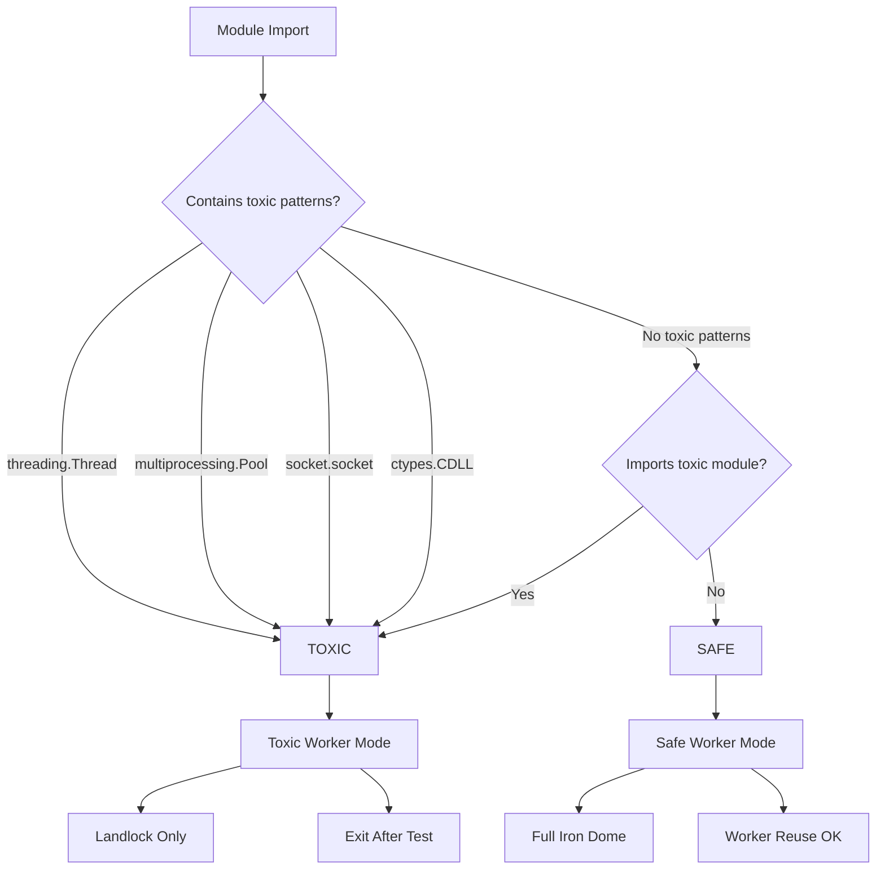
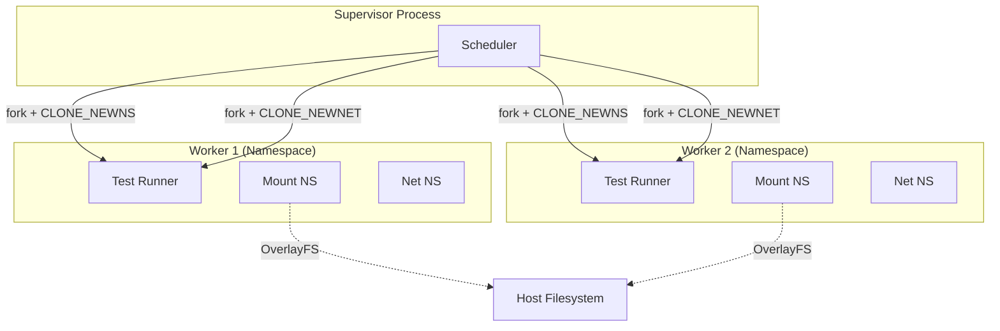
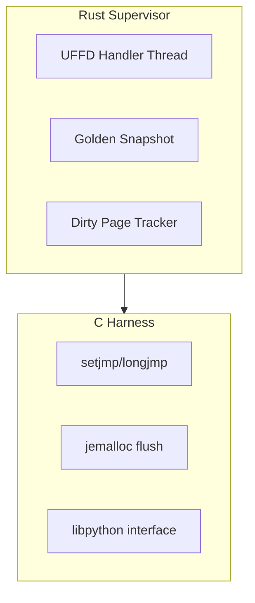

# Research Topic Archive

> Consolidated research blueprints for tach-core development.
> These topics informed the architecture decisions documented in `docs/architecture/`.

---


# Cross-Platform Process Cloning

> **Status:** Future work (CHANGELOG 0.8.x+)
> **Deep Dive:** [Cross-Platform Process Cloning Research](../papers-very-verbose/Cross-Platform%20Process%20Cloning%20Research.txt)

---

## Overview

Linux `fork()` provides Copy-on-Write (CoW) semantics enabling sub-10ms worker spawns. Neither macOS nor Windows natively supports this paradigm.

> Source: "The Darwin kernel (XNU) and the Windows NT kernel utilize fundamentally different process creation paradigms that were not designed with the optimization of runtime cloning as a primary objective." [Paper, Section 1]

**Core Challenge:** Replicate Linux's Zygote pattern performance (<10ms startup) on non-Linux platforms without kernel-level CoW support.

---

## macOS (Darwin)

### Key Primitives

| Primitive                                     | Purpose                                         |
| --------------------------------------------- | ----------------------------------------------- |
| `mach_vm_remap`                               | Map memory from another task with CoW semantics |
| `posix_spawn` + `POSIX_SPAWN_START_SUSPENDED` | Create BSD process in suspended state           |
| `task_for_pid()`                              | Acquire Mach task port for memory surgery       |
| `thread_get_state` / `thread_set_state`       | Transfer register state between processes       |

### Recommended Strategy: Suspended Spawn + Remap

1. `posix_spawn` with `POSIX_SPAWN_START_SUSPENDED` - creates valid PID
2. `task_for_pid()` to get task port (requires entitlement)
3. `mach_vm_remap` with `VM_FLAGS_OVERWRITE` and `copy=TRUE` for CoW
4. `thread_set_state` to transfer register context
5. `task_resume` to start execution

> Source: "This hybrid approach leverages the BSD subsystem for process lifecycle management while utilizing Mach primitives for high-performance memory cloning." [Paper, Section 2.2.1]

### Why Not `task_create`?

Creates a "bare" Mach task with no BSD identity (no PID, no file descriptors). Python would crash on any POSIX syscall.

> Source: "A Python interpreter running inside a raw Mach task would immediately crash upon attempting any POSIX system call." [Paper, Section 2.2]

---

## Windows (NT)

### Key Primitives

| Primitive                                | Purpose                                         |
| ---------------------------------------- | ----------------------------------------------- |
| `NtCreateProcessEx`                      | Legacy POSIX fork (creates zombie - no threads) |
| `RtlCloneUserProcess`                    | Modern fork with thread cloning                 |
| `NtCreateSection` / `NtMapViewOfSection` | Section Objects for shared memory               |
| `PAGE_WRITECOPY`                         | Manual CoW via memory protection                |
| Job Objects                              | Lifecycle management (kill-on-close)            |

### The Lock Inheritance Problem

`RtlCloneUserProcess` clones only the calling thread. Mutexes held by other threads remain locked in the child, causing deadlocks.

> Source: "This leads to immediate deadlocks if the child attempts to allocate memory or call generic Win32 APIs. This is the classic 'fork-safety' problem." [Paper, Section 4.2]

### Recommended Strategy: Section Objects + Manual CoW

1. Zygote creates `NtCreateSection` backed by paging file for Python heap
2. Workers spawn via standard `CreateProcess` (clean Win32 process)
3. Workers map section with `PAGE_WRITECOPY` protection
4. OS handles CoW at page level automatically

> Source: "This architecture avoids the CPU overhead of parsing and loading Python modules in the worker, as the data structures are already present in the mapped memory." [Paper, Section 5.1]

### Job Objects for Cleanup

```rust
// Essential flags for worker lifecycle
JOB_OBJECT_LIMIT_KILL_ON_JOB_CLOSE  // Kill all workers if supervisor dies
```

> Source: "The lifecycle of the workers is cryptographically tied to the Job handle." [Paper, Section 5.2]

---

## Micro-VMs: Not Viable for <10ms

### Latency Analysis

| Framework                                | Boot Latency | Notes                           |
| ---------------------------------------- | ------------ | ------------------------------- |
| Virtualization.framework                 | 150-300ms    | virtio overhead, Swift bridging |
| Hypervisor.framework (Firecracker-style) | ~100-125ms   | Context switch overhead         |
| **Target**                               | **<10ms**    | Required for test isolation     |

> Source: "The analysis conclusively indicates that neither framework can currently achieve <10ms startup times for a fresh VM boot sequence." [Paper, Section 3.3]

**Verdict:** Userspace cloning via `mach_vm_remap` remains the only viable path on macOS.

---

## Security Considerations

### macOS Entitlements

| Requirement                         | Impact                                |
| ----------------------------------- | ------------------------------------- |
| `com.apple.security.get-task-allow` | Required for `task_for_pid()`         |
| System Integrity Protection (SIP)   | May block task port acquisition       |
| Hardened Runtime                    | Strips entitlements in release builds |

> Source: "This operation requires the com.apple.security.get-task-allow entitlement. While standard in debug builds, this entitlement is stripped in release distributions." [Paper, Section 2.2.1]

### Windows Considerations

- `NtCreateProcessEx` / `RtlCloneUserProcess` are undocumented APIs
- May trigger EDR/security software alerts
- Section Objects require careful handle inheritance

---

## Implementation in Tach

**Target Version:** 0.8.x+ (future roadmap)

| Phase | Platform | Key Work                                                           |
| ----- | -------- | ------------------------------------------------------------------ |
| 1     | macOS    | `mach_vm_remap` FFI, suspended spawn, `mach_vm_region` enumeration |
| 2     | Windows  | Section Objects, Job Objects, ConPTY integration                   |

**Dependencies:** `portable-pty` crate, custom allocator hooking for Section Object backing

---

## Key References

> Source: [Apple vm_remap Documentation](https://developer.apple.com/documentation/kernel/1585336-vm_remap)

> Source: [Hunt and Hackett - Process Cloning on Windows](https://github.com/huntandhackett/process-cloning)

> Source: [Chrome PartitionAlloc Design](https://chromium.googlesource.com/chromium/src/+/master/base/allocator/partition_allocator/PartitionAlloc.md)

> Source: [portable_pty crate](https://docs.rs/portable-pty) | [Microsoft ConPTY](https://learn.microsoft.com/en-us/windows/console/creating-a-pseudoconsole-session)

## Summary

| Platform | Viable Approach                    | Expected Latency       |
| -------- | ---------------------------------- | ---------------------- |
| Linux    | Native `fork()` / `clone()`        | <10ms                  |
| macOS    | `posix_spawn` + `mach_vm_remap`    | ~10-20ms (theoretical) |
| Windows  | Section Objects + `PAGE_WRITECOPY` | ~20-50ms (theoretical) |

Micro-VMs are not viable for Tach's latency requirements. Userspace cloning primitives are the only path to approximate Linux `fork()` performance on non-Linux platforms.

---

# Fork Safety in Tach

> **Source Papers**: See [Fork Safety of Python C-Extensions](../papers-very-verbose/Fork%20Safety%20of%20Python%20C-Extensions.txt) and [Rust Static Analysis for Toxic Python Modules](../papers-very-verbose/Rust%20Static%20Analysis%20for%20Toxic%20Python%20Modules.txt) for complete analysis.

---

## Overview: The Fork-Safety Paradox

The Unix `fork()` system call was designed for single-threaded processes. When applied to multi-threaded Python applications with C-extensions, it creates a fundamental incompatibility that threatens process stability.

> "The fundamental assumptions of fork()---specifically regarding memory isolation and state duplication---are incompatible with the complex internal threading pools, global state mutexes, and hardware contexts managed by modern C libraries."
> Source: Fork Safety of Python C-Extensions

**The Paradox**: Libraries most valuable to pre-load (NumPy, TensorFlow, database drivers) are precisely those most likely to corrupt state after fork. This directly impacts Tach's Zygote architecture.

**Python 3.12+ Response**: A `DeprecationWarning` is now issued when `os.fork()` is called in a multithreaded process. Python 3.14 will likely change the default multiprocessing start method from `fork` to `spawn`.

---

## The Orphaned Lock Problem

When `fork()` duplicates a multi-threaded process, only the calling thread survives in the child. All other threads vanish without cleanup.

> "If a background thread holds a mutex or lock at the precise nanosecond fork() is invoked, that lock is copied into the child process's memory in a 'locked' state. However, the thread that 'owns' the lock does not exist in the child process."
> Source: Fork Safety of Python C-Extensions

**Consequences**:

- Child waits indefinitely for a non-existent thread to release the lock
- No exception thrown, no traceback generated
- Silent deadlock freezes the child immediately

**POSIX Requirement**: After `fork()` in a multithreaded program, the child may only execute **async-signal-safe** functions until it calls `exec()`. The Python interpreter, `malloc`, and `printf` are NOT async-signal-safe.

**Common Victim**: The `logging` module. If a background thread is writing to a log file during `fork()`, the logging lock is inherited in "acquired" state, deadlocking the first log call in the child.

### Fork-Safety Decision Flow



---

## Toxic Module Detection

Tach uses static AST analysis to classify modules as "safe" or "toxic" before execution. This prevents fork-unsafe modules from corrupting Zygote children.

### Toxicity Categories

| Category          | Pattern                             | Consequence                                          |
| ----------------- | ----------------------------------- | ---------------------------------------------------- |
| **Threading**     | `threading.Thread().start()`        | Thread structures copied but no kernel thread exists |
| **Locking**       | `threading.Lock()` at module level  | Mutex may be inherited in locked state               |
| **IPC**           | `multiprocessing.Pool()`            | Pipes/semaphores corrupted across fork               |
| **Randomness**    | `random.seed()`, `ssl.SSLContext()` | PRNG state duplicated, identical "random" values     |
| **I/O Resources** | `socket.socket()`, `open()`         | FD duplication causes interleaved writes             |

### Static Analysis Approach

> "Identify 'toxic' or 'fork-unsafe' Python modules through static analysis of import graphs."
> Source: Rust Static Analysis for Toxic Python Modules

**Key heuristics**:

1. **Blocklist Imports**: Flag `multiprocessing`, `socket`, `ctypes`, `grpc`, `tkinter`
2. **Top-Level Calls**: Detect `Thread().start()`, `Lock()`, `Pool()` at module scope
3. **Global Assignments**: Flag `MY_LOCK = threading.Lock()` patterns
4. **Scope Analysis**: Only flag code at `scope_depth == 0` (executed on import)
5. **Main Guard**: Skip code inside `if __name__ == "__main__":` blocks

### Transitive Toxicity

> "Toxicity is contagious. If Module A imports Module B, and Module B opens a database connection, then importing Module A effectively opens a database connection."
> Source: Python Monorepo Zygote Tree Design

Tach builds a dependency graph and propagates toxicity status. A module is toxic if:

- It is locally toxic, OR
- It imports a toxic module

---

## C-Extension Risks

The most severe fork-safety violations occur in C-extensions that manage their own threading and resources.

### NumPy / BLAS

> "If the child process attempts a linear algebra operation, the BLAS library checks its internal state, sees an 'initialized' pool, and attempts to dispatch work to the threads. Since the threads do not exist, the dispatch mechanism deadlocks."
> Source: Fork Safety of Python C-Extensions

**Failure Mode**: `np.linalg.inv(A)` in child hangs if parent triggered BLAS initialization.

### TensorFlow / PyTorch

> "TensorFlow is explicitly not fork-safe. The primary point of failure is the interaction with the GPU via CUDA. The CUDA runtime API does not support fork()."
> Source: Fork Safety of Python C-Extensions

**Failure Mode**: GPU memory mapping invalid in child, Eigen thread pool becomes zombie.

> "PyTorch documentation defines the 'Poison Fork' as a scenario where the accelerator runtime (CUDA or OpenMP) is initialized before the fork."
> Source: Fork Safety of Python C-Extensions

### gRPC

> "Historically, gRPC was completely unsafe to fork. The background threads managed by grpc-core would die upon fork, leaving the completion queue in a zombie state."
> Source: Fork Safety of Python C-Extensions

**Mitigation**: `GRPC_ENABLE_FORK_SUPPORT=1` enables `pthread_atfork` handlers, but only works with `epoll1` polling and requires no active RPCs.

### Database Drivers (Psycopg2, Redis)

> "libpq connections are stateful and tied to a socket. Forking duplicates the socket. If the child uses the inherited connection, it injects data into the parent's TCP stream."
> Source: Fork Safety of Python C-Extensions

**SSL Complication**: Encryption context cannot be shared. Results in "SSL error: decryption failed or bad record mac".

---

## Mitigation Strategies

### 1. Use `spawn` Instead of `fork`

```python
import multiprocessing
multiprocessing.set_start_method('spawn')
```

> "The industry-wide migration away from fork toward spawn and forkserver models, a shift formally recognized by the Python Steering Council's deprecation of fork-with-threads in Python 3.12."
> Source: Fork Safety of Python C-Extensions

### 2. Dispose Pattern for Database Connections

```python
# In the child process:
engine.dispose(close=False)  # Discards pool struct without closing parent sockets
```

> "Ensure that any connection pool created in the parent is explicitly discarded (not closed, which kills the parent's socket) in the child process immediately after startup."
> Source: Fork Safety of Python C-Extensions

### 3. Environment Variables for Thread Control

```bash
export OMP_NUM_THREADS=1
export OPENBLAS_NUM_THREADS=1
export MKL_NUM_THREADS=1
```

This prevents BLAS/OpenMP from creating thread pools that corrupt on fork.

### 4. Lazy Loading Pattern

> "The report recommends that 'Toxic' modules are not necessarily banned but must be refactored to use Lazy Loading."
> Source: Rust Static Analysis for Toxic Python Modules

**Toxic Pattern**:

```python
# db.py - WRONG
import redis
CLIENT = redis.Redis()  # Connection created at import
```

**Safe Pattern**:

```python
# db.py - CORRECT
import redis
_CLIENT = None

def get_client():
    global _CLIENT
    if _CLIENT is None:
        _CLIENT = redis.Redis()  # Connection created at first use
    return _CLIENT
```

---

## Implementation in Tach

Tach addresses fork-safety through multiple mechanisms mapped to the development roadmap.

### Toxicity Classification (Current)

Tach classifies tests and their dependencies as safe or toxic at discovery time:

- **Safe Workers**: Full Iron Dome (Landlock + Seccomp), can reuse workers
- **Toxic Workers**: Landlock only (skip Seccomp for subprocess support), must exit after test

> "The result is a binary classification for every module in the monorepo: Safe or Toxic."
> Source: Rust Static Analysis for Toxic Python Modules

### Database Integration (0.3.x)

The 0.3.x series specifically addresses database fork-safety:

> "Injecting SAVEPOINT and ROLLBACK TO SAVEPOINT to make DB tests I/O-free."
> Source: Rust-Python Test Isolation Blueprint

Key features:

- Transaction wrapping with automatic rollback
- Connection pool disposal in child processes
- FD handover via SCM_RIGHTS for connection preservation

See [CHANGELOG.md](../../../CHANGELOG.md) section 0.3.x for complete database roadmap.

### Hierarchical Zygotes (0.4.x)

The 0.4.x series implements hierarchical zygote trees that respect toxicity boundaries:

> "The root node contains universally shared modules (e.g., os, sys). Child nodes branch off to specialize (e.g., a 'Data Science Zygote' adds numpy)."
> Source: Python Monorepo Zygote Tree Design

Toxic modules are excluded from zygote pre-loading. Tests requiring toxic dependencies fork from appropriate safe ancestors.

---

## Quick Reference: Fork-Safety Status

| Library      | Status        | Failure Mode      | Mitigation                   |
| ------------ | ------------- | ----------------- | ---------------------------- |
| NumPy        | Unsafe        | BLAS deadlock     | `OPENBLAS_NUM_THREADS=1`     |
| Pandas       | Unsafe        | Inherits NumPy    | spawn                        |
| TensorFlow   | Unsafe        | CUDA/Eigen zombie | spawn (mandatory)            |
| PyTorch      | Unsafe        | OpenMP/CUDA       | spawn (mandatory)            |
| gRPC         | Conditional   | Completion queue  | `GRPC_ENABLE_FORK_SUPPORT=1` |
| Psycopg2     | Unsafe        | Socket/SSL        | `engine.dispose()`           |
| Redis-py     | Unsafe        | Pool duplication  | Reset pool in child          |
| Cryptography | Safe (Modern) | Historic PRNG     | Update OpenSSL > 1.1.1d      |
| orjson       | Safe          | Stateless Rust    | N/A                          |

---

## Key References

> "The fork() system call was designed in an era of single-threaded programming."
> Source: Rust Static Analysis for Toxic Python Modules, Section 1.3

> "Code at the top level of a module (indentation zero) executes on import. Code inside a function body executes only when called."
> Source: Rust Static Analysis for Toxic Python Modules, Section 4.1

> "The child process inherits a corrupted state. The background thread is dead, but the memory structures indicating it is running remain."
> Source: Rust Static Analysis for Toxic Python Modules, Section 1.3

> "The 'Copy-on-Write' Fallacy: Python utilizes reference counting for memory management. Even reading a Python object requires incrementing its reference count, which is a write operation."
> Source: Fork Safety of Python C-Extensions, Section 2.3

> "Rust, utilizing the rayon data parallelism library, can saturate all CPU cores to parse and analyze thousands of files per second."
> Source: Rust Static Analysis for Toxic Python Modules, Section 3.1

---

## See Also

- [Toxicity Architecture](../../architecture/toxicity.md) - Tach's toxicity classification system
- [Zygote Architecture](../../architecture/zygote.md) - Fork-server implementation details
- [CHANGELOG 0.3.x](../../../CHANGELOG.md) - Database integration roadmap

---

# Test Isolation for Parallel Execution

This document summarizes isolation strategies for Tach based on research blueprints.

For deep dives, see:

- [Project Tach Compatibility Layer Blueprint](../papers-very-verbose/Project%20Tach%20Compatibility%20Layer%20Blueprint.txt)
- [Rust-Python Test Isolation Blueprint](../papers-very-verbose/Rust-Python%20Test%20Isolation%20Blueprint.txt)

---

## Overview

Parallel test execution breaks without isolation. When 32 workers run simultaneously:

- Worker #5 calls `open("/tmp/log.txt", O_WRONLY)` and collides with Worker #3
- Worker #12 binds `127.0.0.1:8080` and gets "Address already in use"
- Worker #7 modifies `/dev/shm/cache` and corrupts Worker #19's snapshot

> Source: "When 32 test workers run in parallel: Worker #5 calls open('/tmp/log.txt', O_WRONLY) -> collides with Worker #3" - Project Tach Compatibility Layer Blueprint

> Source: "Every syscall that modifies global state is transparently isolated per-worker with <5% overhead" - Project Tach Compatibility Layer Blueprint

---

## Linux Namespaces

The primary isolation mechanism uses kernel namespaces via `clone()`:

```rust
let flags = CloneFlags::CLONE_NEWNS   // Mount namespace isolation
          | CloneFlags::CLONE_NEWNET  // Network namespace isolation
          | CloneFlags::CLONE_VM      // Share virtual memory (CoW)
          | CloneFlags::CLONE_FILES;  // Share file descriptor table
```

**CLONE_NEWNS:** Each worker gets its own filesystem view. Operations run at native speed once established.

> Source: "Once the namespace is established, filesystem operations run at native speed. The kernel resolves paths using the namespace-specific vfsmount table" - Rust-Python Test Isolation Blueprint

**CLONE_NEWNET:** Isolates network interfaces so port bindings never collide.

> Source: "Port 8080 in worker #5 is separate from port 8080 in worker #12" - Project Tach Compatibility Layer Blueprint

### Namespace Architecture



**CLONE_NEWUSER:** Allows unprivileged mount operations inside the namespace.

> Source: "The User namespace allows a non-root process to map its user ID to root (0) inside the namespace" - Rust-Python Test Isolation Blueprint

**Kernel Requirements:** `CLONE_NEWNS` (2.4.19+), `CLONE_NEWNET` (2.6.24+), `overlayfs metacopy` (5.11+ for optimal performance)

---

## Filesystem Isolation

Each worker mounts an overlay with read-only lower and writable upper layers:

```
/var/tach/workers/{id}/lower   <- Read-only bind of host /tmp
/var/tach/workers/{id}/upper   <- Writable tmpfs (in-memory)
/var/tach/workers/{id}/merged  <- Overlayfs mount point
```

> Source: "Worker #5 reads /tmp/test_data.bin -> direct read from lower (host) layer, zero copy. Worker #5 writes to /tmp/test_output.txt -> copied to upper layer on first write only" - Project Tach Compatibility Layer Blueprint

**LD_PRELOAD Fallback:** When namespaces are unavailable, intercept syscalls via library preload to rewrite paths (`/tmp/log.txt` -> `/tmp/tach_overlay/5/log.txt`).

> Source: "LD_PRELOAD alone covers ~75% of real-world pytest tests, but fails on: C/C++ extension libraries (numpy, cv2, protobuf), pytest plugins written in C" - Project Tach Compatibility Layer Blueprint

---

## Network Isolation

Each worker gets its own network namespace with a veth pair:

```rust
Command::new("ip").args(&["link", "add", "veth_w", "type", "veth", "peer", "name", "veth_h"]).output()?;
Command::new("ip").args(&["addr", "add", &format!("192.168.{}.2/24", worker_id), "dev", "veth_w"]).output()?;
```

> Source: "Setup veth pair: veth_worker -> bridge -> veth_host. This gives worker isolated lo + veth interface" - Project Tach Compatibility Layer Blueprint

---

## The Matrix Layer

The "Matrix Layer" provides syscall virtualization with minimal overhead:

| Vector      | Overhead | Coverage | Use Case         |
| ----------- | -------- | -------- | ---------------- |
| LD_PRELOAD  | <2%      | ~75%     | Fallback only    |
| Seccomp-BPF | ~15-45%  | 100%     | Security sandbox |
| Namespaces  | <2%      | 100%     | **Primary**      |

> Source: "Namespaces provide complete, kernel-enforced isolation with acceptable overhead. This is the primary vector" - Project Tach Compatibility Layer Blueprint

---

## Shadow Plugin Shim

pytest plugins cannot run in isolated workers. Solution: record effects in parent, replay in child.

**Recording (Parent):**

```python
def record_collection_modify(self, items):
    modifications = [{"nodeid": item.nodeid, "markers": [m.name for m in item.iter_markers()]} for i, item in enumerate(items)]
    self.recorded_effects["collection_modifications"] = modifications
```

> Source: "Most pytest plugins perform one of three actions: Metadata modification, Fixture setup, or Reporting. Only (1) and (2) must be captured" - Project Tach Compatibility Layer Blueprint

**Replay (Child):**

```python
def replay_collection_modifications(self, items):
    for i, item in enumerate(items):
        for marker_name in self.collection_mods[i]["markers"]:
            item.add_marker(pytest.Mark(marker_name, (), {}))
```

> Source: "Plugins run once (in parent), record their 'effects', and those effects are replayed in each child worker via an IPC channel" - Project Tach Compatibility Layer Blueprint

**Cannot be shimmed:** `pytest_timeout` (signal handlers are process-local), `pytest-xdist` (replaced by Tach).

---

## Implementation in Tach

### CHANGELOG 0.2.x (Plugin Compatibility)

Maps directly to the Matrix Layer and Shadow Plugin Shim:

> Source: "Implements the 'Matrix Layer' from Project Tach Compatibility Layer Blueprint for syscall isolation" - CHANGELOG.md

Key deliverables: Hook interception framework, plugin recording/replay via IPC, pytest-django/asyncio support.

### Iron Dome (0.1.x - Current)

Security sandbox combining Landlock + Seccomp:

- **Safe workers**: Full Iron Dome (Landlock + Seccomp)
- **Toxic workers**: Landlock only (need subprocess support)

> Source: "Toxic workers: Need subprocess support, so bypass Seccomp" - CLAUDE.md

---

## Overhead Budget

| Component            | Overhead                       | Notes                |
| -------------------- | ------------------------------ | -------------------- |
| Namespace creation   | 50ms                           | Once per worker      |
| Mount overlayfs      | 15ms                           | Once per worker      |
| Network veth setup   | 10ms                           | Once per worker      |
| Per-syscall (read)   | <1us                           | Filesystem cache hit |
| Per-syscall (write)  | 5-10us                         | CoW page table ops   |
| **Total per worker** | **~100ms setup + <2% runtime** | Acceptable           |

> Source: "Overhead Budget" table - Project Tach Compatibility Layer Blueprint

---

## Fallback Strategies

If Namespaces + LD_PRELOAD fail:

- **Gramine-TDX:** Complete isolation via SGX enclaves (25-40% overhead)
- **Intel Dune:** Ring -1 hypervisor for syscall rewriting (5-20% overhead, 6+ month effort)

> Source: "Deploy only if Namespaces + LD_PRELOAD fails AND speed loss is acceptable (<10x instead of 100x)" - Project Tach Compatibility Layer Blueprint

---

## Key References

> Source: "Isolation without overhead requires moving from userspace interception to kernel-level integration" - Project Tach Compatibility Layer Blueprint

> Source: "The central tenet of the proposed architecture is treating the process, rather than the machine, as the unit of isolation" - Rust-Python Test Isolation Blueprint

**External:**

- [Linux Namespaces](https://man7.org/linux/man-pages/man7/namespaces.7.html)
- [OverlayFS](https://www.kernel.org/doc/html/latest/filesystems/overlayfs.html)
- [Landlock](https://docs.kernel.org/userspace-api/landlock.html)
- [MBOX Paper](https://www.usenix.org/conference/atc13/technical-sessions/presentation/kim)

---

## See Also

- [Toxicity Classification](../../architecture/toxicity.md) - Which tests need full isolation
- [Snapshot Architecture](../../architecture/snapshot.md) - Memory state restoration
- [Zygote Hierarchy](../../architecture/zygote.md) - Process cloning patterns

---

# Memory Snapshotting

Tach uses Linux userfaultfd (UFFD) to achieve microsecond-scale memory resets between test executions. This document summarizes the kernel mechanics, allocator interactions, and implementation considerations.

For detailed analysis, see:

- [Python Memory Snapshotting with Userfaultfd](../papers-very-verbose/Python%20Memory%20Snapshotting%20with%20Userfaultfd.txt)
- [Userfaultfd and CPython Allocator Interaction](../papers-very-verbose/Userfaultfd%20and%20CPython%20Allocator%20Interaction.txt)

---

## Overview

Traditional fork-server models incur kernel overhead from page table duplication and COW fault handling. UFFD provides an alternative: user-space demand paging that decouples memory restoration from process creation.

> Source: "By 'snapshotting' the virtual memory state of a process and lazily restoring it upon access, engineers can achieve reset times measured in microseconds rather than milliseconds."
> -- Python Memory Snapshotting with Userfaultfd

The key insight is **lazy restoration**: only pages actually accessed during execution are physically copied.

> Source: "If a 1GB heap is snapshotted, but the subsequent execution only touches 50KB, only those 50KB are physically copied and mapped. This O(N) cost, where N is the number of touched pages rather than the total heap size, is the primary driver of UFFD's performance advantage."
> -- Python Memory Snapshotting with Userfaultfd

---

## UFFD Mechanics

### Registration and Fault Handling

UFFD intercepts the standard page fault handler path via `UFFDIO_REGISTER`:

1. **Registration** - Register VMAs with `UFFDIO_REGISTER_MODE_MISSING`
2. **Fault** - Hardware raises page fault; kernel suspends faulting thread
3. **Resolution** - Supervisor receives `UFFD_EVENT_PAGEFAULT`, issues `UFFDIO_COPY`
4. **Wake** - Kernel maps restored page, wakes suspended thread

> Source: "When a process accesses a virtual address registered with UFFDIO_REGISTER, the hardware raises a page fault exception. The kernel suspends the faulting thread and generates a UFFD_EVENT_PAGEFAULT message."
> -- Python Memory Snapshotting with Userfaultfd

### MADV_DONTNEED Reset

Memory reversion uses `madvise(addr, length, MADV_DONTNEED)`:

1. **PTE Modification** - Clears "Present" bit, unmapping physical pages
2. **Physical Release** - Decrements reference counts, returns pages to buddy allocator
3. **TLB Shootdown** - IPIs flush cached translations on all cores (primary bottleneck)

> Source: "In a snapshotting loop, MADV_DONTNEED effectively 'punches holes' in the process's memory. The next time the application accesses these addresses, the userfaultfd mechanism triggers again."
> -- Python Memory Snapshotting with Userfaultfd

### Write Tracking Optimization

Naive reset iterates entire heap O(N). Modern kernels (5.7+) support `UFFDIO_WRITEPROTECT`:

- Write-protect snapshot region
- First write triggers UFFD event
- Log page index, remove protection
- Reset only dirty pages

> Source: "CPython is a memory-intensive runtime. Even simple operations involve reference count updates (Py_INCREF/Py_DECREF), which are writes. The 'dirty set' for even a trivial Python function can be surprisingly dispersed across the heap."
> -- Userfaultfd and CPython Allocator Interaction

---

## Allocator Interactions

### Why PYTHONMALLOC=malloc

CPython's pymalloc creates complexity with its Arena/Pool/Block hierarchy. Using `PYTHONMALLOC=malloc` redirects all allocations to the system allocator:

> Source: "Setting PYTHONMALLOC=malloc forces CPython to redirect all memory requests directly to the standard C library's malloc. Every Python object corresponds to a distinct allocation block."
> -- Python Memory Snapshotting with Userfaultfd

### Allocator Comparison

| Allocator      | TLS Usage            | Manual Flush                    | Snapshot Suitability |
| -------------- | -------------------- | ------------------------------- | -------------------- |
| glibc ptmalloc | Aggressive (tcache)  | No                              | Low                  |
| jemalloc       | Tunable              | **Yes** (`thread.tcache.flush`) | **High**             |
| mimalloc       | Deep (sharded pages) | Partial (`mi_collect`)          | Medium               |

> Source: "jemalloc is the superior choice. The ability to programmatically flush thread caches provides a deterministic synchronization point essential for reliable snapshot restoration."
> -- Python Memory Snapshotting with Userfaultfd

### The tcache Problem (glibc)

glibc's tcache creates a split-brain between heap metadata and TLS:

```c
typedef struct tcache_perthread_struct {
    uint16_t counts[TCACHE_MAX_BINS];
    tcache_entry *entries[TCACHE_MAX_BINS];
} tcache_perthread_struct;
```

> Source: "If any part of the allocator's state resides in non-snapshotted memory, the tcache becomes desynchronized. The heap says 'Chunk A is free,' but the global state says 'Chunk A is in use.'"
> -- Python Memory Snapshotting with Userfaultfd

### Pointer Mangling Hazard

glibc XORs tcache pointers with `tcache_key` (stored in TLS):

> Source: "When malloc attempts to demangle the pointers from the restored heap using the _new_ key, it produces garbage addresses. Dereferencing these garbage addresses causes a segmentation fault inside malloc logic."
> -- Python Memory Snapshotting with Userfaultfd

### jemalloc Solution

Flush thread-local caches before snapshot:

```c
mallctl("thread.tcache.flush", NULL, NULL, NULL, 0);
```

> Source: "By invoking this _before_ taking the snapshot, the test runner ensures the thread-local bins are empty and all free chunks are returned to the global arena structures."
> -- Python Memory Snapshotting with Userfaultfd

### Python Version Considerations

| Version | Allocator | State Location            | TLS     | Risk                   |
| ------- | --------- | ------------------------- | ------- | ---------------------- |
| < 3.12  | pymalloc  | Global Static (.bss)      | No      | High (BSS/Heap desync) |
| 3.12    | pymalloc  | PyInterpreterState (Heap) | No      | Medium                 |
| 3.13+   | mimalloc  | TLS + Heap                | **Yes** | Critical               |

> Source: "The transition to mimalloc in Python 3.13 represents a hard barrier for naive memory restoration strategies due to its dependence on Thread Local Storage."
> -- Userfaultfd and CPython Allocator Interaction

---

## Split-Brain Prevention

### BSS/Heap Synchronization

The `usedpools` array (pymalloc metadata) lives in BSS, pointing into heap arenas. Both must be snapshotted atomically.

> Source: "The critical state to capture is not just the 'heap' but the Data/BSS segments of the interpreter. The usedpools array contains pointers into the arenas. Both the pointers (in BSS) and the targets (in Arenas) must be snapshotted atomically."
> -- Userfaultfd and CPython Allocator Interaction

### Required Memory Regions

The supervisor must register:

1. **Heap** - jemalloc arenas
2. **Stack** - Local variables
3. **BSS/Data** - `small_ints`, `PyFloat_FreeList`, `usedpools`
4. **TLS** - Thread-local allocator state

> Source: "You must snapshot Anonymous Mappings (Arenas) and Data Segments (Global State). Snapshotting only [heap] is insufficient."
> -- Userfaultfd and CPython Allocator Interaction

### CPython Hidden State

Even with `PYTHONMALLOC=malloc`, CPython maintains internal caches:

- **Float/Int Free Lists** - `PyFloat_FreeList` in `Objects/floatobject.c`
- **small_ints Array** - Pre-allocated integers -5 to 256 in `.bss`

> Source: "The reference counts of these small integers change constantly during execution. If the .data segment of libpython is not included in the UFFD registered range, the reference counts will not roll back."
> -- Python Memory Snapshotting with Userfaultfd

### TLS Restoration

`setjmp`/`longjmp` saves FS/GS registers but not TLS memory contents:

> Source: "longjmp does not restore TLS memory contents, UFFD is the only mechanism protecting this state."
> -- Python Memory Snapshotting with Userfaultfd

For Python 3.13+, TLS segments must be explicitly registered:

> Source: "You must identify and register the TLS memory segments with userfaultfd. This requires parsing the fs_base (via arch_prctl) to find the TLS range."
> -- Userfaultfd and CPython Allocator Interaction

### GC Race Conditions

The garbage collector modifies `ob_refcnt` and `gc_refs` during traversal:

> Source: "The GC thread resumes holding pointers to objects expecting them to be in the 'intermediate' state. The memory restore reverts them to their 'stable' state. The GC logic now computes incorrect reference counts."
> -- Userfaultfd and CPython Allocator Interaction

**Mitigation:** Call `gc.disable()` before snapshot or ensure GIL is held.

---

## Implementation in Tach

Tach's snapshot system (v0.7.x) uses this architecture:



### Snapshot Workflow

1. **Quiesce** - `mallctl("thread.tcache.flush", ...)`
2. **Capture** - `setjmp()` + copy registered pages to Golden Snapshot
3. **Execute** - Run Python test
4. **Reset** - `MADV_DONTNEED` on dirty pages
5. **Restore** - `longjmp()` returns to snapshot point

### Rust Panic Safety

> Source: "If the Rust supervisor calls into C, and C longjmps past Rust stack frames, destructors (Drop traits) for Rust objects will not run."
> -- Python Memory Snapshotting with Userfaultfd

**Constraint:** `longjmp` must occur entirely within C boundary.

### Single-Threaded Requirement

> Source: "userfaultfd cannot restore CPU register state. Multi-threaded snapshots are essentially impossible without fork or heavyweight context serialization."
> -- Userfaultfd and CPython Allocator Interaction

Tach enforces single-threaded execution for safe workers; toxic workers use process isolation.

---

## Key References

### External Documentation

- [userfaultfd(2) - Linux manual page](https://man7.org/linux/man-pages/man2/userfaultfd.2.html)
- [Kernel UFFD documentation](https://www.kernel.org/doc/html/v5.7/admin-guide/mm/userfaultfd.html)
- [jemalloc mallctl reference](https://jemalloc.net/jemalloc.3.html)
- [CPython Memory Management](https://docs.python.org/3/c-api/memory.html)

### Related Tach Documentation

- [docs/architecture/snapshot.md](../../architecture/snapshot.md) - Snapshot architecture
- [docs/architecture/zygote.md](../../architecture/zygote.md) - Zygote process model

---

## Summary

Memory snapshotting in Tach requires:

1. **jemalloc** with `thread.tcache.flush` for deterministic allocator state
2. **Complete memory registration** including BSS/Data segments, not just heap
3. **TLS awareness** especially for Python 3.13+
4. **GC quiescence** via `gc.disable()` before snapshot
5. **Single-threaded execution** or process-level isolation for multi-threaded tests

The lazy restoration via UFFD achieves O(touched_pages) reset cost rather than O(heap_size), enabling microsecond-scale test iteration.

---

# Rust Integration for Tach

Rust serves as the **hypervisor substrate** for Tach, inverting the traditional relationship between test runner and Python interpreter. Rather than Python orchestrating Python, a compiled Rust binary controls the Python runtime as a "Leaf Node" execution engine.

> Source: "the runner is a high-performance native binary--constructed in Rust--that acts as a hypervisor for the Python runtime" -- _Rust-CPython Execution Blueprint Research_

---

## Overview: Why Rust?

Python test runners like pytest suffer from an inherent "dynamic tax":

- **Import Tax**: Collection requires executing Python imports, triggering cascading module loads
- **Serialization Bottleneck**: `multiprocessing` requires pickle for IPC
- **GIL Contention**: True parallelism requires process isolation with heavy overhead

> Source: "The reliance on runtime reflection, while offering immense flexibility, imposes a severe 'dynamic tax' that scales linearly with the size of the codebase" -- _Python Testing Engine Rust Breakthroughs_

Rust eliminates these via static analysis, shared memory IPC, and native Tokio scheduling that bypasses the GIL entirely.

---

## Kineton Engine

The "Kineton" architecture treats tests as content-addressable execution units.

### Static Discovery

Tach uses `rustpython-parser` for AST-based test discovery without executing Python.

> **Implementation Note:** Tach uses `rustpython-parser` for AST analysis. Research papers referenced `ruff_python_parser` as an alternative approach.

> Source: "ruff_python_parser, the Rust-based parsing engine powering the Ruff linter. This parser is designed for extreme performance, capable of processing gigabytes of source code per second" -- _Rust-CPython Execution Blueprint Research_

Discovery extracts import statements (dependency graphs), function definitions (`test_*` patterns), and decorators (`@pytest.mark.parametrize` values).

### Semantic Hashing

Tests are fingerprinted by logical content using **SipHash** on normalized AST nodes:

> Source: "The AST visitor walks the tree of a function. It serializes the nodes into a byte stream, deliberately excluding: Docstrings, Type hints, Formatting" -- _Python Testing Engine Rust Breakthroughs_

Changes to whitespace or comments do not trigger re-execution.

### Native Mocking via PEP 523

Kineton intercepts execution at the C-level using the frame evaluation API:

> Source: "PEP 523 allows C-extensions to override the default bytecode evaluation function. Kineton installs a custom frame evaluator written in Rust" -- _Python Testing Engine Rust Breakthroughs_

Mechanism: Register via `_PyInterpreterState_SetEvalFrameFunc`, check Rust hash map for mock registration, return canned value without executing bytecode if mocked.

> Source: "The overhead of the check is a single pointer lookup... This technique allows Kineton to mock millions of calls per second with zero Python-level overhead" -- _Python Testing Engine Rust Breakthroughs_

---

## Zero-Copy Module Loading

Tach bypasses `importlib` entirely by loading pre-compiled bytecode directly into memory.

### mmap-Based Loading

> Source: "Memory mapping allows a file's contents to be mapped directly into the virtual address space. The interpreter reads directly from the OS page cache" -- _Zero-Copy Python Module Loading_

Benefits: No userspace copy, page cache sharing across workers, direct pointer access to C-API.

### PyMarshal_ReadObjectFromString

Code objects are deserialized directly from mapped memory:

```c
PyObject* PyMarshal_ReadObjectFromString(const char *data, Py_ssize_t len)
```

> Source: "The Rust Control Plane fetches the bytecode blob from the CAS. It does not instruct Python to 'import' the file. Instead, it creates the code object directly using PyMarshal_ReadObjectFromString" -- _Rust-CPython Execution Blueprint Research_

The 16-byte `.pyc` header must be skipped. Use `PyImport_ExecCodeModuleObject` for proper `sys.modules` registration.

---

## PEP 684 Sub-Interpreters

Each worker can run in an isolated sub-interpreter with its own GIL.

> Source: "PEP 684 introduces the ability to spawn sub-interpreters that each possess their own GIL... This 'Hybrid Isolation' model offers the best of both worlds" -- _Rust-CPython Execution Blueprint Research_

Configuration via `PyInterpreterConfig` with `.gil = PyInterpreterConfig_OWN_GIL`.

### Thread Affinity

> Source: "To solve this, we employ tokio::task::LocalSet. We associate a specific LocalSet with each worker thread that owns a Python interpreter" -- _Rust-CPython Execution Blueprint Research_

Tokio's work-stealing scheduler could move tasks between threads, corrupting interpreter state. `LocalSet` prevents this.

### Cross-Interpreter Data Sharing

> Source: "We define a custom Rust type that implements the Python Buffer Protocol slots. The memoryview supports the buffer protocol natively, allowing Python code in the sub-interpreter to read the data without copying" -- _Rust-CPython Execution Blueprint Research_

---

## PEP 669 Low-Impact Monitoring

Tach uses PEP 669 for coverage and observability with minimal overhead.

> Source: "PEP 669 replaces the slow sys.settrace with a low-overhead monitoring API" -- _Rust-CPython Execution Blueprint Research_

Subscribe to events (`PY_MONITORING_EVENT_BRANCH`, `_LINE`, `_RAISE`) via `PyMonitoring_RegisterCallback`. The Rust callback writes to a lock-free ring buffer consumed asynchronously.

> Source: "We can run tests with 'Always-On' coverage with less than 2-5% overhead, compared to the 30-50% typical of coverage.py" -- _Rust-CPython Execution Blueprint Research_

---

## PyO3 Integration

PyO3 bridges Rust and Python with careful GIL management.

### GIL Release Patterns

```rust
py.allow_threads(|| {
    heavy_rust_computation()
})
```

> Source: "Always release GIL (Python::allow_threads) during heavy Rust ops" -- _CLAUDE.md_

### Rayon Parallelism

> Source: "Using Rust's rayon data parallelism library, the Control Plane can distribute the parsing of 10,000+ files across all available CPU cores" -- _Rust-CPython Execution Blueprint Research_

Pattern: Parse files in parallel, merge results single-threaded.

---

## Implementation in Tach

The CHANGELOG maps research concepts to version milestones:

| Version   | Research Phase    | Primary Paper                               | Key Deliverable                      |
| --------- | ----------------- | ------------------------------------------- | ------------------------------------ |
| **0.1.x** | Static Discovery  | _Python Testing Engine Rust Breakthroughs_  | AST-based test discovery ("Kineton") |
| **0.5.x** | Observability     | _Rust-CPython Execution Blueprint Research_ | PEP 669 low-impact monitoring        |
| **0.6.x** | Zero-Copy Loading | _Zero-Copy Python Module Loading_           | mmap-based bytecode loading          |

### 0.1.x - Kineton Foundation (Current)

- `rustpython-parser` for static AST analysis
- Fixture dependency graph construction
- Zygote fork-server pattern

> Source: "shifts the heavy lifting of static analysis, dependency graph resolution, and execution supervision out of the slow, interpreted Python runtime and into a high-performance, compiled substrate: Rust" -- CHANGELOG

### 0.5.x/0.6.x - Planned

- PEP 669 monitoring, ring buffer coverage
- mmap-based bytecode cache, topological module loading

---

## Key References

### Primary Papers

1. **Python Testing Engine Rust Breakthroughs** - Kineton, semantic hashing, PEP 523
   - [Full paper](../papers-very-verbose/Python%20Testing%20Engine%20Rust%20Breakthroughs.txt)

2. **Rust-CPython Execution Blueprint Research** - PEP 684, PEP 669, Tokio
   - [Full paper](../papers-very-verbose/Rust-CPython%20Execution%20Blueprint%20Research.txt)

3. **Zero-Copy Python Module Loading** - mmap, PyMarshal, importlib bypass
   - [Full paper](../papers-very-verbose/Zero-Copy%20Python%20Module%20Loading.txt)

### External References

> Source: [PyO3 Parallelism Guide](https://pyo3.rs/main/parallelism) - GIL release patterns

> Source: [PEP 684](https://peps.python.org/pep-0684/) - Per-Interpreter GIL

> Source: [PEP 669](https://peps.python.org/pep-0669/) - Low Impact Monitoring

> Source: [PEP 523](https://peps.python.org/pep-0523/) - Frame Evaluation API

> Source: [Python C-API Marshal](https://docs.python.org/3/c-api/marshal.html) - PyMarshal functions

---

## Summary

| Component | Python Approach      | Tach Rust Approach        | Speedup |
| --------- | -------------------- | ------------------------- | ------- |
| Discovery | Runtime import       | Static AST parsing        | 10-100x |
| IPC       | Pickle serialization | Shared memory             | 10-50x  |
| Mocking   | `MagicMock` proxies  | PEP 523 C-level intercept | 10-50x  |
| Loading   | `importlib` + I/O    | mmap + PyMarshal          | 10-100x |
| Coverage  | `sys.settrace`       | PEP 669 + ring buffer     | 10-15x  |

The architecture treats Python as an embedded execution engine, with Rust handling all control plane operations.

---

# Zygote Patterns for Test Execution

This document synthesizes zygote initialization research for Tach's hierarchical process model.

---

## Overview

A **zygote** is a pre-initialized process that has loaded common dependencies but not yet executed application logic. When a new worker is needed, the system forks the zygote rather than creating a process from scratch.

> Source: "A zygote process pre-imports frequently-used modules, but does not run any specific application. Applications needing those modules provision the processes by creating copy-on-write clones of the zygote." -- [Forklift](../papers-very-verbose/forklift.txt)

### Why Zygotes Matter

1. **Speed**: Child processes already have resources imported
2. **Efficiency**: Physical memory containing code is shared via CoW
3. **Isolation**: Modifications trigger copy-on-write, preventing pollution

> Source: "This approach is fast, efficient (physical memory containing code is shared across different processes), and isolated (processes attempting to modify shared pages trigger copy on write)." -- [Forklift](../papers-very-verbose/forklift.txt)

### The Cold Start Problem

Module initialization dominates Python startup time:

> Source: "Profiling data from large-scale deployments indicates that module initialization--specifically the parsing, compiling, and executing of top-level code in dependencies--accounts for 60% to 80% of cold start duration." -- [Zygote Tree Design](../papers-very-verbose/Python%20Monorepo%20Zygote%20Tree%20Design.txt)

---

## Hierarchical Zygote Trees

### Beyond Single Zygotes

A single global zygote is insufficient for diverse workloads:

> Source: "A data science function requiring pandas and scipy shares little with a lightweight webhook handler using requests and cryptography. A single global zygote containing all these libraries would be bloated." -- [Zygote Tree Design](../papers-very-verbose/Python%20Monorepo%20Zygote%20Tree%20Design.txt)

### The Tiered Structure

Hierarchical zygotes create specialized branches:

```
Root Zygote (bare Python + stdlib)
    |
    +-- Data Science Zygote (+ numpy, pandas)
    |       |
    |       +-- ML Zygote (+ scikit-learn)
    |       +-- Viz Zygote (+ matplotlib)
    |
    +-- Web Zygote (+ requests, flask)
            |
            +-- API Zygote (+ fastapi)
```

> Source: "The root node contains universally shared modules (e.g., os, sys). Child nodes branch off to specialize (e.g., a 'Data Science Zygote' adds numpy, a 'Web Zygote' adds fastapi)." -- [Zygote Tree Design](../papers-very-verbose/Python%20Monorepo%20Zygote%20Tree%20Design.txt)

### Depth Limits

Tree depth should be constrained:

> Source: "Deep process hierarchies negatively impact OS scheduler performance. We enforce a maximum tree depth (e.g., 3 levels: Root -> Domain Zygote -> App Zygote -> Leaf)." -- [Zygote Tree Design](../papers-very-verbose/Python%20Monorepo%20Zygote%20Tree%20Design.txt)

---

## Forklift Algorithm

The Forklift algorithm constructs zygote trees from historical invocation data.

### Core Concept

> Source: "Forklift, a new algorithm for training zygote trees based on invocation history. Each zygote pre-imports some modules and can be forked to create other zygotes or function instances." -- [Forklift](../papers-very-verbose/forklift.txt)

### Tree Construction Process

The algorithm iteratively builds the tree:

1. Start with a root node (bare Python)
2. Track which functions would use each potential zygote
3. Select the highest-utility child to add
4. Repeat until desired tree size is reached

> Source: "The BUILD_TREE function starts with a single-node tree, then repeatedly adds nodes to the tree until the tree is a desired size. Each node (except the root) indicates what package the zygote should pre-load." -- [Forklift](../papers-very-verbose/forklift.txt)

### Utility Function

Utility measures the benefit of adding a zygote node:

> Source: "The utility of a candidate is computed as the sum over the column corresponding to the package/version that the candidate's zygote would pre-load; in other words, utility (for now) is simply a measure of usage frequency." -- [Forklift](../papers-very-verbose/forklift.txt)

### DAAC Clustering

The **Dependency-Aware Agglomerative Clustering** algorithm groups tests by shared dependencies:

> Source: "A novel 'Dependency-Aware Agglomerative Clustering' (DAAC) algorithm that synthesizes the dependency graph into an optimal initialization tree." -- [Zygote Tree Design](../papers-very-verbose/Python%20Monorepo%20Zygote%20Tree%20Design.txt)

#### Weighted Jaccard Similarity

DAAC uses weighted similarity to prioritize heavy packages:

> Source: "Standard Jaccard similarity treats all modules equally. However, sharing pandas (50MB, 500ms load) is far more valuable than sharing textwrap (10KB, 1ms load)." -- [Zygote Tree Design](../papers-very-verbose/Python%20Monorepo%20Zygote%20Tree%20Design.txt)

#### Merge Gain Threshold

Clustering stops when merging provides insufficient benefit:

> Source: "If the max Gain is below a defined threshold (e.g., merging saves < 10MB of memory), stop clustering. This prevents creating useless zygotes that share trivial dependencies." -- [Zygote Tree Design](../papers-very-verbose/Python%20Monorepo%20Zygote%20Tree%20Design.txt)

### Key Optimizations

#### Multi-Package Nodes

Nodes should load multiple packages together:

> Source: "We observe that assigning multiple packages to a single zygote is a critical optimization; the trees that do so double throughput relative to their single-package equivalents." -- [Forklift](../papers-very-verbose/forklift.txt)

#### Time-Based Weighting

Weight packages by import latency, not just frequency:

> Source: "We profile packages and give more weight to those with slow module imports. We implement priority by replacing the 1's in the binary calls matrix with the weight values." -- [Forklift](../papers-very-verbose/forklift.txt)

#### Lazy Zygote Creation

Create zygotes on-demand for faster startup:

> Source: "To speed up restart, zygotes are created lazily upon first use. Zygotes may be evicted under memory pressure." -- [Forklift](../papers-very-verbose/forklift.txt)

---

## Implementation in Tach

### Version Mapping

Tach version 0.4.x implements hierarchical zygote patterns:

| Feature             | Paper Reference    | Tach Implementation               |
| ------------------- | ------------------ | --------------------------------- |
| DAAC Clustering     | Zygote Tree Design | Fixture-based grouping            |
| Multi-package nodes | Forklift           | Framework warmup (pytest, Django) |
| Lazy creation       | Forklift           | On-demand worker spawning         |
| Time-based priority | Forklift           | Toxicity-aware scheduling         |

### Current Architecture

Tach uses a simplified two-tier model:

1. **Zygote Process**: Pre-loads Python, pytest, Django (if configured)
2. **Workers**: Fork from Zygote, apply sandbox, run tests

See [zygote.md](../../architecture/zygote.md) for implementation details.

### Safe vs Toxic Classification

Tach replaces complex clustering with toxicity classification:

- **Safe tests**: Reuse workers via memory reset
- **Toxic tests**: Require fresh fork (exit after test)

> Source: "Toxic modules are 'Must-Link' constraints for the leaf node but 'Cannot-Link' constraints for any shared zygote." -- [Zygote Tree Design](../papers-very-verbose/Python%20Monorepo%20Zygote%20Tree%20Design.txt)

### Fixture Lifecycle (0.4.x)

Session-scoped fixtures map to the zygote concept:

> Source: "The forked process receives the list of modules to add via a pipe. It imports them. This process becomes the 'DataScience Zygote'." -- [Zygote Tree Design](../papers-very-verbose/Python%20Monorepo%20Zygote%20Tree%20Design.txt)

Tach's approach:

- Session fixtures execute once in Zygote
- Module fixtures trigger worker batching
- Function fixtures run per-test

---

## Performance Results

### Forklift Benchmarks

The research demonstrates significant improvements:

> Source: "The best trees improve invocation latency by 5x while consuming <6 GB of RAM." -- [Forklift](../papers-very-verbose/forklift.txt)

Median latency improvements:

| Configuration            | Median Latency | Speedup |
| ------------------------ | -------------- | ------- |
| Baseline (single zygote) | 76.5 ms        | 1x      |
| 40-node tree             | ~24 ms         | 3.2x    |
| 640-node tree            | ~16 ms         | 4.8x    |

### Top-15 Package Insight

A small set of packages provides most benefit:

> Source: "The top 15 packages alone account for more than 50% of the files for both requirements.txt and complete.txt." -- [Forklift](../papers-very-verbose/forklift.txt)

This justifies Tach's approach of pre-loading pytest and Django rather than building complex trees.

### Hit Rate vs Performance

Multi-package trees outperform despite lower hit rates:

> Source: "The multi-package, uniform-weighted tree has the best hit rates (over 90%); the fact that the time-weighted tree is the fastest indicates that not all misses are equal (some package imports are slower than others)." -- [Forklift](../papers-very-verbose/forklift.txt)

---

## Security Considerations

### Zygote Selection

Only fork from zygotes containing requested packages:

> Source: "If a zygote Z provides a package a function F does not need, it would be insecure to initialize F from Z, as packages are neither vetted nor trusted." -- [Forklift](../papers-very-verbose/forklift.txt)

### Side-Effect Isolation

Pre-loading must avoid modules with import-time side effects:

> Source: "Pre-loading a module that initiates a network connection or spawns a thread is dangerous in a zygote, as these resources may not survive a fork()." -- [Zygote Tree Design](../papers-very-verbose/Python%20Monorepo%20Zygote%20Tree%20Design.txt)

Tach addresses this via toxicity analysis. See [toxicity.md](../../architecture/toxicity.md).

---

## Key References

### Primary Sources

- [Forklift: Fitting Zygote Trees for Faster Package Initialization](../papers-very-verbose/forklift.txt) (WoSC 2024)
- [Python Monorepo Zygote Tree Design](../papers-very-verbose/Python%20Monorepo%20Zygote%20Tree%20Design.txt)

### Related Documentation

- [Zygote Lifecycle Architecture](../../architecture/zygote.md)
- [Toxicity Classification](../../architecture/toxicity.md)
- [CHANGELOG 0.4.x](../../../CHANGELOG.md)

### External References

- [SOCK: Rapid Task Provisioning](https://pages.cs.wisc.edu/~tyler/papers/sock.pdf) - OpenLambda foundation
- [Cinder: Meta's Python Fork](https://github.com/facebookincubator/cinder) - CoW-optimized Python
- [Android Zygote](https://source.android.com/docs/core/runtime) - Original zygote pattern

---
