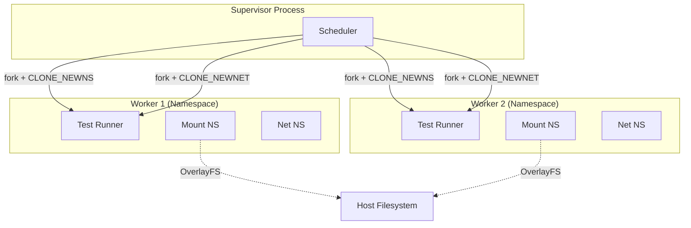

# Test Isolation for Parallel Execution

This document summarizes isolation strategies for Tach based on research blueprints.

For deep dives, see:

- [Project Tach Compatibility Layer Blueprint](../papers-very-verbose/Project%20Tach%20Compatibility%20Layer%20Blueprint.txt)
- [Rust-Python Test Isolation Blueprint](../papers-very-verbose/Rust-Python%20Test%20Isolation%20Blueprint.txt)

---

## Overview

Parallel test execution breaks without isolation. When 32 workers run simultaneously:

- Worker #5 calls `open("/tmp/log.txt", O_WRONLY)` and collides with Worker #3
- Worker #12 binds `127.0.0.1:8080` and gets "Address already in use"
- Worker #7 modifies `/dev/shm/cache` and corrupts Worker #19's snapshot

> Source: "When 32 test workers run in parallel: Worker #5 calls open('/tmp/log.txt', O_WRONLY) -> collides with Worker #3" - Project Tach Compatibility Layer Blueprint

> Source: "Every syscall that modifies global state is transparently isolated per-worker with <5% overhead" - Project Tach Compatibility Layer Blueprint

---

## Linux Namespaces

The primary isolation mechanism uses kernel namespaces via `clone()`:

```rust
let flags = CloneFlags::CLONE_NEWNS   // Mount namespace isolation
          | CloneFlags::CLONE_NEWNET  // Network namespace isolation
          | CloneFlags::CLONE_VM      // Share virtual memory (CoW)
          | CloneFlags::CLONE_FILES;  // Share file descriptor table
```

**CLONE_NEWNS:** Each worker gets its own filesystem view. Operations run at native speed once established.

> Source: "Once the namespace is established, filesystem operations run at native speed. The kernel resolves paths using the namespace-specific vfsmount table" - Rust-Python Test Isolation Blueprint

**CLONE_NEWNET:** Isolates network interfaces so port bindings never collide.

> Source: "Port 8080 in worker #5 is separate from port 8080 in worker #12" - Project Tach Compatibility Layer Blueprint

### Namespace Architecture



**CLONE_NEWUSER:** Allows unprivileged mount operations inside the namespace.

> Source: "The User namespace allows a non-root process to map its user ID to root (0) inside the namespace" - Rust-Python Test Isolation Blueprint

**Kernel Requirements:** `CLONE_NEWNS` (2.4.19+), `CLONE_NEWNET` (2.6.24+), `overlayfs metacopy` (5.11+ for optimal performance)

---

## Filesystem Isolation

Each worker mounts an overlay with read-only lower and writable upper layers:

```
/var/tach/workers/{id}/lower   <- Read-only bind of host /tmp
/var/tach/workers/{id}/upper   <- Writable tmpfs (in-memory)
/var/tach/workers/{id}/merged  <- Overlayfs mount point
```

> Source: "Worker #5 reads /tmp/test_data.bin -> direct read from lower (host) layer, zero copy. Worker #5 writes to /tmp/test_output.txt -> copied to upper layer on first write only" - Project Tach Compatibility Layer Blueprint

**LD_PRELOAD Fallback:** When namespaces are unavailable, intercept syscalls via library preload to rewrite paths (`/tmp/log.txt` -> `/tmp/tach_overlay/5/log.txt`).

> Source: "LD_PRELOAD alone covers ~75% of real-world pytest tests, but fails on: C/C++ extension libraries (numpy, cv2, protobuf), pytest plugins written in C" - Project Tach Compatibility Layer Blueprint

---

## Network Isolation

Each worker gets its own network namespace with a veth pair:

```rust
Command::new("ip").args(&["link", "add", "veth_w", "type", "veth", "peer", "name", "veth_h"]).output()?;
Command::new("ip").args(&["addr", "add", &format!("192.168.{}.2/24", worker_id), "dev", "veth_w"]).output()?;
```

> Source: "Setup veth pair: veth_worker -> bridge -> veth_host. This gives worker isolated lo + veth interface" - Project Tach Compatibility Layer Blueprint

---

## The Matrix Layer

The "Matrix Layer" provides syscall virtualization with minimal overhead:

| Vector      | Overhead | Coverage | Use Case         |
| ----------- | -------- | -------- | ---------------- |
| LD_PRELOAD  | <2%      | ~75%     | Fallback only    |
| Seccomp-BPF | ~15-45%  | 100%     | Security sandbox |
| Namespaces  | <2%      | 100%     | **Primary**      |

> Source: "Namespaces provide complete, kernel-enforced isolation with acceptable overhead. This is the primary vector" - Project Tach Compatibility Layer Blueprint

---

## Shadow Plugin Shim

pytest plugins cannot run in isolated workers. Solution: record effects in parent, replay in child.

**Recording (Parent):**

```python
def record_collection_modify(self, items):
    modifications = [{"nodeid": item.nodeid, "markers": [m.name for m in item.iter_markers()]} for i, item in enumerate(items)]
    self.recorded_effects["collection_modifications"] = modifications
```

> Source: "Most pytest plugins perform one of three actions: Metadata modification, Fixture setup, or Reporting. Only (1) and (2) must be captured" - Project Tach Compatibility Layer Blueprint

**Replay (Child):**

```python
def replay_collection_modifications(self, items):
    for i, item in enumerate(items):
        for marker_name in self.collection_mods[i]["markers"]:
            item.add_marker(pytest.Mark(marker_name, (), {}))
```

> Source: "Plugins run once (in parent), record their 'effects', and those effects are replayed in each child worker via an IPC channel" - Project Tach Compatibility Layer Blueprint

**Cannot be shimmed:** `pytest_timeout` (signal handlers are process-local), `pytest-xdist` (replaced by Tach).

---

## Implementation in Tach

### CHANGELOG 0.2.x (Plugin Compatibility)

Maps directly to the Matrix Layer and Shadow Plugin Shim:

> Source: "Implements the 'Matrix Layer' from Project Tach Compatibility Layer Blueprint for syscall isolation" - CHANGELOG.md

Key deliverables: Hook interception framework, plugin recording/replay via IPC, pytest-django/asyncio support.

### Iron Dome (0.1.x - Current)

Security sandbox combining Landlock + Seccomp:

- **Safe workers**: Full Iron Dome (Landlock + Seccomp)
- **Toxic workers**: Landlock only (need subprocess support)

> Source: "Toxic workers: Need subprocess support, so bypass Seccomp" - CLAUDE.md

---

## Overhead Budget

| Component            | Overhead                       | Notes                |
| -------------------- | ------------------------------ | -------------------- |
| Namespace creation   | 50ms                           | Once per worker      |
| Mount overlayfs      | 15ms                           | Once per worker      |
| Network veth setup   | 10ms                           | Once per worker      |
| Per-syscall (read)   | <1us                           | Filesystem cache hit |
| Per-syscall (write)  | 5-10us                         | CoW page table ops   |
| **Total per worker** | **~100ms setup + <2% runtime** | Acceptable           |

> Source: "Overhead Budget" table - Project Tach Compatibility Layer Blueprint

---

## Fallback Strategies

If Namespaces + LD_PRELOAD fail:

- **Gramine-TDX:** Complete isolation via SGX enclaves (25-40% overhead)
- **Intel Dune:** Ring -1 hypervisor for syscall rewriting (5-20% overhead, 6+ month effort)

> Source: "Deploy only if Namespaces + LD_PRELOAD fails AND speed loss is acceptable (<10x instead of 100x)" - Project Tach Compatibility Layer Blueprint

---

## Key References

> Source: "Isolation without overhead requires moving from userspace interception to kernel-level integration" - Project Tach Compatibility Layer Blueprint

> Source: "The central tenet of the proposed architecture is treating the process, rather than the machine, as the unit of isolation" - Rust-Python Test Isolation Blueprint

**External:**

- [Linux Namespaces](https://man7.org/linux/man-pages/man7/namespaces.7.html)
- [OverlayFS](https://www.kernel.org/doc/html/latest/filesystems/overlayfs.html)
- [Landlock](https://docs.kernel.org/userspace-api/landlock.html)
- [MBOX Paper](https://www.usenix.org/conference/atc13/technical-sessions/presentation/kim)

---

## See Also

- [Toxicity Classification](../../architecture/toxicity.md) - Which tests need full isolation
- [Snapshot Architecture](../../architecture/snapshot.md) - Memory state restoration
- [Zygote Hierarchy](../../architecture/zygote.md) - Process cloning patterns
