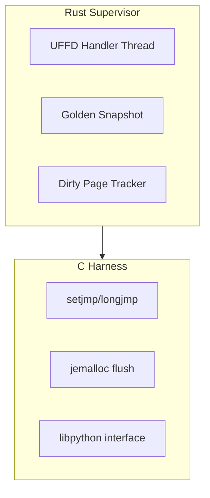

# Memory Snapshotting

Tach uses Linux userfaultfd (UFFD) to achieve microsecond-scale memory resets between test executions. This document summarizes the kernel mechanics, allocator interactions, and implementation considerations.

For detailed analysis, see:

- [Python Memory Snapshotting with Userfaultfd](../papers-very-verbose/Python%20Memory%20Snapshotting%20with%20Userfaultfd.txt)
- [Userfaultfd and CPython Allocator Interaction](../papers-very-verbose/Userfaultfd%20and%20CPython%20Allocator%20Interaction.txt)

---

## Overview

Traditional fork-server models incur kernel overhead from page table duplication and COW fault handling. UFFD provides an alternative: user-space demand paging that decouples memory restoration from process creation.

> Source: "By 'snapshotting' the virtual memory state of a process and lazily restoring it upon access, engineers can achieve reset times measured in microseconds rather than milliseconds."
> -- Python Memory Snapshotting with Userfaultfd

The key insight is **lazy restoration**: only pages actually accessed during execution are physically copied.

> Source: "If a 1GB heap is snapshotted, but the subsequent execution only touches 50KB, only those 50KB are physically copied and mapped. This O(N) cost, where N is the number of touched pages rather than the total heap size, is the primary driver of UFFD's performance advantage."
> -- Python Memory Snapshotting with Userfaultfd

---

## UFFD Mechanics

### Registration and Fault Handling

UFFD intercepts the standard page fault handler path via `UFFDIO_REGISTER`:

1. **Registration** - Register VMAs with `UFFDIO_REGISTER_MODE_MISSING`
2. **Fault** - Hardware raises page fault; kernel suspends faulting thread
3. **Resolution** - Supervisor receives `UFFD_EVENT_PAGEFAULT`, issues `UFFDIO_COPY`
4. **Wake** - Kernel maps restored page, wakes suspended thread

> Source: "When a process accesses a virtual address registered with UFFDIO_REGISTER, the hardware raises a page fault exception. The kernel suspends the faulting thread and generates a UFFD_EVENT_PAGEFAULT message."
> -- Python Memory Snapshotting with Userfaultfd

### MADV_DONTNEED Reset

Memory reversion uses `madvise(addr, length, MADV_DONTNEED)`:

1. **PTE Modification** - Clears "Present" bit, unmapping physical pages
2. **Physical Release** - Decrements reference counts, returns pages to buddy allocator
3. **TLB Shootdown** - IPIs flush cached translations on all cores (primary bottleneck)

> Source: "In a snapshotting loop, MADV_DONTNEED effectively 'punches holes' in the process's memory. The next time the application accesses these addresses, the userfaultfd mechanism triggers again."
> -- Python Memory Snapshotting with Userfaultfd

### Write Tracking Optimization

Naive reset iterates entire heap O(N). Modern kernels (5.7+) support `UFFDIO_WRITEPROTECT`:

- Write-protect snapshot region
- First write triggers UFFD event
- Log page index, remove protection
- Reset only dirty pages

> Source: "CPython is a memory-intensive runtime. Even simple operations involve reference count updates (Py_INCREF/Py_DECREF), which are writes. The 'dirty set' for even a trivial Python function can be surprisingly dispersed across the heap."
> -- Userfaultfd and CPython Allocator Interaction

---

## Allocator Interactions

### Why PYTHONMALLOC=malloc

CPython's pymalloc creates complexity with its Arena/Pool/Block hierarchy. Using `PYTHONMALLOC=malloc` redirects all allocations to the system allocator:

> Source: "Setting PYTHONMALLOC=malloc forces CPython to redirect all memory requests directly to the standard C library's malloc. Every Python object corresponds to a distinct allocation block."
> -- Python Memory Snapshotting with Userfaultfd

### Allocator Comparison

| Allocator      | TLS Usage            | Manual Flush                    | Snapshot Suitability |
| -------------- | -------------------- | ------------------------------- | -------------------- |
| glibc ptmalloc | Aggressive (tcache)  | No                              | Low                  |
| jemalloc       | Tunable              | **Yes** (`thread.tcache.flush`) | **High**             |
| mimalloc       | Deep (sharded pages) | Partial (`mi_collect`)          | Medium               |

> Source: "jemalloc is the superior choice. The ability to programmatically flush thread caches provides a deterministic synchronization point essential for reliable snapshot restoration."
> -- Python Memory Snapshotting with Userfaultfd

### The tcache Problem (glibc)

glibc's tcache creates a split-brain between heap metadata and TLS:

```c
typedef struct tcache_perthread_struct {
    uint16_t counts[TCACHE_MAX_BINS];
    tcache_entry *entries[TCACHE_MAX_BINS];
} tcache_perthread_struct;
```

> Source: "If any part of the allocator's state resides in non-snapshotted memory, the tcache becomes desynchronized. The heap says 'Chunk A is free,' but the global state says 'Chunk A is in use.'"
> -- Python Memory Snapshotting with Userfaultfd

### Pointer Mangling Hazard

glibc XORs tcache pointers with `tcache_key` (stored in TLS):

> Source: "When malloc attempts to demangle the pointers from the restored heap using the _new_ key, it produces garbage addresses. Dereferencing these garbage addresses causes a segmentation fault inside malloc logic."
> -- Python Memory Snapshotting with Userfaultfd

### jemalloc Solution

Flush thread-local caches before snapshot:

```c
mallctl("thread.tcache.flush", NULL, NULL, NULL, 0);
```

> Source: "By invoking this _before_ taking the snapshot, the test runner ensures the thread-local bins are empty and all free chunks are returned to the global arena structures."
> -- Python Memory Snapshotting with Userfaultfd

### Python Version Considerations

| Version | Allocator | State Location            | TLS     | Risk                   |
| ------- | --------- | ------------------------- | ------- | ---------------------- |
| < 3.12  | pymalloc  | Global Static (.bss)      | No      | High (BSS/Heap desync) |
| 3.12    | pymalloc  | PyInterpreterState (Heap) | No      | Medium                 |
| 3.13+   | mimalloc  | TLS + Heap                | **Yes** | Critical               |

> Source: "The transition to mimalloc in Python 3.13 represents a hard barrier for naive memory restoration strategies due to its dependence on Thread Local Storage."
> -- Userfaultfd and CPython Allocator Interaction

---

## Split-Brain Prevention

### BSS/Heap Synchronization

The `usedpools` array (pymalloc metadata) lives in BSS, pointing into heap arenas. Both must be snapshotted atomically.

> Source: "The critical state to capture is not just the 'heap' but the Data/BSS segments of the interpreter. The usedpools array contains pointers into the arenas. Both the pointers (in BSS) and the targets (in Arenas) must be snapshotted atomically."
> -- Userfaultfd and CPython Allocator Interaction

### Required Memory Regions

The supervisor must register:

1. **Heap** - jemalloc arenas
2. **Stack** - Local variables
3. **BSS/Data** - `small_ints`, `PyFloat_FreeList`, `usedpools`
4. **TLS** - Thread-local allocator state

> Source: "You must snapshot Anonymous Mappings (Arenas) and Data Segments (Global State). Snapshotting only [heap] is insufficient."
> -- Userfaultfd and CPython Allocator Interaction

### CPython Hidden State

Even with `PYTHONMALLOC=malloc`, CPython maintains internal caches:

- **Float/Int Free Lists** - `PyFloat_FreeList` in `Objects/floatobject.c`
- **small_ints Array** - Pre-allocated integers -5 to 256 in `.bss`

> Source: "The reference counts of these small integers change constantly during execution. If the .data segment of libpython is not included in the UFFD registered range, the reference counts will not roll back."
> -- Python Memory Snapshotting with Userfaultfd

### TLS Restoration

`setjmp`/`longjmp` saves FS/GS registers but not TLS memory contents:

> Source: "longjmp does not restore TLS memory contents, UFFD is the only mechanism protecting this state."
> -- Python Memory Snapshotting with Userfaultfd

For Python 3.13+, TLS segments must be explicitly registered:

> Source: "You must identify and register the TLS memory segments with userfaultfd. This requires parsing the fs_base (via arch_prctl) to find the TLS range."
> -- Userfaultfd and CPython Allocator Interaction

### GC Race Conditions

The garbage collector modifies `ob_refcnt` and `gc_refs` during traversal:

> Source: "The GC thread resumes holding pointers to objects expecting them to be in the 'intermediate' state. The memory restore reverts them to their 'stable' state. The GC logic now computes incorrect reference counts."
> -- Userfaultfd and CPython Allocator Interaction

**Mitigation:** Call `gc.disable()` before snapshot or ensure GIL is held.

---

## Implementation in Tach

Tach's snapshot system (v0.7.x) uses this architecture:



### Snapshot Workflow

1. **Quiesce** - `mallctl("thread.tcache.flush", ...)`
2. **Capture** - `setjmp()` + copy registered pages to Golden Snapshot
3. **Execute** - Run Python test
4. **Reset** - `MADV_DONTNEED` on dirty pages
5. **Restore** - `longjmp()` returns to snapshot point

### Rust Panic Safety

> Source: "If the Rust supervisor calls into C, and C longjmps past Rust stack frames, destructors (Drop traits) for Rust objects will not run."
> -- Python Memory Snapshotting with Userfaultfd

**Constraint:** `longjmp` must occur entirely within C boundary.

### Single-Threaded Requirement

> Source: "userfaultfd cannot restore CPU register state. Multi-threaded snapshots are essentially impossible without fork or heavyweight context serialization."
> -- Userfaultfd and CPython Allocator Interaction

Tach enforces single-threaded execution for safe workers; toxic workers use process isolation.

---

## Key References

### External Documentation

- [userfaultfd(2) - Linux manual page](https://man7.org/linux/man-pages/man2/userfaultfd.2.html)
- [Kernel UFFD documentation](https://www.kernel.org/doc/html/v5.7/admin-guide/mm/userfaultfd.html)
- [jemalloc mallctl reference](https://jemalloc.net/jemalloc.3.html)
- [CPython Memory Management](https://docs.python.org/3/c-api/memory.html)

### Related Tach Documentation

- [docs/architecture/snapshot.md](../../architecture/snapshot.md) - Snapshot architecture
- [docs/architecture/zygote.md](../../architecture/zygote.md) - Zygote process model

---

## Summary

Memory snapshotting in Tach requires:

1. **jemalloc** with `thread.tcache.flush` for deterministic allocator state
2. **Complete memory registration** including BSS/Data segments, not just heap
3. **TLS awareness** especially for Python 3.13+
4. **GC quiescence** via `gc.disable()` before snapshot
5. **Single-threaded execution** or process-level isolation for multi-threaded tests

The lazy restoration via UFFD achieves O(touched_pages) reset cost rather than O(heap_size), enabling microsecond-scale test iteration.
