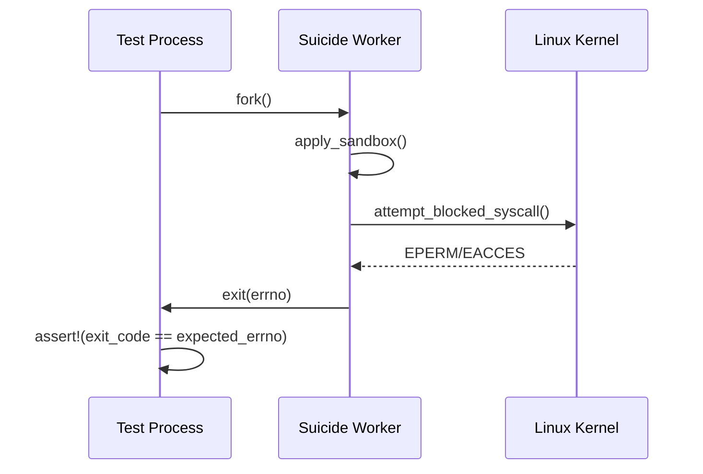
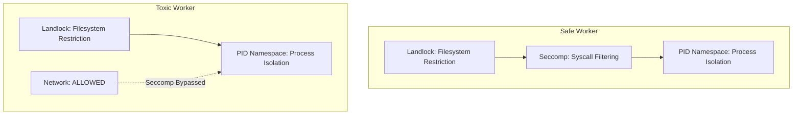

# Sandbox Enforcement: The EPERM Doctrine

> **Status**: Complete - Kernel Validation Achieved
> **Author**: Project Tach Development Team
> **Mandate**: "Stop testing if the code works. Start testing if the kernel is being obeyed."

---

## Executive Summary

Project Tach is not a Python application; it is a **userspace kernel extension**. Our sandbox is not a configuration setting - it is a verified hardware-level boundary enforced by the Linux kernel.

This document codifies the **EPERM Doctrine**: the principle that security enforcement must be validated at the syscall level, not through logical assertions about code behavior.

---

## The EPERM Doctrine

### Core Principle

> A sandbox is only as strong as the kernel's refusal to cooperate with malicious code.

We do not trust our sandbox implementation based on code inspection. We trust it because:

1. **Seccomp** returns `EPERM` (errno 1) when blocked syscalls are attempted
2. **Landlock** returns `EACCES` (errno 13) when blocked filesystem access is attempted
3. **PID Namespaces** return `ESRCH` (errno 3) when attempting to signal invisible processes

### Validation Philosophy

```
Traditional Testing:     "Did our code set up the sandbox correctly?"
EPERM Doctrine Testing:  "Does the kernel actually block the operation?"
```

---

## The Suicide Worker Pattern

The **Suicide Worker** is Project Tach's gold standard for isolation testing. It validates kernel enforcement by deliberately attempting prohibited operations.

### Pattern Definition



### Implementation Reference

```rust
// From rust_tests/sandbox_enforcement.rs
#[test]
fn test_seccomp_blocks_socket() {
    match unsafe { fork() }.expect("fork failed") {
        ForkResult::Child => {
            // Apply Seccomp filter
            apply_seccomp().expect("Failed to apply Seccomp");

            // Attempt blocked syscall
            let result = unsafe {
                libc::socket(libc::AF_INET, libc::SOCK_STREAM, 0)
            };

            if result == -1 {
                let errno = std::io::Error::last_os_error()
                    .raw_os_error().unwrap_or(0);
                std::process::exit(errno);  // Exit with errno
            } else {
                std::process::exit(255);  // CRITICAL: Sandbox failed!
            }
        }
        ForkResult::Parent { child } => {
            match waitpid(child, None).expect("waitpid failed") {
                WaitStatus::Exited(_, code) => {
                    assert_eq!(code, libc::EPERM,
                        "Seccomp should block socket() with EPERM");
                }
                status => panic!("Unexpected status: {:?}", status),
            }
        }
    }
}
```

### Why Exit with errno?

The child process exits with the errno value, allowing the parent to verify:

- `exit(1)` = `EPERM` - Seccomp blocked the syscall
- `exit(13)` = `EACCES` - Landlock blocked filesystem access
- `exit(255)` = Operation succeeded - **SANDBOX FAILURE**

---

## The Fork-Clone Duality

### Discovery

During Phase 1 implementation, we discovered that modern glibc maps `fork()` to the `clone()` syscall internally. This is a critical finding for sandbox testing.

### Technical Details

```
User Code:           libc::fork()
Glibc Translation:   SYS_clone(SIGCHLD, 0, NULL, NULL, 0)
Kernel Execution:    clone() syscall
```

### Implications for Seccomp Testing

| Approach                  | Syscall     | Result                                       |
| ------------------------- | ----------- | -------------------------------------------- |
| `libc::fork()`            | `SYS_clone` | Allowed (clone is whitelisted for threading) |
| `libc::syscall(SYS_fork)` | `SYS_fork`  | Blocked with EPERM                           |

### Correct Implementation

```rust
// WRONG: Tests clone(), not fork()
let result = unsafe { libc::fork() };

// CORRECT: Tests actual SYS_fork syscall
let result = unsafe { libc::syscall(libc::SYS_fork) };
```

### Reference

See `test_seccomp_blocks_fork` in `rust_tests/sandbox_enforcement.rs` for the canonical implementation.

---

## The "Matrix" Boundary: PID Namespace Isolation

### Concept

Workers operate in separate PID namespaces. From inside their namespace, sibling workers do not exist - they are invisible to `kill()`, `ptrace()`, and `/proc` enumeration.

### Validation Method

Use `kill(target_pid, 0)` to probe for process existence:

- Returns `0` if process exists and is signalable
- Returns `-1` with `ESRCH` if process does not exist
- Returns `-1` with `EPERM` if process exists but is not signalable

### Implementation

```rust
// From rust_tests/sandbox_enforcement.rs
#[test]
fn test_kill_sibling_returns_esrch() {
    let fake_pid = Pid::from_raw(999999);

    let result = kill(fake_pid, None);  // Signal 0 = probe

    match result {
        Err(Errno::ESRCH) => {
            // Expected: process doesn't exist in our namespace
        }
        Ok(_) => {
            panic!("kill() should return ESRCH for invisible PID");
        }
        Err(e) => {
            assert!(e == Errno::ESRCH || e == Errno::EPERM,
                "Expected ESRCH or EPERM, got {:?}", e);
        }
    }
}
```

### Namespace Proof

Workers in separate PID namespaces have low PIDs (typically 1-10) because each namespace has its own PID counter:

```rust
#[test]
fn test_pid_namespace_isolation() {
    let (worker1_host_pid, worker1_inner_pid) = spawn_namespaced_worker();
    let (worker2_host_pid, worker2_inner_pid) = spawn_namespaced_worker();

    // Inside their namespaces, both workers have low PIDs
    assert!(worker1_inner_pid < 100);
    assert!(worker2_inner_pid < 100);

    // But they have different host PIDs
    assert_ne!(worker1_host_pid, worker2_host_pid);
}
```

---

## Test Matrix: Phase 1 Results

### Seccomp Enforcement Tests

| Test                          | Syscall           | Expected | Status |
| ----------------------------- | ----------------- | -------- | ------ |
| `test_seccomp_blocks_socket`  | `socket(AF_INET)` | EPERM    | PASS   |
| `test_seccomp_blocks_connect` | `connect()`       | EPERM    | PASS   |
| `test_seccomp_blocks_fork`    | `SYS_fork` (raw)  | EPERM    | PASS   |
| `test_seccomp_blocks_execve`  | `execve()`        | EPERM    | PASS   |
| `test_seccomp_allows_clone`   | `clone()`         | Success  | PASS   |

### Landlock Enforcement Tests

| Test                                | Operation | Path          | Expected | Status |
| ----------------------------------- | --------- | ------------- | -------- | ------ |
| `test_landlock_blocks_etc_write`    | write     | `/etc/passwd` | EACCES   | PASS   |
| `test_landlock_blocks_root_write`   | create    | `/evil.txt`   | EACCES   | PASS   |
| `test_landlock_allows_tmp_write`    | create    | `/tmp/*`      | Success  | PASS   |
| `test_landlock_allows_project_read` | read      | `{project}/`  | Success  | PASS   |

### Namespace Isolation Tests

| Test                              | Validation                     | Status |
| --------------------------------- | ------------------------------ | ------ |
| `test_pid_namespace_isolation`    | Workers have isolated low PIDs | PASS   |
| `test_kill_sibling_returns_esrch` | Invisible PIDs return ESRCH    | PASS   |

### Toxic vs Safe Worker Differentiation

| Test                                   | Worker Type | Network | Filesystem | Status |
| -------------------------------------- | ----------- | ------- | ---------- | ------ |
| `test_toxic_worker_can_use_network`    | Toxic       | Allowed | Restricted | PASS   |
| `test_toxic_worker_still_has_landlock` | Toxic       | N/A     | Restricted | PASS   |
| `test_safe_worker_full_iron_dome`      | Safe        | Blocked | Restricted | PASS   |

### File Descriptor Isolation

| Test                            | Validation                           | Status |
| ------------------------------- | ------------------------------------ | ------ |
| `test_fd_isolation_clone_files` | Child FD close doesn't affect parent | PASS   |

---

## Iron Dome Architecture

### Two-Tier Sandbox Model



### Safe Workers

Full Iron Dome protection:

- **Landlock**: Filesystem restricted to project root, `/tmp`, Python stdlib
- **Seccomp**: Network, fork, exec syscalls blocked
- **Namespaces**: PID, mount, user isolation

### Toxic Workers

Relaxed Seccomp for subprocess support:

- **Landlock**: Full filesystem restrictions (same as safe)
- **Seccomp**: BYPASSED (toxic tests may need subprocesses)
- **Namespaces**: PID, mount, user isolation

### Why Clone Must Be Allowed

Python's `threading` module uses `clone()` internally:

```
import threading
threading.Thread(target=fn).start()
    ↓
pthread_create()
    ↓
clone(CLONE_VM | CLONE_FS | CLONE_FILES | CLONE_SIGHAND | ...)
```

Blocking `clone()` breaks Python threading. Our Seccomp filter explicitly allows it.

---

## Error Code Reference

| Error    | Code | Context  | Meaning                                 |
| -------- | ---- | -------- | --------------------------------------- |
| `EPERM`  | 1    | Seccomp  | Syscall blocked by BPF filter           |
| `EACCES` | 13   | Landlock | Filesystem access denied                |
| `ESRCH`  | 3    | kill()   | Process not found (namespace isolation) |
| `EINVAL` | 22   | Landlock | Invalid ruleset configuration           |
| `SIGSYS` | 31   | Seccomp  | Process killed (SECCOMP_RET_KILL mode)  |

---

## Kernel Version Requirements

| Feature         | Minimum Kernel | Notes                          |
| --------------- | -------------- | ------------------------------ |
| Seccomp-BPF     | 3.17           | Required for syscall filtering |
| Landlock        | 5.13           | Filesystem sandboxing          |
| Landlock ABI v2 | 5.19           | File truncation rules          |
| userfaultfd     | 4.11           | Memory snapshot/restore        |
| PID Namespaces  | 2.6.24         | Process isolation              |

### Graceful Degradation

On unsupported kernels, Tach logs warnings but continues:

```rust
match apply_landlock(&project_root, 9999) {
    Ok(SandboxStatus::NotEnforced) => {
        eprintln!("[sandbox] WARNING: Landlock not supported, continuing without");
    }
    Ok(SandboxStatus::FullyEnforced) => {
        eprintln!("[sandbox] Landlock enforced");
    }
    Err(e) => {
        return Err(e);  // Critical error, fail fast
    }
}
```

---

## References

- `rust_tests/sandbox_enforcement.rs` - Suicide Worker tests
- `src/isolation/sandbox.rs` - Landlock and Seccomp implementation
- `docs/architecture/sandbox.md` - Sandbox architecture documentation
- Linux Kernel Documentation: [Seccomp](https://www.kernel.org/doc/html/latest/userspace-api/seccomp_filter.html)
- Linux Kernel Documentation: [Landlock](https://www.kernel.org/doc/html/latest/security/landlock.html)

---

_"A sandbox is not secure until the kernel says no."_

_The EPERM Doctrine - Project Tach Security Standard_
