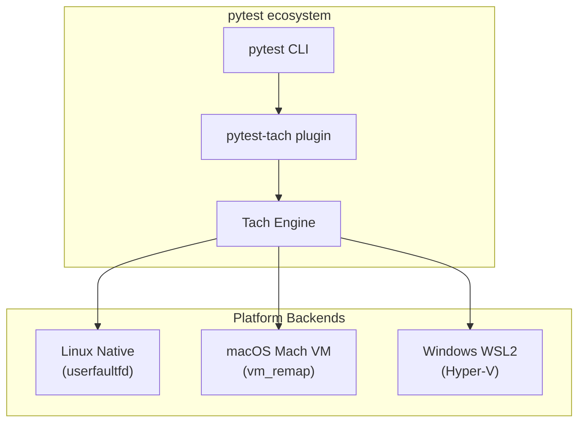

# Tach: Vision & Future Roadmap

> This document captures the long-term vision for Tach adoption and development trajectory.

---

## What Makes Tach Interesting

Tach is a **Snapshot-Hypervisor for Python Tests** that replaces pytest's execution model with microsecond-scale memory snapshots.

### The Core Innovation

Traditional test runners (pytest, unittest) suffer from:

1. **Import Tax**: Every test process re-imports modules (`import pandas` = 200ms+)
2. **Fork Safety Issues**: `fork()` copies locked mutexes → deadlocks
3. **Slow Reset**: ~200ms to reset state between tests

**Tach's Solution:**

- Initialize Python **once**, capture a memory snapshot
- Run test, then **restore memory in <50 microseconds** using Linux `userfaultfd`
- **100x+ throughput improvement** over traditional runners

### Technical Sophistication

| Component             | Technology                               | Innovation Level            |
| --------------------- | ---------------------------------------- | --------------------------- |
| **Memory Snapshots**  | `userfaultfd` + `madvise(MADV_DONTNEED)` | Advanced kernel-level       |
| **Security Sandbox**  | Landlock + Seccomp-BPF                   | Production-grade isolation  |
| **Zero-Copy Loading** | `PyMarshal_ReadObjectFromString`         | Bypasses importlib entirely |
| **Toxicity Analysis** | petgraph dependency propagation          | Novel approach to isolation |
| **Coverage**          | PEP 669 + lock-free ring buffers         | Cutting-edge Python 3.12+   |
| **AST Parsing**       | rustpython-parser (pure Rust)            | No Python dependency        |

---

## Future Development Opportunities

### High-Impact Features

| Feature                   | Impact                     | Difficulty  |
| ------------------------- | -------------------------- | ----------- |
| **macOS Support**         | Massive market expansion   | Hard        |
| **pytest Plugin Mode**    | Drop-in compatibility      | Medium      |
| **Distributed Execution** | Scale across machines      | Medium-Hard |
| **IDE Integration**       | VS Code/PyCharm extensions | Medium      |
| **Cloud-Native Mode**     | Kubernetes-aware sharding  | Medium      |

### Technical Enhancements

1. **Checkpoint Trees** — Multiple snapshot points for complex fixture hierarchies
2. **Predictive Scheduling** — ML-based test ordering for fastest feedback
3. **Incremental Coverage** — Only re-run tests affected by code changes
4. **GPU State Snapshots** — For ML/CUDA test isolation
5. **WASM Compilation** — Portable test discovery without Rust toolchain

### Ecosystem Integration

- **pytest-xdist replacement** — Direct migration path
- **Django/FastAPI deep integration** — Automatic DB rollback, connection pooling
- **Hypothesis property testing** — Snapshot between property iterations
- **CI Providers** — GitHub Actions, GitLab CI native support

---

## Adoption Trajectory

### Why Docker Is Required Today

| Requirement                         | Why It's Problematic Now               |
| ----------------------------------- | -------------------------------------- |
| **Linux Kernel 5.13+**              | macOS/Windows don't have `userfaultfd` |
| **`CAP_SYS_PTRACE`**                | Requires elevated privileges           |
| **`vm.unprivileged_userfaultfd=1`** | Disabled by default on many distros    |
| **Landlock ABI v4**                 | Only in newer kernels                  |
| **WSL2 instability**                | Kernel crashes with userfaultfd        |

Docker provides a **controlled environment** where all these are pre-configured.

### The Future: Native Adoption (No Docker Needed)

#### Phase 1: Linux Native (1-2 years)

As the project matures:

- **Kernel defaults change** — `unprivileged_userfaultfd` becoming more common
- **Distro packages** — `apt install tach` / `dnf install tach`
- **CI providers adopt it** — GitHub Actions runners, GitLab CI with pre-configured kernels
- **Cloud IDE support** — Codespaces, Gitpod run Linux natively

**Result:** Linux developers run `tach .` directly, no Docker.

#### Phase 2: macOS/Windows Support (2-3 years)

Two possible paths:

| Approach                 | How It Works                                           | Performance              |
| ------------------------ | ------------------------------------------------------ | ------------------------ |
| **Mach VM (macOS)**      | Use `mach_vm_*` APIs instead of userfaultfd            | ~80% of Linux speed      |
| **Lightweight VM**       | Transparent Linux microVM (like Colima/Lima)           | ~70% of native           |
| **Graceful Degradation** | Fall back to process-per-test on unsupported platforms | Still faster than pytest |

#### Phase 3: Invisible Infrastructure (3-5 years)

```bash
pip install tach
tach .  # Just works everywhere
```

The complexity becomes **invisible** — like how Docker itself abstracts away containerization details today.

---

## Realistic Adoption Scenarios

### Scenario A: CI/CD First (Most Likely)

```yaml
# GitHub Actions - no Docker needed
runs-on: ubuntu-latest # Already has kernel support
steps:
  - run: pip install tach && tach .
```

CI environments are **already Linux** — this is the path of least resistance.

### Scenario B: Dev Containers Become Standard

VS Code Dev Containers / GitHub Codespaces are already normalizing containerized development:

```json
{
  "image": "mcr.microsoft.com/devcontainers/python:3.12",
  "features": {
    "ghcr.io/tach-core/devcontainer-feature": {}
  }
}
```

### Scenario C: pytest Plugin Mode

```bash
pip install pytest-tach
pytest --tach .  # Uses Tach engine under the hood
```

This would let people adopt **incrementally** without changing their workflow.

---

## What Won't Happen

| Myth                           | Reality                                 |
| ------------------------------ | --------------------------------------- |
| "Everyone runs Docker locally" | No — friction too high for casual users |
| "Only works on servers"        | No — local dev will be supported        |
| "Replaces pytest entirely"     | No — will likely integrate as a backend |
| "Linux-only forever"           | No — cross-platform is inevitable       |

---

## The Likely Endgame (5+ Years)



**The answer:** Tach becomes a **backend engine** that pytest can optionally use, with platform-specific implementations that hide the complexity.

---

## Timeline Summary

| Timeframe     | How People Use Tach                               |
| ------------- | ------------------------------------------------- |
| **Now**       | Docker (dev), Native Linux (CI)                   |
| **1-2 years** | Native Linux everywhere, Docker optional          |
| **3-5 years** | Cross-platform, `pip install tach` just works     |
| **5+ years**  | Invisible — pytest uses Tach engine automatically |

Docker is a **bridge**, not the destination. The goal is to make the advanced kernel features accessible without users needing to think about them.

---

## Why Tach Is Worth Developing

1. **Real Problem**: Python test suites at scale are painfully slow
2. **Novel Solution**: No other tool uses userfaultfd for test isolation
3. **Strong Foundation**: Clean architecture, extensive docs, proper testing
4. **Market Gap**: pytest-xdist is the only real competitor, and it's limited
5. **Technical Moat**: Deep kernel integration is hard to replicate

This has the potential to become the **Turborepo/esbuild of Python testing** — a Rust-powered tool that makes an order-of-magnitude improvement over the status quo.

---

_Document created from project analysis conversation._
